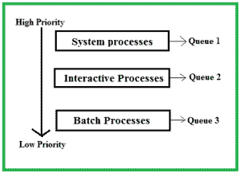
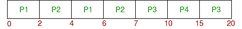

# 多级队列(MLQ) CPU 调度

> 原文:[https://www . geesforgeks . org/multiple-queue-mlq-CPU-scheduling/](https://www.geeksforgeeks.org/multilevel-queue-mlq-cpu-scheduling/)

前提: [CPU 调度](https://www.geeksforgeeks.org/gate-notes-operating-system-process-scheduling/)
可能会发生就绪队列中的进程可以分为不同的类，每个类都有自己的调度需求。例如，常见的划分是**前台(交互)**流程和**后台(批处理)**流程。这两个类有不同的调度需求。对于这种情况，使用多级队列调度。现在，让我们看看它是如何工作的。

**就绪队列**为每类进程划分为单独的队列。例如，让我们以三种不同类型的流程系统流程、交互流程和批处理流程为例。所有三个进程都有自己的队列。现在，看下图。

所有三种不同类型的进程都有自己的队列。每个队列都有自己的调度算法。例如，队列 1 和队列 2 使用**循环调度**，而队列 3 可以使用 **FCFS** 来调度它们的进程。

**队列间调度:**如果所有的队列都有一些进程会怎么样？哪个进程应该得到 CPU？为了确定这一点，有必要在队列中进行调度。有两种方法可以做到这一点–

1.  **固定优先级抢占式调度方式–**每个队列相对于优先级较低的队列具有绝对的优先级。让我们考虑以下优先顺序**队列 1 >队列 2 >队列 3** 。根据该算法，批处理队列(队列 3)中的任何进程都不能运行，除非队列 1 和 2 为空。如果任何批处理进程(队列 3)正在运行，并且任何系统(队列 1)或交互进程(队列 2)进入就绪队列，则该批处理进程被抢占。
2.  **时间切片**–在这种方法中，每个队列获得一定比例的 CPU 时间，并可以用它来调度自己的进程。例如，队列 1 占用 50%的 CPU 时间，队列 2 占用 30%，队列 3 占用 20%的 CPU 时间。

**示例问题:**
考虑下表中多级队列调度下的四个进程。队列号表示进程的队列。

队列 1 的优先级大于队列 2。队列 1 使用循环调度(时间量= 2)，队列 2 使用 FCFS。

下面是问题的**甘特图**:

在开始时，两个队列都有进程，因此队列 1 (P1，P2)中的进程以循环方式首先运行(因为优先级较高)，并在 7 个单元后完成，然后队列 2 (P3)中的进程开始运行(因为队列 1 中没有进程)，但当它运行时，P4 进入队列 1，中断 P3，并开始运行 5 秒钟，完成后，P3 接管 CPU 并完成其执行。

**优势:**

*   进程被永久地分配给队列，因此它具有低调度开销的优点。

**缺点:**

*   如果一些更高优先级的队列永远不会变空，一些进程可能会缺少 CPU。
*   它本质上是不灵活的。

本文由 **Ashish Sharma** 供稿。如果你喜欢 GeeksforGeeks 并想投稿，你也可以使用[write.geeksforgeeks.org](https://write.geeksforgeeks.org)写一篇文章或者把你的文章邮寄到 review-team@geeksforgeeks.org。看到你的文章出现在极客博客主页上，帮助其他极客。

如果你发现任何不正确的地方，或者你想分享更多关于上面讨论的话题的信息，请写评论。