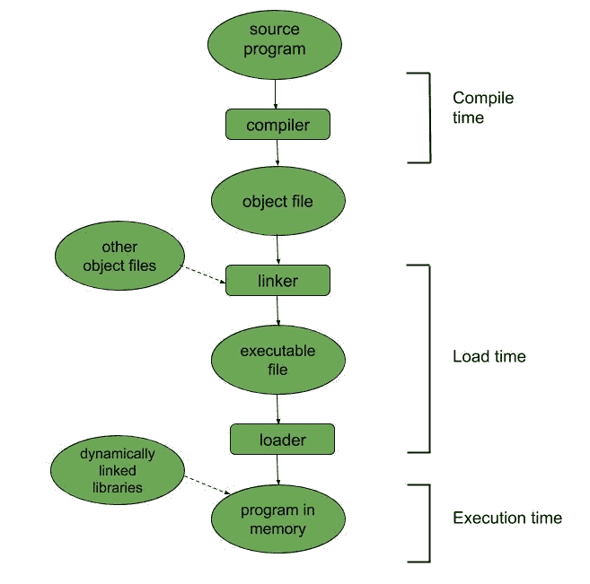

# 用户程序的多步处理

> 原文:[https://www . geesforgeks . org/multi step-processing-of-a-user-program/](https://www.geeksforgeeks.org/multistep-processing-of-a-user-program/)

[程序](https://www.geeksforgeeks.org/formation-of-process-from-program/)是用户编写的指令序列，指令计算机执行解决某个问题的任务。现在，我们将更多地了解程序在执行之前所经历的各个步骤。程序作为二进制可执行文件驻留在磁盘上。为了运行程序，它必须从磁盘进入主存储器(因为中央处理器可以直接访问的唯一存储位置是——主存储器和寄存器——虽然寄存器在一个中央处理器周期或更短的时间内被访问，但主存储器可能需要许多周期)。现在，让我们知道程序执行的详细步骤，以便完成前一个任务。

当要执行的程序从磁盘被带到主存储器时，它被放在一个进程的上下文中(它基本上是一个正在执行的程序)，在那里它可以在中央处理器上执行。在执行过程中，它从内存中访问数据和指令，一旦执行完成，进程终止，内存被回收供另一个进程使用。

源代码中的地址通常是符号化的(比如变量计数)。编译器将这些地址绑定到可重定位的地址，这些地址由[链接器或加载器](https://www.geeksforgeeks.org/difference-between-loading-and-linking/)绑定到绝对地址(绑定-从一个地址空间到另一个地址空间的映射)。

指令和数据到存储器地址的绑定可以在程序执行的以下任何步骤中完成:

1.  **[编译时间](https://www.geeksforgeeks.org/difference-between-compile-time-and-load-time-address-binding/) :**
    如果我们在编译时初步知道进程驻留在内存中的什么位置，那么就可以生成绝对代码。如果起始位置改变，那么代码必须重新编译。
2.  **[加载时间](https://www.geeksforgeeks.org/difference-between-compile-time-and-load-time-address-binding/) :**
    如果进程所在的内存地址在编译时未知，那么编译器必须生成可重定位的代码(没有运行的静态内存地址)。如果起始地址改变，那么程序必须重新加载以合并该值。
3.  **[执行时间](https://www.geeksforgeeks.org/difference-between-compile-time-and-execution-time-address-binding/) :**
    如果进程在其执行时间内可以从一个段移动到另一个段，那么绑定必须延迟到执行时间。这种类型的绑定需要特殊的硬件(如下所述)。

**Figure –** Multistep Processing of a User Program

**[逻辑地址 vs 物理地址](https://www.geeksforgeeks.org/logical-and-physical-address-in-operating-system/) :**
逻辑地址是中央处理器生成的地址，而物理地址是存储单元看到的地址(即加载到存储器的存储器地址寄存器中的地址)。用户程序处理逻辑地址，但永远看不到物理地址。

编译时或加载时绑定地址(如上所述)会生成相同的逻辑和物理地址，而在执行时绑定地址则不是这种情况。在后一种情况下，生成的物理和逻辑地址是不同的。在这种情况下，逻辑地址被称为**虚拟地址**。在运行时，一个名为**内存管理单元**的硬件设备执行从虚拟地址到物理地址的映射。

[动态加载](https://practice.geeksforgeeks.org/problems/what-is-dynamic-loading)用于更有效地利用内存。动态加载的优势在于，只有在需要的时候才会加载特定的例程。动态链接库是程序运行时链接到程序的系统库。这是用户程序从源代码阶段到执行的多步处理的总体简要总结。附图精确地描述了程序的多步处理。