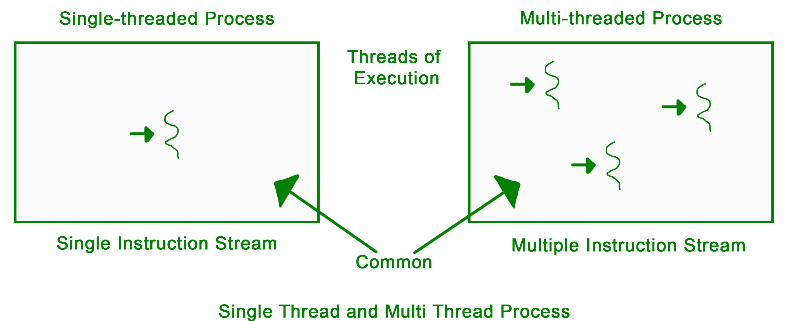

# 操作系统中的多线程

> 原文:[https://www . geesforgeks . org/操作系统多线程/](https://www.geeksforgeeks.org/multithreading-in-operating-system/)

**线程**是程序执行期间遵循的路径。现在编写的大多数程序每天都作为一个线程运行。比方说，一个程序不能在绘图时读取击键。这些任务不能由程序同时执行。这个问题可以通过多任务处理来解决，这样就可以同时执行两个或多个任务。

多任务有两种类型:基于处理器的和基于线程的。基于处理器的多任务处理完全由操作系统管理，但是通过多线程进行多任务处理在某种程度上可以由程序员控制。

**多线程**的概念需要正确理解这两个术语–**一个流程和一个线程**。进程是正在执行的程序。一个进程可以进一步划分为独立的单元，称为线程。

线程就像进程中的一个轻量级小进程。或者我们可以说线程的集合就是所谓的进程。

**应用–**
线程几乎被广泛应用于每个领域。最广泛的是在互联网上，现在我们使用各种类型的交易处理，如充值，网上转账，银行等。线程化是将代码分成重量很轻的小部分，对中央处理器内存的负担很小，这样就可以很容易地计算出来，并在期望的领域实现目标。线程的概念是由于技术的快速和定期变化的问题而设计的，并且由于应用较少而减少了不同领域的工作。然后，正如所说的“需求是创造或创新的产生”，因此，通过遵循这种方法，人类思维发展了线程的概念，以提高编程能力。