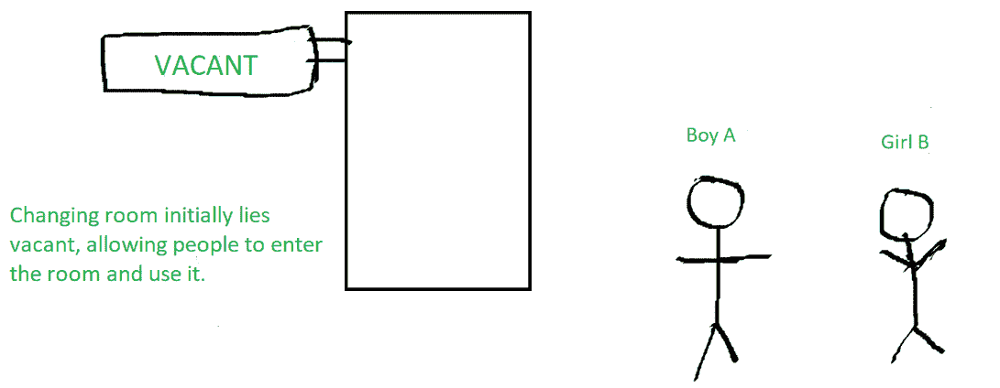
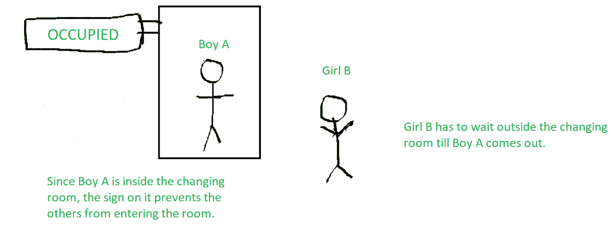
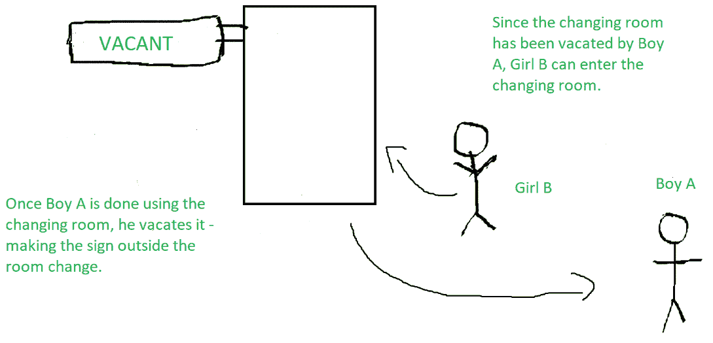

# 同步互斥

> 原文:[https://www . geesforgeks . org/同步互斥/](https://www.geeksforgeeks.org/mutual-exclusion-in-synchronization/)

在进程的并发执行过程中，进程有时需要进入[临界区](https://www.geeksforgeeks.org/g-fact-70/)(或进程间共享的程序段)进行执行。由于同时执行多个进程，存储在关键部分的值可能会变得不一致。换句话说，这些值取决于指令的执行顺序——也称为[比赛条件](https://practice.geeksforgeeks.org/problems/what-is-race-condition)。进程同步的主要任务是在执行关键部分时消除竞争条件。
这主要通过[互斥](https://practice.geeksforgeeks.org/problems/what-is-mutual-exclusion)来实现。

**互斥**是[进程同步](https://www.geeksforgeeks.org/introduction-of-process-synchronization/)的一个属性，表示“在任何给定的时间点，临界区内不能存在两个进程”。这个术语最早是由迪克斯特拉创造的。正在使用的任何进程同步技术都必须满足互斥的特性，没有互斥就不可能消除竞争条件。

为了理解互斥，我们举个例子。

**例:**
在一家超市的衣服区，两个人正在选购衣服。

男孩甲决定买一些衣服，然后去更衣室试穿。现在，当男孩 A 在更衣室里的时候，上面有一个“有人”的标志——表示没有其他人可以进来。女生 B 也要用更衣室，所以要等到男生 A 用完更衣室。

一旦男孩 A 从更衣室出来，上面的标志就会从“有人”变成“空着”——表示另一个人可以使用。因此，女孩乙继续使用更衣室，而标志再次显示“占用”。

更衣室无非是临界区，男生 A 和女生 B 是两个不同的流程，而更衣室外的标志则表示正在使用流程同步机制。