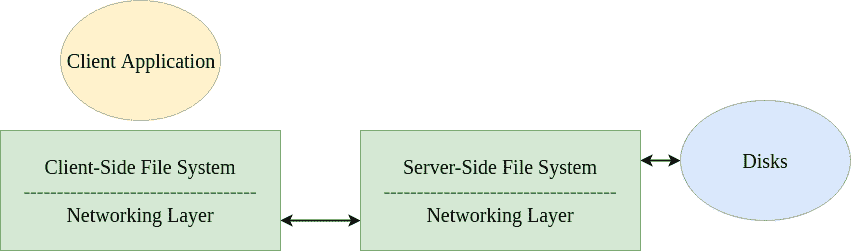

# 网络文件系统(NFS)

> 原文:[https://www.geeksforgeeks.org/network-file-system-nfs/](https://www.geeksforgeeks.org/network-file-system-nfs/)

分布式计算的出现以分布式文件系统的引入为标志。这种系统涉及多台客户机和一台或几台服务器。服务器将数据存储在其磁盘上，客户端可以通过一些协议消息请求数据。

**分布式文件系统的优势:**

*   允许在客户端之间轻松共享数据。
*   提供集中管理。
*   提供安全性，即必须只保护服务器以保护数据。

**分布式文件系统架构:**

即使是简单的客户机/服务器体系结构也比操作系统中以前讨论的物理文件系统包含更多的组件。该体系结构由一个**客户端文件系统**和一个**服务器端文件系统**组成。客户端应用程序发出**系统调用**(例如，读取()、写入()、打开()、关闭()等。)来访问客户端文件系统上的文件，客户端文件系统又从服务器检索文件。有趣的是，对于客户端应用程序来说，这个过程似乎与从物理磁盘请求数据没有什么不同，因为这样做不需要特殊的 API。这种现象在文件访问方面被称为**透明**。客户端文件系统执行命令来服务这些系统调用。

例如，假设客户端应用程序发出 read()系统调用。然后，客户端文件系统向服务器端文件系统发送消息，要求从服务器的磁盘中读取一个数据块，并将数据返回给客户端。最后，它将这些数据缓冲到 read()缓冲区中，并完成系统调用。

服务器端文件系统也简称为**文件服务器**。

**太阳的网络文件系统:**
最早成功的分布式系统可以归功于太阳微系统公司，它开发了网络文件系统(NFS)。NFSv2 是多年来遵循的标准协议，旨在实现简单快速的服务器崩溃恢复。这个目标在基于多客户端和单服务器的网络架构中至关重要，因为服务器崩溃的一瞬间意味着所有客户端都无法使用。整个系统瘫痪了。

有状态协议让崩溃变得复杂。考虑客户端 A 试图从服务器访问一些数据。然而，就在第一次读取后，服务器崩溃了。现在，当服务器启动并运行时，客户端 A 发出第二个读取请求。但是，服务器不知道客户端指的是哪个文件，因为所有这些信息都是临时的，在崩溃期间丢失了。

**无状态协议**来拯救我们。这样的协议被设计成不在服务器中存储任何状态信息。服务器不知道客户机正在做什么——它们正在缓存什么块，它们打开了哪些文件，以及它们当前的文件指针在哪里。服务器只需提供服务客户端请求所需的所有信息。如果发生服务器崩溃，客户端只需重试请求。由于简单，NFS 实现了无状态协议。

**文件句柄:**
NFS 使用文件句柄来唯一标识当前操作正在其上执行的文件或目录。这包括以下组件:

*   **卷标识符–**NFS 服务器可能有多个文件系统或分区。卷标识符告诉服务器正在引用哪个文件系统。
*   **索引节点号–**该号标识分区内的文件。
*   生成号–在重用信息节点号时使用该编号。

**文件属性:**
“文件属性”是 NFS 术语中常用的术语。这是跟踪文件元数据的统称，包括文件创建时间、上次修改时间、大小、所有权权限等。这可以通过在文件上调用 stat()来访问。

**NFSv2 协议:**
下面列出了一些常见的协议消息。

| 消息 | 描述 |
| --- | --- |
| nfsproc _ getattr | 给定文件句柄，返回文件属性。 |
| NFSPROC_SETATTR | 设置/更新文件属性。 |
| NFC _ LOOKUP | 给定要查找的文件句柄和文件名，返回文件句柄。 |
| NFC _ READ | 给定文件句柄、偏移量、计数数据和属性，读取数据。 |
| NFC _ WRITE | 给定文件句柄、偏移量、计数数据和属性，将数据写入文件。 |
| NFC _ CREATE | 给定目录句柄、文件名和属性，创建一个文件。 |
| NFC _ REMOVE | 给定目录句柄和文件名，删除文件。 |
| nfsproc _ mkdir | 给定目录句柄、目录名和属性，创建一个新目录。 |

LOOKUP 协议消息用于获取文件句柄，以便进一步访问数据。NFS 装载协议有助于获取文件系统中根目录(/)的目录句柄。如果客户端应用程序打开文件/abc.txt，客户端文件系统将通过根(/)文件句柄向服务器发送查找请求，查找名为 abc.txt 的文件。如果查找成功，将返回文件属性。

**客户端缓存:**
为了提高 NFS 的性能，分布式文件系统将数据以及从服务器读取的元数据缓存到客户端。这就是所谓的客户端缓存。这减少了后续客户端访问所需的时间。缓存还用作写入的临时缓冲区。这有助于提高效率，因为所有写入都是一次性写入服务器的。