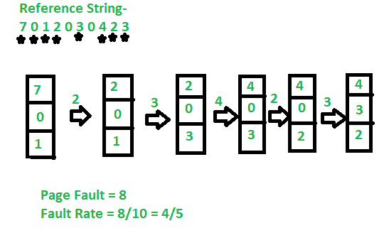

# 最近未使用(NRU)页面替换算法

> 原文:[https://www . geesforgeks . org/非最近使用-nru-page-replacement-algorithm/](https://www.geeksforgeeks.org/not-recently-used-nru-page-replacement-algorithm/)

是一个[页面替换算法](https://www.geeksforgeeks.org/page-replacement-algorithms-in-operating-systems/)。该算法从编号最低的非空类中随机移除一个页面。该算法隐含的意思是，删除至少一个时钟周期中未被引用的修改过的页面比删除大量使用的干净页面更好。

这很容易理解，实现起来效率适中，并且给出的性能虽然肯定不是最佳的，但可能是足够的。修改页面时，会设置一个修改位。当一个页面需要被替换时，操作系统将页面分成 4 类。

*   **0:-** 未引用，未修改
*   **1:-** 未引用，已修改
*   **2:-** 引用，未修改
*   **3:-** 引用、修改

在上述 4 个类别中，NRU 将替换一个**未被引用、未被修改的**页面，如果该页面存在的话。请注意，该算法意味着**已修改但未引用**不如**未修改且未引用**重要。

**示例–**

| 页 | 引用的 | 修改 |
| --- | --- | --- |
| Zero | one | Zero |
| one | Zero | one |
| Two | Zero | Zero |
| three | one | one |

*   案例 1 表示未被引用和修改。
*   案例 2 表示未引用和未修改。
*   案例 3 暗示“引用和修改”。
*   Case-0 表示“已引用”和“未修改”。

**算法:**
从给定的引用字符串中，NRU 将从最低编号的非空类中随机移除一页。该算法隐含的意思是，删除在至少一个时钟周期(通常为 20 毫秒)内未被引用的已修改页面比删除大量使用的干净页面更好。

**示例–**

