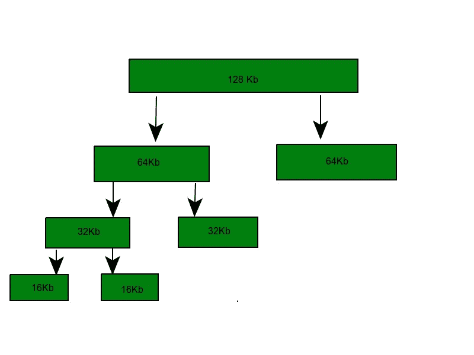
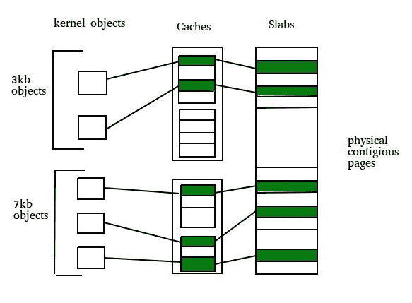

# 分配内核内存(伙伴系统和平板系统)

> 原文:[https://www . geesforgeks . org/operating-system-allocation-kernel-memory-buddy-system-slab-system/](https://www.geeksforgeeks.org/operating-system-allocating-kernel-memory-buddy-system-slab-system/)

先决条件–[伙伴系统](https://www.geeksforgeeks.org/operating-system-buddy-system-memory-allocation-technique/)

管理分配给内核进程的空闲内存的两种策略:

### 1.伙伴系统–

伙伴分配系统是一种算法，其中较大的存储块被分成小的部分来满足请求。该算法用于给出最佳拟合。block 的两个较小部分大小相同，称为伙伴。以同样的方式，两个伙伴中的一个将进一步分成更小的部分，直到请求被满足。这种技术的好处是两个伙伴可以根据内存请求组合形成更大的块。

*示例–*如果请求 25Kb，则分配 32Kb 大小的块。



**四种伙伴系统–**

1.  二元伙伴系统
2.  斐波那契伙伴系统
3.  加权伙伴系统
4.  三级伙伴系统

**为什么是哥们儿制？**
如果分区大小和进程大小不同，则会出现不匹配的情况，并且可能会低效使用空间。
易于实施且高效的动态分配。

**二进制伙伴系统–**
伙伴系统维护每个大小的空闲块的列表(称为空闲列表)，因此如果有空闲块，很容易找到所需大小的块。如果没有请求大小的块可用，分配会在第一个非空列表中搜索至少具有请求大小的块。在这两种情况下，都会从自由列表中删除一个块。

**示例–**假设内存段的大小最初为 256kb，内核请求 25kb 的内存。该片段最初被分成两个好友。让我们称 A1 和 A2 各为 128kb 大小。其中一个好友被进一步分成两个 64kb 的好友，比如 B1 和 B2。但是 25kb 的次高幂是 32kb，因此，B1 或 B2 被进一步分成两个 32kb 的好友(C1 和 C2)，最后使用其中一个好友来满足 25kb 的请求。拆分的块只能与其唯一的伙伴块合并，然后由伙伴块对拆分出的较大块进行重组。

**斐波那契伙伴系统–**
这是一个系统，其中块被分成大小，这些大小是斐波那契数。它满足以下关系:

```
  Zi = Z(i-1)+Z(i-2)
```

0, 1, 1, 2, 3, 5, 8, 13, 21, 34, 55, 144, 233, 377, 610.二进制和加权伙伴系统的地址计算是直截了当的，但是斐波那契伙伴系统的原始过程要么局限于小的、固定数量的块大小，要么是耗时的计算。

**优势–**

*   与其他更简单的技术(如动态分配)相比，伙伴内存系统几乎没有外部碎片。
*   伙伴存储器分配系统通过使用二叉树来表示已使用或未使用的分割存储器块来实现。
*   伙伴系统分配或释放内存的速度非常快。
*   在伙伴系统中，分配和释放一块内存的成本比最佳或第一适合算法的成本低。
*   另一个优势是合并。
*   地址计算很容易。

**什么是聚结？**
它被定义为相邻好友可以多快地组合成更大的片段，这被称为合并。
例如，当内核释放分配给它的 C1 单元时，系统可以将 C1 和 C2 合并成一个 64kb 的段。该片段 B1 又可以与其伙伴 B2 结合形成 128kb 的片段。最终我们可以得到最初的 256kb 片段。

**缺点–**
好友系统的主要缺点是内部碎片，因为需要获取更大的内存块。例如，如果发出一个 36 kb 的请求，那么它只能由 64 kb 的段来满足，剩余的内存将被浪费。

### 2.平板分配–

分配内核内存的第二种策略称为片分配。它消除了由分配和解除分配引起的碎片。此方法用于保留已分配的内存，该内存包含特定类型的数据对象，以便在后续分配相同类型的对象时重用。在块分配中，预先分配适合特定类型或大小的数据对象的内存块。缓存不会在使用后立即释放空间，尽管它会跟踪经常需要的数据，这样无论何时发出请求，数据都会很快到达。需要两个术语:

*   **平板–**平板由一个或多个物理上连续的页面组成。板是与包含缓存的特定类型的对象相关联的数据的实际容器。
*   **缓存–**缓存代表少量非常快的内存。缓存由一个或多个板组成。每个唯一的内核数据结构都有一个缓存。



**示例–**

*   用于表示进程描述符的数据结构的独立缓存
*   文件对象的独立缓存
*   信号量等的独立缓存。

每个缓存都填充有对象，这些对象是缓存所表示的内核数据结构的实例。例如，表示信号量的高速缓存存储信号量对象的实例，表示进程描述符的高速缓存存储进程描述符对象的实例。

**实现–**
平板分配算法使用缓存来存储内核对象。当创建缓存时，许多最初标记为空闲的对象被分配给缓存。缓存中的对象数量取决于关联板的大小。
*示例–*一个 12 kb 的板(由三个连续的 4 kb 页面组成)可以存储六个 2 kb 的对象。最初，缓存中的所有对象都被标记为空闲。当需要内核数据结构的新对象时，分配器可以从缓存中分配任何空闲对象来满足请求。从缓存分配的对象被标记为已使用。

在 linux 中，平板可能处于三种可能的状态之一:

1.  **满–**板中的所有对象都标记为已使用
2.  **空–**板中的所有对象都标记为空闲
3.  **部分–**板坯由两者组成

平板分配器首先尝试用部分平板中的自由对象来满足请求。如果不存在，则从空板中指定一个自由对象。如果没有空的板可用，则从连续的物理页面中分配一个新的板，并将其分配给缓存。

**平板分配器的优势–**

*   由于每个唯一的内核数据结构都有一个相关的缓存，因此不会因为碎片而浪费内存。
*   可以快速满足内存需求。
*   当对象被频繁分配或释放时，片分配方案对于管理特别有效。分配和释放内存的行为可能是一个耗时的过程。但是，对象是预先创建的，因此可以从缓存中快速分配。当内核完成一个对象并释放它时，它被标记为空闲并返回到它的缓存中，从而使它立即可供内核的后续请求使用。