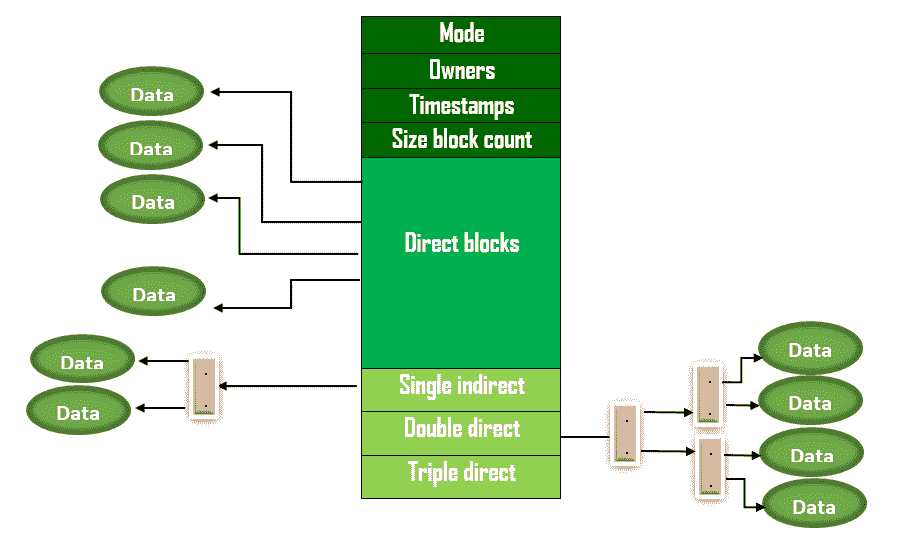

# 操作系统|第 10 集

> 原文:[https://www.geeksforgeeks.org/operating-systems-set-10/](https://www.geeksforgeeks.org/operating-systems-set-10/)

GATE 2008 CS 考试提出了以下问题。

**1)使用**
(A)连续分配
(B)链接分配
(C)索引分配
(D)索引分配的扩展来分配 Unix 文件系统中非常大的文件的数据块

答案(D)
Unix 文件系统使用索引分配的扩展。它使用直接块、单间接块、双间接块和三间接块。下图显示了 Unix 文件系统的实现。

[](https://media.geeksforgeeks.org/wp-content/uploads/operatingsystem.png)

****2)计数信号量的 P 和 V 运算，其中 s 是计数信号量，定义如下:****

```
P(s) : s =  s - 1;
  if (s  < 0) then wait;
V(s) : s = s + 1;
  if (s <= 0) then wakeup a process waiting on s; < pre>**假设 Pb 和 Vb 提供了对二进制信号量的等待和信号操作。两个二进制信号量 Xb 和 Yb 用于实现信号量操作 P 和 V，如下所示:**

```
P(s) : Pb(Xb);
  s = s - 1;
  if (s < 0) {
   Vb(Xb) ;
   Pb(Yb) ;
  }
  else Vb(Xb); 

V(s) : Pb(Xb) ;
  s = s + 1;
  if (s <= 0) vb(yb) ; vb(xb) < pre>**Xb 和 Yb 的初始值分别为** 
 (A) 0 和 0 
 (B) 0 和 1 
 (C) 1 和 0 
 (D) 1 和 1回答(C)
P(s)和 V(s)操作都是执行 Pb(xb)作为第一步。如果 Xb 为 0，则执行这些操作的所有进程都将被阻止。因此，Xb 必须为 1。
如果 Yb 为 1，则有可能两个进程可以一个接一个地执行 P(s)(意味着临界区有 2 个进程)。考虑 s = 1，y = 1 的情况。所以 Yb 一定是 0。

 ** 3)以下关于同步和异步 I/O 的说法，哪一个是不正确的？** 
 (A)在同步 I/O 中完成 I/O 时调用 ISR，但在异步 I/O 中不调用
 (B)在同步和异步 I/O 中，在 I/O 完成后调用 ISR(中断服务例程)
 (C)进行同步 I/O 调用的进程等待直到 I/O 完成，但进行异步 I/O 调用的进程不等待 I/O 完成
 (D)在同步 I/O 的情况下，进程等待回答(B) 
在输入/输出操作完成后，将调用中断服务例程，并将进程从阻塞状态置于就绪状态，*因为执行输入/输出操作的*进程被置于阻塞状态，直到在**同步输入/输出**中完成输入/输出操作。但是，执行输入/输出的进程不会被置于阻塞状态，进程继续执行**异步输入/输出**、*中的剩余指令，因为在执行输入/输出操作时将注册*处理程序功能，此时输入/输出操作完成信号机制用于通知进程数据可用。所以，选项(B)是假的。

**所有往年论文/解答/说明、教学大纲、重要日期、笔记等请见[门角](http://geeksquiz.com/gate-corner-2/)。**如果您发现任何答案/解释不正确，或者您想分享关于上述主题的更多信息，请写评论。=>
```

=>
```