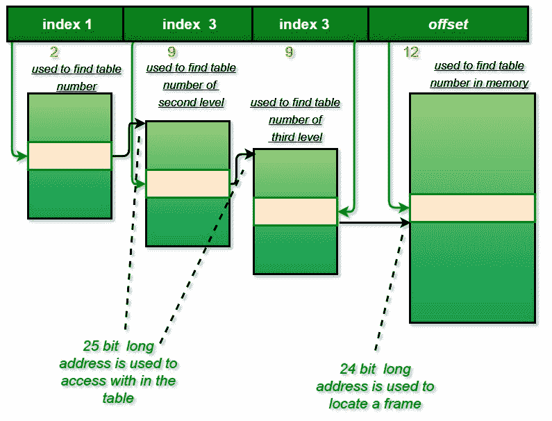

# 操作系统|第 11 集

> 原文:[https://www.geeksforgeeks.org/operating-systems-set-11/](https://www.geeksforgeeks.org/operating-systems-set-11/)

GATE 2008 CS 考试提出了以下问题。

**1)一个进程执行以下代码**

```
  for (i = 0; i < n; i++) fork(); 
```

**创建的子进程总数为**
(a)n
(b)2^n-1
(c)2^n
(d)2^(n+1-1；

答案(二)

```
         F0       // There will be 1 child process created by first fork
      /     \
    F1      F1    // There will be 2 child processes created by second fork
   /  \    /  \
 F2   F2  F2   F2  // There will be 4 child processes created by third fork
/ \   / \ / \  / \
 ...............   // and so on

```

如果我们对以上树的所有级别求和，i = 0 到 n-1，我们得到 2^n - 1。所以会有 2^n-1 子流程。详见[本](https://www.geeksforgeeks.org/fork-and-binary-tree/)帖。

**2)以下哪一项不是死锁预防和死锁避免方案？**
(A)在死锁预防中，如果结果状态是安全的
(B)在死锁避免中，如果结果状态是安全的
(C)死锁避免的限制性小于死锁预防
(D)死锁避免需要先验的资源需求知识

答案(A)
死锁预防方案通过确保四个必要条件之一不发生来处理死锁。在死锁预防中，即使结果状态是安全的，对资源的请求也可能不会被批准。(详见[高尔文图书幻灯片](http://codex.cs.yale.edu/avi/os-book/OS8/os8j/slide-dir/index.html)

**3)处理器使用 36 位物理地址和 32 位虚拟地址，页面帧大小为 4k 字节。每个页表条目的大小为 4 字节。三级页表用于虚拟到物理地址的转换，其中虚拟地址如下使用**
；位 30-31 用于索引到第一级页表
；位 21-29 用于索引到第二级页表
；位 12-20 用于索引到第三级页表，
位 0-11 作为页内偏移量
**一、二、三级页表的页表条目中寻址下一级页表(或页框)所需的位数分别为**
(A) 20、20、20
(B) 24、24、24
(C) 24、24、20
(D) 25、25、24

答案(D)
虚拟地址大小= 32 位
物理地址大小= 36 位
物理内存大小= 2^36 字节
页帧大小= 4K 字节= 2^12 字节
访问物理内存帧所需的位数= 36 - 12 = 24
因此在页表的第三级中，访问一个条目需要 24 位。

9 位虚拟地址用于访问二级页表条目，二级页的大小为 4 字节。所以二级页表的大小是(2^9)*4 = 2^11 字节。这意味着有(2^36)/(2^11)可能的位置来存储这个页表。因此，第二页表需要 25 位来寻址。同样，第三页表需要 25 位来寻址。



**所有往年论文/解答/说明、教学大纲、重要日期、笔记等请见[门角](http://geeksquiz.com/gate-corner-2/)。**

如果您发现任何答案/解释不正确，或者您想分享关于上述主题的更多信息，请写评论。