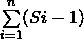
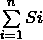

# 操作系统|第 16 集

> 原文:[https://www.geeksforgeeks.org/operating-systems-set-16/](https://www.geeksforgeeks.org/operating-systems-set-16/)

GATE CS 2005 考试提出了以下问题。

**1)通常情况下，用户程序被其中的输入输出指令阻止直接处理输入输出。对于具有显式输入/输出指令的处理器，这种输入/输出保护是通过使输入/输出指令具有特权来确保的。在内存映射输入输出的中央处理器中，没有显式的输入输出指令。对于具有内存映射输入/输出的中央处理器，以下哪一项是正确的？**
(a) I/O 保护由操作系统例程
保证(b) I/O 保护由硬件陷阱
保证(c) I/O 保护在系统配置期间保证
(d) I/O 保护不可能

回答(a)
内存映射输入/输出是指通过一般内存访问来访问输入/输出，而不是专门的输入/输出指令。一个例子，

```
  unsigned int volatile const *pMappedAddress const = (unsigned int *)0x100;
```

所以，程序员可以直接访问任何内存位置。为了防止这种访问，操作系统(内核)会将地址空间分为内核空间和用户空间。用户应用程序可以轻松访问用户应用程序。为了访问内核空间，我们需要系统调用(陷阱)。
感谢文基提供上述解释。

**2)磁盘中的交换空间用于什么？**
(a)保存临时 html 页面
(b)保存过程数据
(c)存储超级块
(d)存储设备驱动程序

回答(b)
交换空间通常用于存储过程数据。详见[本](http://www.centos.org/docs/5/html/5.1/Deployment_Guide/s1-swap-what-is.html)。

**3)增加计算机的 RAM 通常会提高性能，因为:**
(a)虚拟内存增加
(b)RAM 越大越快
(c)页面错误越少
(d)分段错误越少

答案(c)

**4)假设 n 个进程，P1，…。Pn 共享 m 个相同的资源单元，可以一次保留和释放一个。工艺 Pi 最大资源需求为 Si，其中 Si > 0。以下哪一项是确保不会发生死锁的充分条件？**


答案(c)
在极端情况下，所有进程都获取 Si-1 资源，需要多 1 个资源。因此，以下条件必须为真，以确保死锁不会发生。



< m

上面的表达式可以写成如下。



**5)考虑以下代码片段:**

```
  if (fork() == 0)
  { a = a + 5; printf(“%d,%d\n”, a, &a); }
  else { a = a –5; printf(“%d, %d\n”, a, &a); } 
```

**设 u、v 为父进程打印的值，x、y 为子进程打印的值。以下哪一项是正确的？**
(a) u = x + 10 和 v = y
(b) u = x + 10 和 v！= y
(c) u + 10 = x 和 v = y
(d) u + 10 = x 和 v！= y

答案(c)
fork()在子进程中返回 0，在父进程中返回子进程的进程 ID。
在子(x)中，a = a + 5
在父(u)中，a = a–5；
因此 x = u + 10。
父母和孩子中“a”的物理地址必须不同。但是我们的程序访问虚拟地址(假设我们运行在使用虚拟内存的操作系统上)。子进程获得父进程的精确副本，并且“a”的虚拟地址在子进程中不会改变。因此，我们在父代和子代中获得相同的地址。参见[本](http://ideone.com/ckhWR)运行举例。
感谢智能指针提供以上解释。

**请参见**[**GATE Corner**](http://geeksquiz.com/gate-corner-2/)**查看往年所有论文/解答/说明、教学大纲、重要日期、笔记等。**

如果您发现任何答案/解释不正确，或者您想分享关于上述主题的更多信息，请写评论。