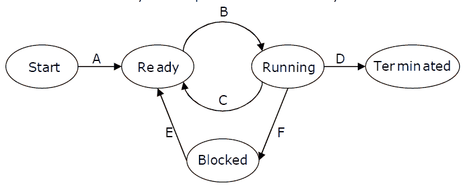

# 操作系统|第 9 集

> 原文:[https://www.geeksforgeeks.org/operating-systems-set-9/](https://www.geeksforgeeks.org/operating-systems-set-9/)

GATE 2009 CS 考试提出了以下问题。

**1)在以下单处理器系统的进程状态转换图中，假设总是有一些进程处于就绪状态:现在考虑以下语句:
[](https://media.geeksforgeeks.org/wp-content/cdn-uploads/gate2009.png) 
I .如果一个进程进行转换 D，将导致另一个进程立即进行转换 A。
二。处于阻塞状态的进程 P2 可以进行转换 E，而另一个进程 P1 处于运行状态。
三。操作系统使用抢先调度。
IV。操作系统使用非抢先调度。
以上陈述哪一项是正确的？**
(一)一、二
(二)一、三
(三)二、三
(四)二、四

答案(C)
我是假的。如果一个进程进行转换 D，将导致另一个进程进行转换 B，而不是 a。
II 为真。当输入/输出完成时，一个进程可以移动到就绪状态，而不管其他进程是否处于运行状态。
三是真的，因为有一个从运行到就绪状态的过渡。
IV 为假，因为 OS 使用抢先调度。

**2)实现过程关键部分的 enter_CS()和 leave_CS()功能使用测试和设置指令实现如下**:

```
void enter_CS(X)
{
    while test-and-set(X) ;
}
void leave_CS(X)
{
   X = 0;
}
```

**在上述解决方案中，X 是与 CS 相关联的存储器位置，并且被初始化为 0。现在考虑以下语句:
I .以上 CS 问题的解决方案是无死锁的
II。解决办法是免于饥饿。
三。流程按照先进先出的顺序进入控制系统。
IV 多个进程可以同时进入 CS。**
**以上哪个说法是正确的？**
(A)仅限 I
(B)仅限 I 和 II
(C)仅限 II 和 III
(D)仅限 IV

回答(A)
上面的解决方案是一个简单的[测试和设置](http://en.wikipedia.org/wiki/Test-and-set)解决方案，确保不会发生死锁，但它不使用任何队列来避免饥饿或具有先进先出顺序。

**3)与用于将虚拟地址转换为物理地址的单级页表相比，多级页表是优选的，因为**
(A)它减少了读取或写入存储器位置的存储器访问时间。
(B)有助于减小实现进程虚拟地址空间所需的页表大小。
(C)翻译后备缓冲器需要。
(D)有助于减少页面替换算法中的页面错误数量。

答案(B)
页表的大小可能会变得太大(见[本](http://dysphoria.net/OperatingSystems1/4_multilevel_paging.html))以至于无法容纳在连续的空间中。这就是为什么页表通常是按级别划分的。

**所有往年论文/解答/说明、教学大纲、重要日期、笔记等请见[门角](http://geeksquiz.com/gate-corner-2/)。**

如果您发现任何答案/解释不正确，或者您想分享关于上述主题的更多信息，请写评论。