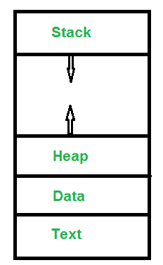

# 流程操作

> 原文:[https://www.geeksforgeeks.org/operations-on-processes/](https://www.geeksforgeeks.org/operations-on-processes/)

**[进程](https://www.geeksforgeeks.org/introduction-of-process-management/) :** 进程是执行程序的活动。基本上，它是一个正在执行的程序。每个进程都需要一定的资源来完成它的任务。

**对流程的操作:**
流程的执行是一项复杂的活动。它涉及各种操作。以下是执行流程时执行的操作:

**1。创建:**这是流程执行活动的第一步。流程创建意味着为执行构建一个新的流程。这可能是由系统、用户或旧进程本身执行的。有几个事件会导致流程创建。以下是一些此类事件:

*   当我们启动计算机时，系统会创建几个后台进程。
*   用户可以请求创建新流程。
*   进程可以在执行时自己创建一个新的进程。
*   批处理系统启动批处理作业。

**2。计划/调度:**流程状态从就绪变为运行的事件或活动。这意味着操作系统将进程从就绪状态置于运行状态。当资源空闲或进程比正在进行的进程具有更高的优先级时，调度由操作系统完成。还有各种其他情况，其中运行状态的进程被抢占，就绪状态的进程由操作系统调度。

**3。阻塞:**当一个进程调用一个输入输出系统调用，阻塞进程，操作系统进入阻塞模式。块模式基本上是一种进程等待输入输出的模式。因此，根据进程本身的要求，操作系统阻塞该进程并将另一个进程分派给处理器。因此，在进程阻塞操作中，操作系统将进程置于“等待”状态。

**4。抢占:**当超时发生时，意味着该进程没有在分配的时间间隔内终止，并且下一个进程准备执行，那么操作系统抢占该进程。此操作仅在 CPU 调度支持抢占的情况下有效。基本上，这发生在优先级调度中，在进入高优先级进程时，正在进行的进程被抢占。因此，在进程抢占操作中，操作系统将进程置于“就绪”状态。

**5。终止:**流程终止是结束流程的活动。换句话说，进程终止是进程为执行而占用的计算机资源的放松。与创建一样，在终止中也可能有几个事件会导致流程终止。其中一些是:

*   进程完全完成其执行，并向操作系统表明它已经完成。
*   由于服务错误，操作系统本身会终止进程。
*   终止进程的硬件可能有问题。
*   一个进程可以被另一个进程终止。