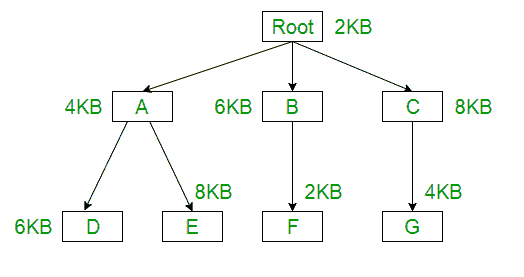

# 内存管理中的覆盖

> 原文:[https://www . geesforgeks . org/overlays-in-memory-management/](https://www.geeksforgeeks.org/overlays-in-memory-management/)

固定分区的主要问题是进程的大小必须受到分区最大大小的限制，这意味着一个进程永远不能跨越另一个进程。为了解决这个问题，早期的人们使用了一些称为覆盖的解决方案。

**覆盖**的概念是，每当一个进程运行时，它不会同时使用整个程序，它只会使用其中的一部分。然后叠加概念说，无论你需要什么零件，你都要加载它，一旦零件完成，你就卸载它，意思是把它拉回来，得到你需要的新零件并运行它。
形式上，
“将程序代码块或其他数据转移到内存中，替换已存储内容的过程”**。
有时会发生这样的情况，与最大分区的大小相比，程序的大小会更大，那么，在这种情况下，您应该使用覆盖。**

所以覆盖是一种技术，通过只保留那些在任何给定时间需要的指令和数据来运行一个比物理内存大的程序。将程序分成模块，这样就不需要所有模块同时在内存中。

**优势–**

*   降低内存需求
*   减少时间需求

**劣势–**

*   重叠图必须由程序员指定
*   程序员必须知道内存需求
*   重叠模块必须完全分离
*   覆盖层结构的编程设计是复杂的，并非在所有情况下都是可能的

**示例–**
叠加的最佳示例是汇编器。假设汇编程序有两次通过，两次通过意味着在任何时候它只做一件事，要么是第一次通过，要么是第二次通过。这意味着它将首先完成第一遍，然后完成第二遍。假设可用的主内存大小为 150 千字节，总代码大小为 200 千字节

```
Pass 1.......................70KB
Pass 2.......................80KB
Symbol table.................30KB
Common routine...............20KB
```

由于总代码大小为 200KB，主内存大小为 150KB，因此不可能一起使用 2 遍。所以，在这种情况下，我们应该使用叠加技术。根据叠加概念，任何时候都只使用一个通道，两个通道都需要符号表和通用例程。现在的问题是，如果 overlays-driver*是 10KB，那么所需的最小分区大小是多少？对于第一遍，所需的总内存为= (70KB + 30KB + 20KB + 10KB) = 130KB，对于第二遍，所需的总内存为= (80KB + 30KB + 20KB + 10KB) = 140KB。因此，如果我们有最小 140 千字节大小的分区，那么我们可以非常容易地运行这段代码。

*覆盖驱动:-负责覆盖是用户的责任，操作系统不会提供任何东西。这意味着用户甚至应该写第一遍需要什么部分，一旦第一遍结束，用户应该写代码拉出第一遍并加载第二遍。这就是用户的责任，也就是所谓的覆盖驱动。覆盖驱动程序将帮助我们移出和移入代码的各个部分。

**问题–**
一个节目的叠加树如下所示:



加载(和
运行)这个程序所需的分区大小(在物理内存中)是多少？
(a) 12 KB (b) 14 KB (c) 10 KB (d) 8 KB

**解释–**
使用叠加概念，我们实际上不需要将整个程序放在主内存中。只有我们需要在那个时候需要的部分，要么我们需要根-A-D 或根-A-E 或根-B-F 或根-C-G 部分。

```
Root+A+D = 2KB + 4KB + 6KB = 12KB
Root+A+E = 2KB + 4KB + 8KB = 14KB
Root+B+F = 2KB + 6KB + 2KB = 10KB
Root+C+G = 2KB + 8KB + 4KB = 14KB
```

因此，如果我们有 14KB 大小的分区，那么我们可以运行其中的任何一个。
答案-(b) 14KB

本文由 [**萨米特·曼德尔**](https://auth.geeksforgeeks.org/profile.php?user=Samit Mandal) 供稿。如果你喜欢 GeeksforGeeks 并想投稿，你也可以使用[write.geeksforgeeks.org](https://write.geeksforgeeks.org)写一篇文章或者把你的文章邮寄到 review-team@geeksforgeeks.org。看到你的文章出现在极客博客主页上，帮助其他极客。

如果你发现任何不正确的地方，或者你想分享更多关于上面讨论的话题的信息，请写评论。