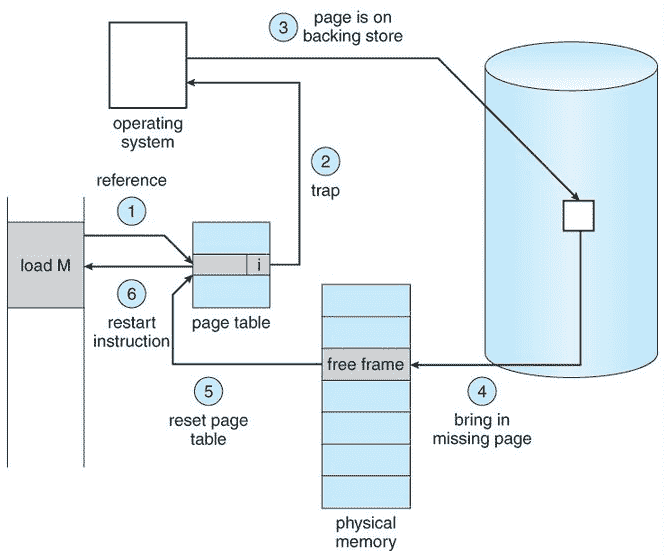

# 操作系统页面故障处理

> 原文:[https://www . geesforgeks . org/page-操作系统中的故障处理/](https://www.geeksforgeeks.org/page-fault-handling-in-operating-system/)

当程序试图访问其地址空间中但当前不在系统内存中的数据或代码时，就会发生页面错误。因此，当页面错误发生时，会发生以下一系列事件:

*   内核和程序计数器的计算机硬件陷阱保存在堆栈上。当前指令状态信息保存在中央处理器寄存器中。
*   启动一个汇编程序来保存通用寄存器和其他易失性信息，以防止操作系统破坏它。
*   操作系统发现出现了页面错误，并试图找出需要哪个虚拟页面。有时硬件寄存器包含这种必需的信息。如果没有，操作系统必须检索电脑，获取指令，并找出故障发生时它在做什么。
*   一旦知道是虚拟地址导致了页面错误，系统会检查地址是否有效，并检查是否不存在保护访问问题。
*   如果虚拟地址有效，系统会检查页面框架是否空闲。如果没有空闲帧，则运行页面替换算法来移除页面。
*   如果选择的帧是脏的，页面被安排传输到磁盘，上下文切换发生，故障进程暂停，另一个进程运行，直到磁盘传输完成。
*   一旦页面框架清理干净，操作系统就会在需要页面的地方查找磁盘地址，安排磁盘操作来获取页面。
*   当磁盘中断指示页面已经到达时，页面表被更新以反映其位置，并且帧被标记为处于正常状态。
*   出错指令被备份到开始时的状态，电脑被重置。故障被安排，操作系统返回到调用它的例程。
*   汇编例程重新加载寄存器和其他状态信息，返回用户空间继续执行。

**参考文献–**

[professormerwyn.wordpress.com](https://professormerwyn.wordpress.com/2015/10/16/steps-for-handling-page-fault/)

本文由 **Swasthik** 供稿。如果你喜欢极客博客并想投稿，你也可以用 contribute.geeksforgeeks.org 写一篇文章或者把你的文章邮寄到 contribute@geeksforgeeks.org。看到你的文章出现在极客博客主页上，帮助其他极客。

如果你发现任何不正确的地方，或者你想分享更多关于上面讨论的话题的信息，请写评论。