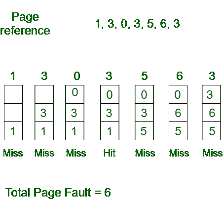
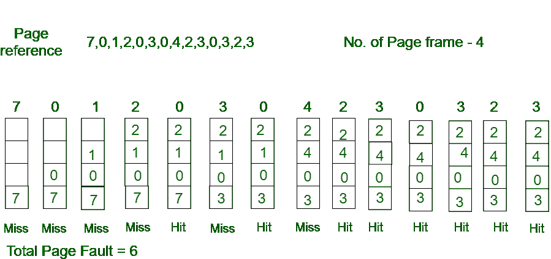
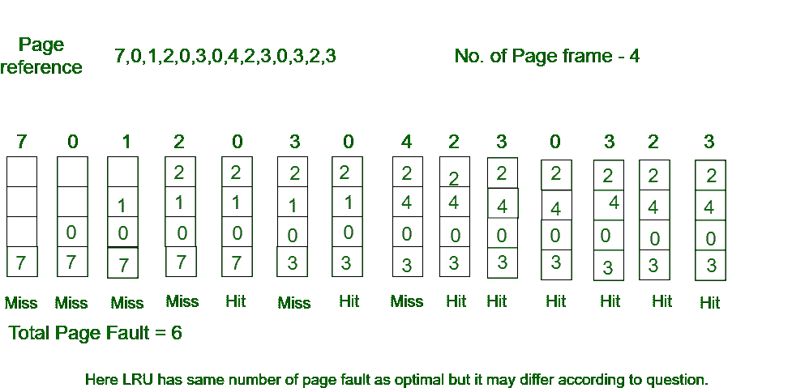

# 操作系统中的页面替换算法

> 原文:[https://www . geesforgeks . org/page-replacement-in-operating-system 算法/](https://www.geeksforgeeks.org/page-replacement-algorithms-in-operating-systems/)

在使用分页进行内存管理的操作系统中，需要一个页面替换算法来决定新页面进入时需要替换哪个页面。

**页面错误–**当正在运行的程序访问映射到虚拟地址空间但未加载到物理内存中的内存页面时，就会发生页面错误。

由于实际物理内存比虚拟内存小得多，因此会发生页面错误。在页面出错的情况下，操作系统可能必须用新需要的页面替换一个现有页面。不同的页面替换算法建议不同的方法来决定替换哪个页面。所有算法的目标都是减少页面错误的数量。

**页面替换算法:**

**1。先进先出(FIFO)–**
这是最简单的页面替换算法。在这种算法中，操作系统跟踪队列中内存的所有页面，最旧的页面在队列的前面。当一个页面需要被替换时，队列前面的页面被选择删除。
**示例-1** 考虑具有 3 个页面框架的页面引用字符串 1、3、0、3、5、6。查找页面错误的数量。

最初，所有插槽都是空的，因此当 1、3、0 出现时，它们被分配给空插槽—> **3 页故障。**
当 3 来临时，它已经在内存中了所以——>**0 页面错误。**
然后 5 来了，它在内存中不可用，所以它取代了最老的页槽，即 1。— > **1 页故障。**
6 来了，它在内存中也不可用，所以它取代了最旧的页槽，即 3 — > **1 页故障。**
最后，当 3 出现时，它不可用，因此它取代了 0 **1 页面故障**

[**贝拉蒂异常**](https://www.geeksforgeeks.org/operating-system-beladys-anomaly/)**–**贝拉蒂异常证明了在使用先进先出(FIFO)页面替换算法的同时增加页面帧数时，有可能出现更多的页面错误。例如，如果我们考虑引用字符串 3、2、1、0、3、2、4、3、2、1、0、4 和 3 个槽，我们总共得到 9 个页面错误，但是如果我们将槽增加到 4 个，我们得到 10 个页面错误。

**2。最佳页面替换–**
在该算法中，替换未来最长时间内不会使用的页面。
**示例-2:** 考虑页面引用 7、0、1、2、0、3、0、4、2、3、0、3、2，共 4 页框架。查找页面错误数。

最初，所有插槽都是空的，因此当 7 0 1 2 被分配给空插槽时—> **4 页故障**
0 已经存在，因此— > **0 页故障。**
当 3 到来时，它将取代 7，因为它在未来的最长时间内不会被使用。— > **1 页故障。**
0 已经在那里了所以——>**0 页面故障。**。
4 将发生 1 — > **1 页故障。**

现在是进一步的页面引用字符串—> **0 页面错误**，因为它们已经在内存中可用。
最佳页面替换是完美的，但实际上是不可能的，因为操作系统无法知道未来的请求。最佳页面替换的用途是建立一个基准，以便可以根据它分析其他替换算法。

**3。最近最少使用–**
在此算法页面中将替换最近最少使用的页面。
**示例-3** 考虑具有 4 个页面框架的页面引用字符串 7、0、1、2、0、3、0、4、2、3、0、3、2。查找页面错误的数量。

最初，所有插槽都是空的，因此当 7 0 1 2 被分配给空插槽时—> **4 页故障**
0 已经是它们的 so — > **0 页故障。**
当 3 出现时，它将取代 7，因为它最近使用最少— > **1 页面故障**
0 已经在内存中，因此— > **0 页面故障**。
4 将取代 1 — > **1 页面错误**
现在为进一步的页面引用字符串— > **0 页面错误**，因为它们已经在内存中可用。

**GATE CS 角题**

练习下列问题将帮助你测试你的知识。所有的问题在前几年的 GATE 考试或 GATE 模拟考试中都被问过。强烈建议你练习一下。

1.  [内存管理|问题 1](https://www.geeksforgeeks.org/operating-systems-memory-management-question-1/)
2.  [内存管理|问题 10](https://www.geeksforgeeks.org/operating-systems-memory-management-question-7/)
3.  [GATE CS 2014(第 1 集)，第 65 题](https://www.geeksforgeeks.org/gate-gate-cs-2014-set-1-question-43/)
4.  [GATE CS 2012，第 40 题](https://www.geeksforgeeks.org/gate-gate-cs-2012-question-42/)
5.  [GATE CS 2007，问题 56](https://www.geeksforgeeks.org/gate-gate-cs-2007-question-56/)
6.  [GATE CS 2007，问题 82](https://www.geeksforgeeks.org/gate-gate-cs-2007-question-82/)
7.  [GATE CS 2007，问题 83](https://www.geeksforgeeks.org/gate-gate-cs-2007-question-83/)
8.  [GATE CS 2014(第 3 集)，第 65 题](https://www.geeksforgeeks.org/gate-gate-cs-2014-set-3-question-30/)
9.  [GATE CS 2002 第 23 题](https://www.geeksforgeeks.org/gate-gate-cs-2002-question-23/)
10.  [GATE CS 2001，问题 21](https://www.geeksforgeeks.org/gate-gate-cs-2001-question-21/)
11.  [GATE CS 2010，第 24 题](https://www.geeksforgeeks.org/gate-gate-cs-2010-question-24/)

**参考–**
[贝拉斯蒂的异常](https://en.wikipedia.org/wiki/B%C3%A9l%C3%A1dy%27s_anomaly)

本文由 [RajshreeSrivastava](https://auth.geeksforgeeks.org/user/RajshreeSrivastava) 进行了改进。如果你发现任何不正确的地方，请写评论，或者你想分享更多关于上面讨论的话题的信息