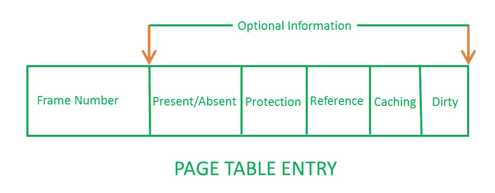

# 页表中的页表条目

> 原文:[https://www . geesforgeks . org/page-table-entries-in-page-table/](https://www.geeksforgeeks.org/page-table-entries-in-page-table/)

**先决条件–**[寻呼](https://www.geeksforgeeks.org/operating-system-paging/)

页表具有页表条目，其中每个页表条目存储帧号和可选的状态(如保护)位。虚拟内存系统中使用的许多状态位。PTE 中最重要的**是**帧数**。**

****页表条目有以下信息–****

****

1.  ****帧号–**给出当前页面所在的帧号。所需的位数取决于帧数。帧位也称为地址转换位。

    ```
    Number of bits for frame = Size of physical memory/frame size

    ```** 
2.  ****存在/不存在位–**存在或不存在位表示您正在寻找的特定页面是存在还是不存在。如果不存在，则称为页面错误。如果相应的页面不在内存中，则设置为 0。用于操作系统控制页面错误以支持虚拟内存。有时该位也被称为**有效/无效**位。**
3.  ****保护位–**保护位表示你在那一页想要什么样的保护。所以，这些位用于保护页框(读、写等)。**
4.  ****参考位–**参考位表示该页是否在最后一个时钟周期内被参考。当页面被访问时，硬件将其设置为 1。**
5.  ****启用/禁用缓存–**有时我们需要新数据。假设用户正在从键盘上键入一些信息，您的程序应该根据用户给出的输入运行。在这种情况下，信息将进入主存储器。因此，主存储器包含用户键入的最新信息。现在，如果您尝试将该页面放入缓存，该缓存将显示旧信息。因此，每当需要新鲜度时，我们都不想使用缓存或多级内存。最靠近中央处理器的信息和最靠近用户的信息可能不同。因此，我们希望信息必须是一致的，这意味着无论用户给出了什么信息，中央处理器都应该能够尽可能先看到它。这就是我们想要禁用缓存的原因。因此，该位**启用或禁用页面的**缓存。**
6.  ****Modified bit –** Modified bit says whether the page has been modified or not. Modified means sometimes you might try to write something on to the page. If a page is modified, then whenever you should replace that page with some other page, then the modified information should be kept on the hard disk or it has to be written back or it has to be saved back. It is set to 1 by hardware on write-access to page which is used to avoid writing when swapped out. Sometimes this modified bit is also called as the **Dirty bit**.

    **GATE CS 角题**

    练习下列问题将帮助你测试你的知识。所有的问题在前几年的 GATE 考试或 GATE 模拟考试中都被问过。强烈建议你练习一下。

    1.  [GATE CS 2001，问题 46](https://www.geeksforgeeks.org/gate-gate-cs-2001-question-46/)
    2.  [GATE CS 2004，问题 66](https://www.geeksforgeeks.org/gate-gate-it-2004-question-66/)
    3.  [GATE CS 2015(第 1 集)，第 65 题](https://www.geeksforgeeks.org/gate-gate-cs-2015-set-1-question-22/)

    本文由 [**萨米特·曼德尔**](https://auth.geeksforgeeks.org/profile.php?user=Samit Mandal) 供稿。如果你喜欢 GeeksforGeeks 并想投稿，你也可以使用[contribute.geeksforgeeks.org](http://www.contribute.geeksforgeeks.org)写一篇文章或者把你的文章邮寄到 contribute@geeksforgeeks.org。看到你的文章出现在极客博客主页上，帮助其他极客。

    如果你发现任何不正确的地方，或者你想分享更多关于上面讨论的话题的信息，请写评论。**