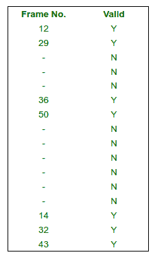
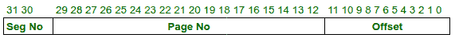
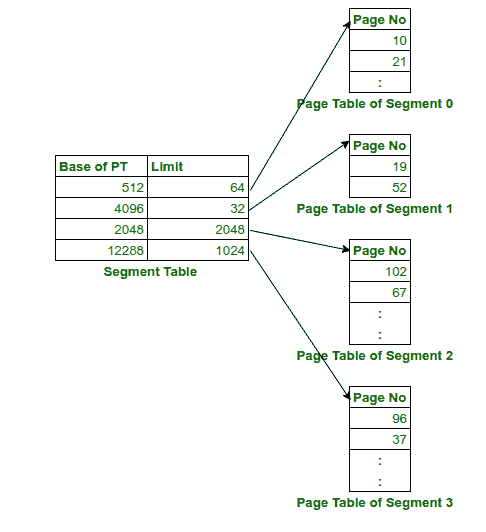
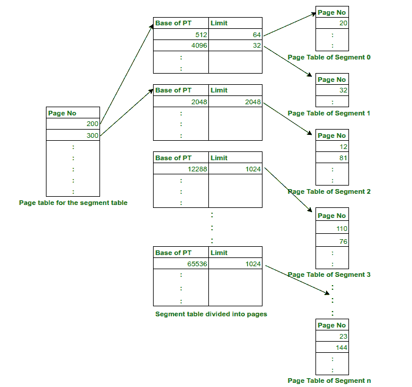

# 分页分段和分段分页

> 原文:[https://www . geesforgeks . org/paged-segmented-and-segmented-paging/](https://www.geeksforgeeks.org/paged-segmentation-and-segmented-paging/)

**单级分页的主要限制**
单级分页的一大挑战是，如果逻辑地址空间很大，那么页表可能会占用大量内存空间。例如，考虑到逻辑地址是 32 位且每页是 4 KB，页数将是 2^20 页。没有附加位的页表大小为 20 位* 2 20 或 2.5 兆字节。由于每个进程都有自己的页表，所以当使用单级分页时会消耗大量内存。对于具有 64 位逻辑地址的系统，即使是单个进程的页表也不能放入主存储器。对于一个逻辑地址空间很大的进程，它的很多页表条目都是无效的，因为很多逻辑地址空间没有被使用。

包含无效条目的页表

**分段分页**
解决这个问题的一个方法是使用分段和分页来减少页表的大小。传统上，一个程序分为四段，即代码段、数据段、堆栈段和堆段。

流程的各个部分

可以通过为每个段创建页表来减小页表的大小。要实现这一点，需要硬件支持。由中央处理器提供的地址现在将被划分为段号、页号和偏移量。

内存管理单元(MMU)将使用段表，该段表将包含页表(基)的地址和限制。页表将指向主存中各段的页框。

分段分页

**分段寻呼的优势**

1.  页表的大小减少了，因为页只为段的数据而存在，因此减少了内存需求。
2.  给出了程序员的观点以及分页的优点。
3.  与分段相比，减少了外部碎片。
4.  由于整个段不需要换出，换出到虚拟内存变得更加容易。

**分段分页的缺点**

1.  页面中仍然存在内部碎片。
2.  需要额外的硬件
3.  翻译变得更加有序，增加了内存访问时间。
4.  在当今的系统中，由于页表和段表的大小不同，会出现外部碎片。

**分页分段**

1.  在分段分页中，不是每个进程都有相同数量的段，并且段表的大小可能很大，这将由于段表大小的变化而导致外部碎片。为了解决这个问题，我们使用**分页分段**，需要对段表进行分页。CPU 生成的逻辑地址现在将由第 1 页、段号、第 2 页和偏移量组成。
2.  即使使用分段分页，页表也会有很多无效页。不使用多级分页和分段分页，直接应用多级分页代替分段分页可以解决页表较大的问题。

分页分段

**分页分段的优势**

1.  没有外部碎片
2.  由于页数受限于段大小，降低了内存需求。
3.  页表大小更小，就像分段分页一样，
4.  与分段分页类似，整个段不需要换出。

**分页分段的缺点**

1.  内部分裂仍然是一个问题。
2.  硬件比分段分页复杂。
3.  第一阶段额外的分页增加了内存访问的延迟。