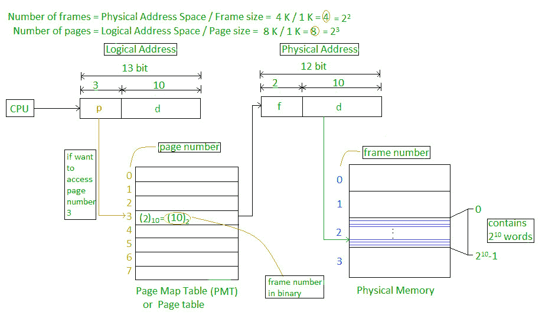
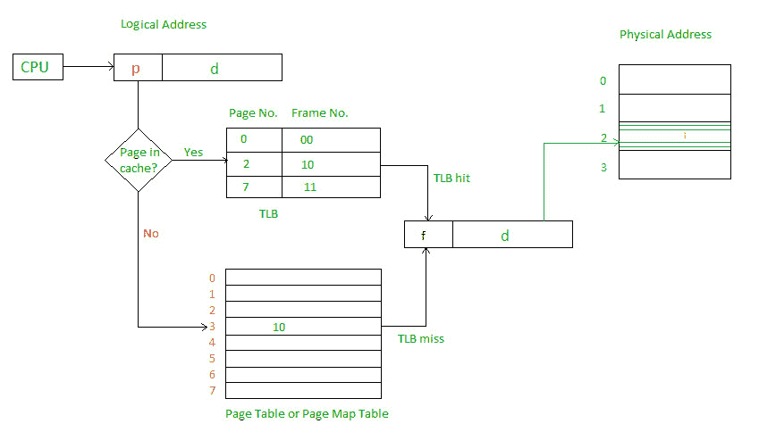
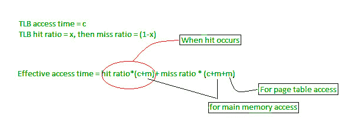

# 操作系统中的分页

> 原文:[https://www.geeksforgeeks.org/paging-in-operating-system/](https://www.geeksforgeeks.org/paging-in-operating-system/)

分页是一种内存管理方案，无需连续分配物理内存。该方案允许进程的物理地址空间是非连续的。

*   逻辑地址或虚拟地址(以位表示):由中央处理器产生的地址
*   逻辑地址空间或虚拟地址空间(用字或字节表示):程序产生的所有逻辑地址的集合
*   物理地址(以位表示):内存单元上实际可用的地址
*   物理地址空间(用字或字节表示):对应于逻辑地址的所有物理地址的集合

**示例:**

*   如果逻辑地址= 31 位，则逻辑地址空间= 2 31 字= 2 G 字(1 G = 2 30 )
*   如果逻辑地址空间= 128 M 字= 2 7 * 2 20 字，则逻辑地址=日志 2 2 27 = 27 位
*   如果物理地址= 22 位，那么物理地址空间= 2 22 字= 4 M 字(1 M = 2 20
*   如果物理地址空间= 16 M 字= 2 4 * 2 20 字，那么物理地址=日志 2 2 24 = 24 位

从虚拟地址到物理地址的映射是由作为硬件设备的内存管理单元完成的，这种映射被称为分页技术。

*   物理地址空间在概念上被分成许多固定大小的块，称为**帧**。
*   逻辑地址空间也被分成固定大小的块，称为**页**。
*   页面大小=框架大小

让我们考虑一个例子:

*   物理地址= 12 位，那么物理地址空间= 4 K 个字
*   逻辑地址= 13 位，那么逻辑地址空间= 8 K 个字
*   页面大小=框架大小= 1 K 字(假设)

由中央处理器产生的地址分为

*   **页码(p):** 在逻辑地址空间或页码中表示页面所需的位数
*   **页面偏移量(d):** 逻辑地址空间的页面或页面大小中表示特定字所需的位数或页面或页面偏移量的字数。

物理地址分为

*   **帧号(f):** 表示物理地址空间的帧或帧号所需的位数。
*   **帧偏移(d):** 表示物理地址空间的帧或帧大小中的特定字或帧或帧偏移的字号所需的位数。

页表的硬件实现可以通过使用专用寄存器来完成。但是只有当页表很小时，页表寄存器的使用才是令人满意的。如果页表包含大量条目，那么我们可以使用 TLB(翻译后备缓冲器)，一种特殊的、小的、快速的查找硬件缓存。

*   TLB 是联想高速记忆。
*   TLB 的每个条目由两部分组成:标签和值。
*   When this memory is used, then an item is compared with all tags simultaneously.If the item is found, then corresponding value is returned.

    

    主存储器访问时间= m
    如果页表保存在主存储器中，
    有效访问时间= m(对于页表)+ m(对于页表中的特定页)

    