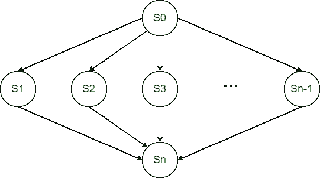
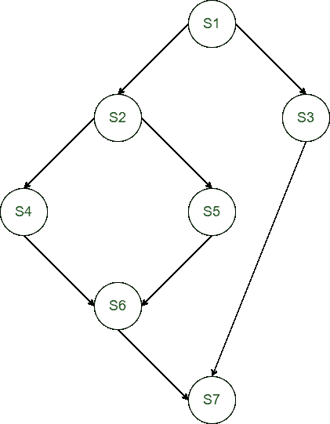

# Parbegin/Parend 并发语句

> 原文:[https://www . geesforgeks . org/parbegin-parend-concurrent-statement/](https://www.geeksforgeeks.org/parbegin-parend-concurrent-statement/)

先决条件–[进程同步介绍](https://www.geeksforgeeks.org/introduction-of-process-synchronization/)
**PARBEGIN/PAREND** 语句是一种用于指定并发性的高级语言构造。所有包含在 **PARBEGIN** 和 **PAREND** 之间的语句都可以同时执行。它用于对优先图建模。它被用作 FORK/JOIN 语句的替代语句。

**注–**
PARBEGIN/PAREND 也叫 COBEGIN/COEND。

考虑以下程序:

```
S0;
PARBEGIN;
   S1;
   S2;
   ...
   Sn-1;
PAREND;
Sn;
```

上面的程序相当于下面的优先图。



**示例–**
为以下 parbegin/parend 程序构建优先图。

```
begin
S1;
      parbegin
      S3;
      begin
      S2;
            parbegin
            S4;
            S5;
            parend;
            S6;
      end;
      parend;
S7;
end;
```

**说明:**



**我们还可以开始两个过程**–

无效 P()无效 Q()

{ {

a；d；

b；e；

c；}

}

P & Q 各种声明之间的相对顺序始终保持不变

**Parbegin/Parend 的优势–**

*   它是一种高级语言块结构。
*   它具有结构化控制语句的优势。
*   信号量机制也是优势之一。

**Parbegin/Parend 的缺点–**

*   它不够强大，无法对所有可能的优先图进行建模。
*   在建模优先图方面，它不如 FORK/JOIN 结构强大。