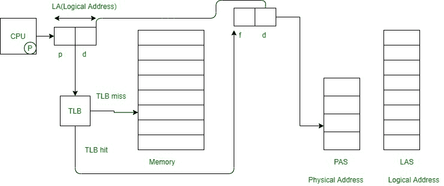

# 寻呼性能

> 原文:[https://www.geeksforgeeks.org/performance-of-paging/](https://www.geeksforgeeks.org/performance-of-paging/)

在本文中，我们将介绍分页的性能，还将介绍评估分页性能的表达式。我们一个一个来讨论。

**先决条件–**[操作系统中的分页](https://www.geeksforgeeks.org/paging-in-operating-system/)

**寻呼性能:**
评估寻呼性能是重要任务之一。假设主存储器访问时间为 M，页表存储在主存储器中，那么有效存储器访问时间的计算表达式如下。

```
Effective Memory Access Time (E.M.A.T) = 2M

```

**寻呼性能特点:**

*   添加了转换后备缓冲区(TLB)以提高分页性能。
*   TLB 是使用关联寄存器实现的硬件设备。
*   与主存储器访问时间相比，TLB 访问时间将非常少。
*   TLB 包含经常提到的页码和相应的帧号。

现在，让我们看看下面给出的分页性能图，以便更好地理解。



**评估分页性能的表达式:**

假设 TLB 的访问时间是“c”。并且 TLB 命中率为“x”，那么分页性能的评估表达式如下。

```
Effective Memory Access Time (E.M.A.T) with TLB
= x(c+m) + (1-x) (c + 2 m)

```