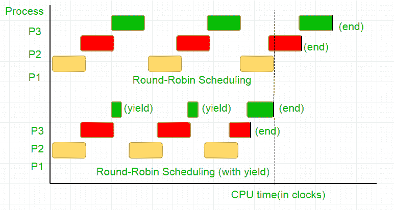

# 彼得森互斥算法|集合 2 (CPU 周期和内存栅栏)

> 原文:[https://www . geeksforgeeks . org/petersons-互斥算法集-2-cpu 周期和内存栅栏/](https://www.geeksforgeeks.org/petersons-algorithm-for-mutual-exclusion-set-2-cpu-cycles-and-memory-fence/)

**问题:**给定 2 个进程 I 和 j，你需要编写一个程序，在没有任何额外硬件支持的情况下，保证两者互斥。

我们强烈建议参考前面文章中讨论的基本解决方案。
[彼得森互斥算法|集合 1](https://www.geeksforgeeks.org/petersons-algorithm-for-mutual-exclusion-set-1/)
我们将在之前的算法中解决 2 个问题。

#### 中央处理器时钟周期的浪费

通俗地说，当一个线程等待轮到它的时候，它会以一个长时间的循环结束，这个循环每秒测试这个条件数百万次，从而进行不必要的计算。有更好的等待方式，被称为*“屈服”*。

为了理解它的作用，我们需要深入研究进程调度器在 Linux 中是如何工作的。这里提到的想法是调度器的简化版本，实际实现有很多复杂之处。

考虑下面的例子，
有三个过程，P1，P2，P3。过程 P3 是这样的，它有一个 while 循环，类似于我们代码中的循环，不做那么有用的计算，它只在 P2 完成它的执行时从循环中存在。调度程序将它们全部放入循环队列中。现在，假设处理器的时钟速度是 1000000/秒，它在每次迭代中为每个进程分配 100 个时钟。然后，首先 P1 将运行 100 个时钟(0.0001 秒)，然后是 P2(0.0001 秒)，接着是 P3(0.0001 秒)，现在由于没有更多的进程，这个循环重复，直到 P2 结束，然后是 P3 的执行，最终结束。

这完全浪费了 100 个 CPU 时钟周期。为了避免这种情况，我们相互放弃了 CPU 时间片，即 yield，这实际上结束了这个时间片，调度器选择下一个进程运行。现在，我们测试一次我们的条件，然后我们放弃中央处理器。考虑到我们的测试需要 25 个时钟周期，我们在一个时间片内节省了 75%的计算。从图形上来说，



考虑到处理器时钟速度为 1 兆赫兹，这是一个很大的节省！。
不同的发行版提供不同的功能来实现这个功能。Linux 提供 **sched_yield()** 。

## C

```
void lock(int self)
{
    flag[self] = 1;
    turn = 1-self;

    while (flag[1-self] == 1 &&
           turn == 1-self)

        // Only change is the addition of
        // sched_yield() call
        sched_yield();
}
```

#### 记忆栅栏。

前面教程中的代码可能适用于大多数系统，但并不是 100%正确。逻辑是完美的，但是大多数现代的 CPU 使用性能优化，这可能导致无序执行。这种内存操作(加载和存储)的重新排序通常在单个执行线程中不会被注意到，但会导致并发程序中不可预测的行为。
考虑这个例子，

## C

```
while (f == 0);

// Memory fence required here
print x;
```

在上面的例子中，编译器认为这 2 条语句是相互独立的，因此试图通过对它们重新排序来提高代码效率，这可能会导致并发程序出现问题。为了避免这种情况，我们放置了一个内存栅栏，向编译器提示跨越栅栏的语句之间的可能关系。

所以陈述的顺序，

> 标志[self]= 1；
> 转= 1-self；
> 虽然(转况检查)
> 产量()；

必须完全相同，锁才能工作，否则它将处于死锁状态。

为了确保这一点，编译器提供了一个指令来防止语句的排序越过这个障碍。如果是 gcc，其**_ _ sync _ sync()**。
所以修改后的代码变成了，
**完全实现在 C:**

## C

```
// Filename: peterson_yieldlock_memoryfence.c
// Use below command to compile:
// gcc -pthread peterson_yieldlock_memoryfence.c -o peterson_yieldlock_memoryfence

#include<stdio.h>
#include<pthread.h>
#include "mythreads.h"

int flag[2];
int turn;
const int MAX = 1e9;
int ans = 0;

void lock_init()
{
    // Initialize lock by reseting the desire of
    // both the threads to acquire the locks.
    // And, giving turn to one of them.
    flag[0] = flag[1] = 0;

    turn = 0;
}

// Executed before entering critical section
void lock(int self)
{
    // Set flag[self] = 1 saying you want
    // to acquire lock
    flag[self]=1;

    // But, first give the other thread the
    // chance to acquire lock
    turn = 1-self;

    // Memory fence to prevent the reordering
    // of instructions beyond this barrier.
    __sync_synchronize();

    // Wait until the other thread loses the
    // desire to acquire  lock or it is your
    // turn to get the lock.
    while (flag[1-self]==1 && turn==1-self)

        // Yield to avoid wastage of resources.
        sched_yield();
}

// Executed after leaving critical section
void unlock(int self)
{
    // You do not desire to acquire lock in future.
    // This will allow the other thread to acquire
    // the lock.
    flag[self]=0;
}

// A Sample function run by two threads created
// in main()
void* func(void *s)
{
    int i = 0;
    int self = (int *)s;
    printf("Thread Entered: %d\n",self);
    lock(self);

    // Critical section (Only one thread
    // can enter here at a time)
    for (i=0; i<MAX; i++)
        ans++;

    unlock(self);
}

// Driver code
int main()
{   
    pthread_t p1, p2;

    // Initialize the lock
    lock_init();

    // Create two threads (both run func)
    Pthread_create(&p1, NULL, func, (void*)0);
    Pthread_create(&p2, NULL, func, (void*)1);

    // Wait for the threads to end.
    Pthread_join(p1, NULL);
    Pthread_join(p2, NULL);

    printf("Actual Count: %d | Expected Count:"
           " %d\n",ans,MAX*2);

    return 0;
}
```

## C

```
// mythread.h (A wrapper header file with assert
// statements)
#ifndef __MYTHREADS_h__
#define __MYTHREADS_h__

#include <pthread.h>
#include <assert.h>
#include <sched.h>

void Pthread_mutex_lock(pthread_mutex_t *m)
{
    int rc = pthread_mutex_lock(m);
    assert(rc == 0);
}

void Pthread_mutex_unlock(pthread_mutex_t *m)
{
    int rc = pthread_mutex_unlock(m);
    assert(rc == 0);
}

void Pthread_create(pthread_t *thread, const pthread_attr_t *attr,    
           void *(*start_routine)(void*), void *arg)
{
    int rc = pthread_create(thread, attr, start_routine, arg);
    assert(rc == 0);
}

void Pthread_join(pthread_t thread, void **value_ptr)
{
    int rc = pthread_join(thread, value_ptr);
    assert(rc == 0);
}

#endif // __MYTHREADS_h__
```

输出:

```
Thread Entered: 1
Thread Entered: 0
Actual Count: 2000000000 | Expected Count: 2000000000
```

本文由**平克什·巴杰蒂亚**供稿。如果你喜欢 GeeksforGeeks 并想投稿，你也可以使用[write.geeksforgeeks.org](https://write.geeksforgeeks.org)写一篇文章或者把你的文章邮寄到 review-team@geeksforgeeks.org。看到你的文章出现在极客博客主页上，帮助其他极客。
如果你发现任何不正确的地方，或者你想分享更多关于上面讨论的话题的信息，请写评论。