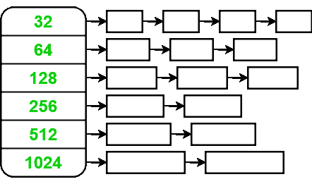
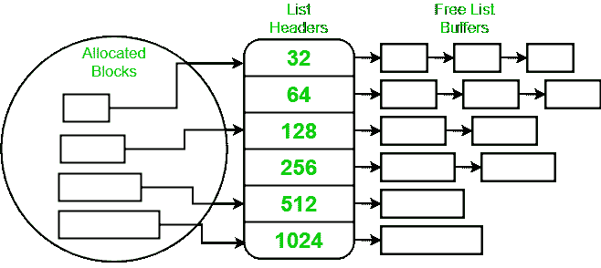

# 两次幂自由列表分配器|内核内存分配器

> 原文:[https://www . geeksforgeeks . org/两次幂自由列表-分配器-内核-内存分配器/](https://www.geeksforgeeks.org/power-of-two-free-lists-allocators-kernal-memory-allocators/)

两个自由列表的**幂是[内核内存分配](https://www.geeksforgeeks.org/operating-system-allocating-kernel-memory-buddy-system-slab-system/)的算法。常用于实现用户级 C 库中的[**【malloc()】**和 **free()**](https://www.geeksforgeeks.org/new-vs-malloc-and-free-vs-delete-in-c/) 。这种方法使用一组**自由列表**。每个列表存储特定大小的缓冲区，所有大小都是[的 2 次方](https://www.geeksforgeeks.org/program-to-find-whether-a-no-is-power-of-two/)。例如，考虑下图有六个自由列表，存储大小为 **32** 、 **64** 、 **128** 、 **256** 、 **512** 、 **1024** 字节的缓冲区。**

每个缓冲区都有一个固定大小的头，这导致可用面积减少。当缓冲区空闲时，它的头存储指向下一个空闲缓冲区的指针。当缓冲区被分配时，它的头指向它应该返回的空闲列表。在一些实现中，它包含分配区域的大小。这有助于检测某些 bug，但需要**例程根据大小计算空闲列表位置。**

**当客户端调用 [**malloc()**](https://www.geeksforgeeks.org/malloc-vs-new/) 时，传递所需的大小作为参数。分配器计算足够大以满足请求的最小缓冲区的大小。这包括将标题( **4 字节**)的空间添加到请求的大小，并将结果值四舍五入到二的次方。32 字节缓冲器满足对 **0-28 字节**的请求， **64 字节**缓冲器满足对 **29-60 字节**的请求，依此类推。分配器然后从适当的空闲列表中移除一个缓冲区，并且头中的指针指向相应的空闲列表。它向调用者返回一个指针，指向缓冲区中标题后面的字节。
下图是[分配的缓冲区](https://www.geeksforgeeks.org/buffer-overflow-attack-with-example/)和[指向缓冲区的指针](https://www.geeksforgeeks.org/pointers-in-c-and-c-set-1-introduction-arithmetic-and-array/)的概念图。**

****

**当客户端释放缓冲区时，调用 **free()** 例程，将 **malloc()** 返回的指针作为参数传递。用户不必指定释放的缓冲区大小。然而，必须释放从 **malloc()** 获得的整个缓冲区；没有规定只释放部分分配的缓冲区。 **free()** 方法将指针向后移动四个字节以访问标头。它从头部接收空闲列表指针，并将缓冲区放在该列表上。**

**分配器可以通过以下三种方式之一来处理对该大小的新的 **malloc()** 请求:**

*   **阻塞请求，直到释放出适当大小的缓冲区。**
*   **用更大的缓冲区满足请求，从下一个列表开始，继续搜索，直到找到非空列表。**
*   **从页面级分配器中获取额外的内存，以生成更多该大小的缓冲区。**

****<u>优势</u> :****

*   **该算法简单且相当快。**
*   **该算法的主要目标是避免资源图方法冗长的线性搜索，并完全消除碎片问题。**
*   **分配器还提供了一个熟悉的编程接口，它的重要优点是不需要给 **free()例程**提供缓冲区大小作为参数。因此，分配的缓冲区可以传递给其他函数和子系统，并最终仅使用指向缓冲区的指针来释放。**
*   **该接口不允许客户端仅释放部分分配的缓冲区。**

****T1】劣势:T3****

*   **将请求舍入到二的次方通常会在缓冲区中留下大量未使用的空间，从而导致内存利用率低下。**
*   **由于必须将报头存储在分配的缓冲区中，这个问题变得更加严重。例如，一个 512 字节的请求将消耗一个 1024 字节的 T2 缓冲区。**
*   **没有规定合并相邻的空闲缓冲区来满足更大的请求。通常，每个缓冲区的大小在其生命周期内保持不变。唯一的灵活性是大缓冲区有时可以用于小请求。**
*   **虽然一些实现允许分配器从[分页系统](https://www.geeksforgeeks.org/paging-in-operating-system/)中窃取内存，但是没有规定将多余的空闲缓冲区返回给页面级分配器。**