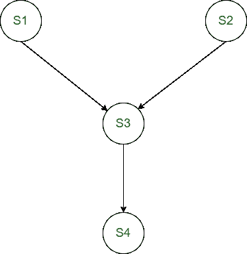
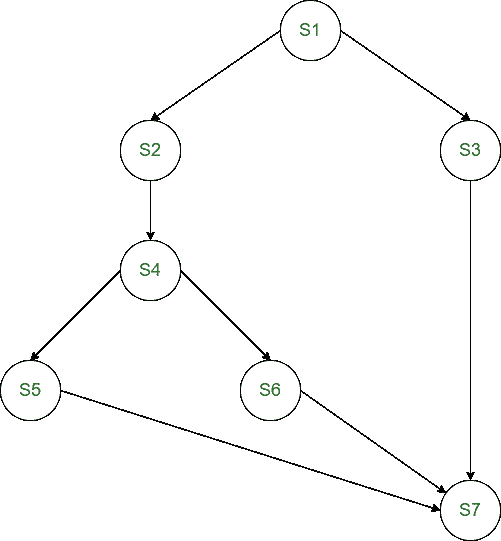

# 操作系统中的优先图

> 原文:[https://www . geesforgeeks . org/preference-graph-in-operating-system/](https://www.geeksforgeeks.org/precedence-graph-in-operating-system/)

先决条件–[进程同步](https://www.geeksforgeeks.org/introduction-of-process-synchronization/)
**优先图**是一个有向无环图，用来表示操作系统中几个进程的执行级别。它由节点和边组成。节点代表流程，边缘代表执行流程。

**优先图的性质:**
优先图的性质如下:

*   这是一个有向图。
*   这是一个非循环图。
*   图的节点对应于程序代码的各个语句。
*   两个节点之间的边表示执行顺序。
*   从节点 A 到节点 B 的有向边显示，语句 A 首先执行，然后语句 B 执行。

考虑以下代码:

```
S1 : a = x + y;
S2 : b = z + 1;
S3 : c = a - b;
S4 : w = c + 1;

```

如果上述代码同时执行，则存在以下优先关系:

*   c = a–b 在 a 和 b 都被赋值之前不能执行。
*   在计算 c 的新值之前，不能执行 w = c + 1。
*   语句 a = x + y 和 b = z + 1 可以同时执行。



**例:**
考虑程序的以下优先关系:

1.  S2 和 S3 可以在 S1 完成后被处决。
2.  S4 可以在 S2 完成后被处决。
3.  S5 和 S6 可以在 S4 完成后执行。
4.  S7 可以在 S5、S6 和 S3 完成后执行。

**解:**
