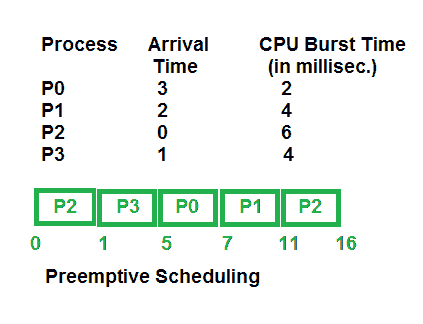
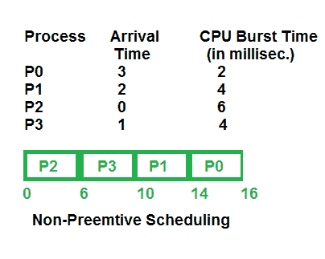

# 抢占式和非抢占式调度

> 原文:[https://www . geeksforgeeks . org/抢占式和非抢占式调度/](https://www.geeksforgeeks.org/preemptive-and-non-preemptive-scheduling/)

先决条件–[中央处理器调度](https://www.geeksforgeeks.org/gate-notes-operating-system-process-scheduling/)

**1。抢先调度:**
当进程从运行状态切换到就绪状态或从等待状态切换到就绪状态时，使用抢先调度。资源(主要是中央处理器周期)在有限的时间内分配给进程，然后被取走，如果该进程还有中央处理器突发时间，则该进程再次被放回就绪队列。该进程将留在就绪队列中，直到它有机会执行。

基于抢先调度的算法有:[循环调度(RR)](https://www.geeksforgeeks.org/program-round-robin-scheduling-set-1/) 、[最短剩余时间优先(SRTF)](https://www.geeksforgeeks.org/program-shortest-job-first-scheduling-set-2srtf-make-changesdoneplease-review/) 、[优先级(抢先版)](https://www.geeksforgeeks.org/program-for-preemptive-priority-cpu-scheduling/)等。

**2。非抢占式调度:**
非抢占式调度用于进程终止，或者进程从运行切换到等待状态。在这种调度中，一旦资源(中央处理器周期)被分配给一个进程，该进程就保持中央处理器，直到它被终止或达到等待状态。在非抢占式的情况下，调度不会在执行过程中中断运行中央处理器的进程。相反，它会等到该进程完成其 CPU 突发时间，然后它可以将该 CPU 分配给另一个进程。

基于非抢先调度的算法有:[最短作业优先(SJF 基本非抢先)](https://www.geeksforgeeks.org/program-shortest-job-first-sjf-scheduling-set-1-non-preemptive/)和[优先(非抢先版)](https://www.geeksforgeeks.org/operating-system-priority-scheduling-different-arrival-time-set-2/)等。

**抢占式和非抢占式调度的主要区别:**

1.  在抢先调度中，CPU 被分配给进程的时间有限，而在非抢先调度中，CPU 被分配给进程，直到它终止或切换到等待状态。
2.  当优先级较高的进程到来时，抢占式调度中的执行进程在执行过程中被中断，而非抢占式调度中的执行进程在执行过程中不被中断，一直等待执行。
3.  在抢先调度中，存在将进程从就绪状态切换到运行状态的开销，反之亦然，并且需要维护就绪队列。而在非抢先调度的情况下，没有将进程从运行状态切换到就绪状态的开销。
4.  在抢先调度中，如果高优先级的进程频繁地到达就绪队列，那么低优先级的进程必须等待很长时间，并且它可能不得不挨饿。在非抢占式调度中，如果将 CPU 分配给具有较大突发时间的进程，则具有较小突发时间的进程可能不得不挨饿。
5.  抢占式调度通过允许关键进程在进入就绪队列时访问 CPU 来实现灵活性，无论当前正在执行什么进程。非抢占式调度被称为刚性调度，因为即使关键进程进入就绪队列，运行 CPU 的进程也不会受到干扰。
6.  抢先调度必须保持共享数据的完整性，这就是为什么它是成本关联的，而非抢先调度则不是这样。

**对比图:**

<figure class="table">

| 参数 | 抢先调度 | 非抢先调度 |
| --- | --- | --- |
| 基础 | 在这种情况下，资源(中央处理器周期)在有限的时间内分配给一个进程。 | 一旦资源(中央处理器周期)被分配给一个进程，该进程将保持它，直到它完成其突发时间或切换到等待状态。 |
| 中断 | 过程可以在两者之间中断。 | 进程不能被中断，直到它自己终止或者它的时间到了。 |
| 饿死 | 如果具有高优先级的进程频繁地到达就绪队列，低优先级的进程可能会饿死。 | 如果一个具有长突发时间的进程正在运行中央处理器，那么稍后到来的具有较少中央处理器突发时间的进程可能会挨饿。 |
| 开销 | 它有调度进程的开销。 | 它没有管理费用。 |
| 灵活性 | 灵活的 | 严格的 |
| 费用 | 相关成本 | 无相关成本 |
| 中央处理器利用率 | 在抢占式调度中，CPU 利用率很高。 | 它在非抢先调度中很低。 |
| 例子 | 抢先调度的例子有循环调度和最短剩余时间优先。 | 非抢先调度的例子有先到先服务和最短作业优先。 |

</figure>