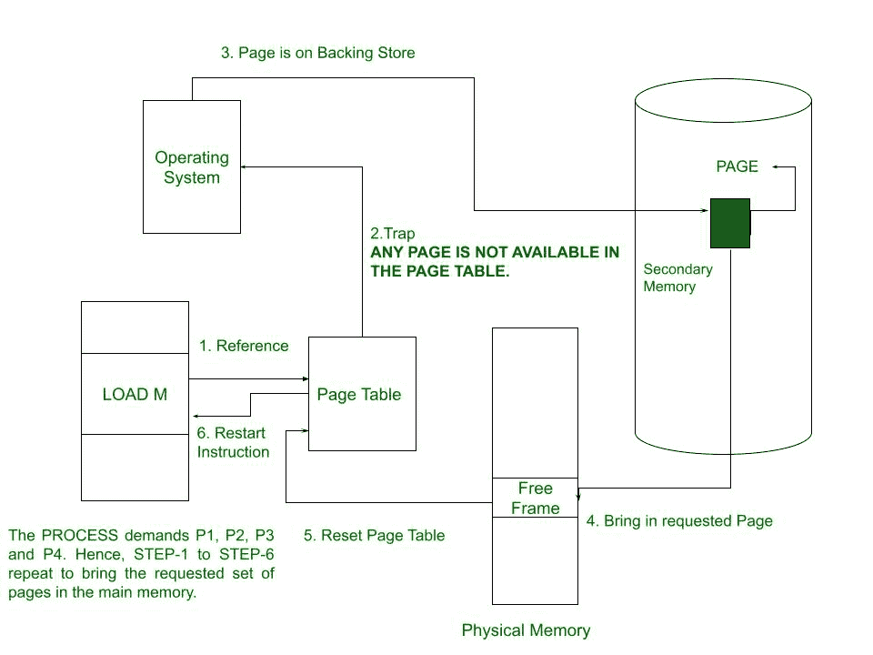
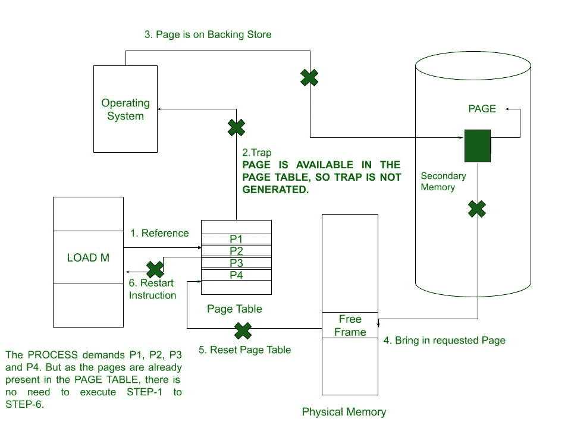

# 准备操作系统

> 原文:[https://www . geeksforgeeks . org/预装操作系统/](https://www.geeksforgeeks.org/prepaging-in-operating-system/)

**先决条件–**[操作系统中的虚拟内存](https://www.geeksforgeeks.org/virtual-memory-in-operating-system/)

正如虚拟内存的概念所建议的，没有必要在给定的时间将整个过程加载到主内存中。如果在特定时间只有一些页面存在于主存储器中，则可以有效地执行该过程。现在，这里出现的问题是，选择要加载到主存储器中以预先执行进程的页面的基础是什么？

这里给出的问题的答案是[需求寻呼](https://www.geeksforgeeks.org/virtual-memory-in-operating-system/)。根据这个概念，任何页面都不会加载到主内存中，除非它在执行的任何阶段都被进程引用。相比之下，**预装**的概念提出了一种不同的方法，其中*操作系统*猜测进程将需要哪个页面，并将其预加载到内存中。

**Prepaging** 的概念被用作减少在进程开始时发生的大量页面错误的尝试，其中基本策略是在它们被进程实际引用之前，将所有需要的页面同时带入内存。

**预装**用于克服需求**寻呼的一个主要缺点。**需求分页**的一个主要缺点是一旦进程开始执行，就会出现大量的页面错误。这种情况是将初始位置加载到内存中的结果。同样的情况可能会反复出现。例如，当一个进程在被换出后重新启动时，它的所有页面都在磁盘上，因此在最坏的情况下，每个页面都必须通过它自己的页面错误被带回主存储器以执行该进程。
如果系统使用工作集模型，则工作集中的每个进程都会维护一个页面列表。如果一个进程由于缺少空闲帧或输入/输出等待而暂停，该进程的工作集不会丢失。当一个进程被恢复时，在该进程再次开始执行之前，整个工作集被带回内存。
Prepaging 的主要优势在于，当进程引用连续地址时，它可以节省时间。在这种情况下，操作系统很容易猜测和加载适当的页面，并且由于许多页面的猜测很有可能是正确的，因此发生的页面错误会更少。**

准备可能并不总是有益的。Prepaging 的优势基于对一个简单问题的回答，即实现 Prepaging 的成本是否低于服务相应页面错误的成本。这里请注意，可能会有大量的页面通过预填充被带回内存而没有被使用的情况。这个概念的缺点是，如果预加载的页面没有被使用，就会浪费时间和内存等资源。

**按需分页和预准备的区别:**

<figure class="table">

| **需求寻呼** | **预寻呼** |
| 任何页面都不会被加载到主存储器中，除非它在当前时刻正被进程引用。 | 所有页面都被加载到内存中，在不久的将来，在它们被进程实际引用之前，会同时需要这些页面。 |
| 页面错误的数量非常多。 | 在某些特定情况下，页面错误的数量可能会减少。 |
| 加载页面所花费的时间在任何情况下都不会减少。 | 当一个进程引用连续地址时，加载页面所需的时间会减少。 |
| 加载到主内存中的页面肯定会被使用。 | 加载到主内存中的页面可能会被使用，也可能不会被使用。 |
| 在需要时加载页面不会浪费资源。 | 由于页面很有可能未被使用，因此存在资源浪费。 |

假设预分页的页数为:s，一个进程实际使用的页数比例为:m，其中(0 ≤ m ≤ 1)。现在检查 **s*m** 保存页面错误是否大于或小于准备 **s*(1-m)** 不必要页面的成本，并继续进行相对值较小的程序。

</figure>