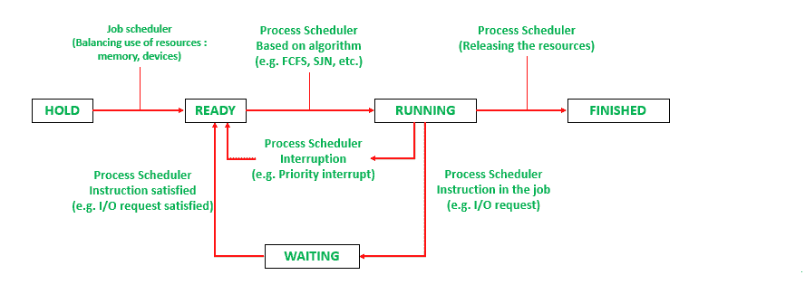

# 进程调度程序:作业和进程状态

> 原文:[https://www . geesforgeks . org/process-scheduler-job-and-process-status/](https://www.geeksforgeeks.org/process-scheduler-job-and-process-status/)

当作业在系统中移动并取得进展时，它会将其状态从保持更改为完成。当作业管理器和流程管理器正在处理作业时，它总是处于以下 5 种状态之一:

1.  **HOLD:**
    当用户提交作业并接受该作业时，该作业被置于 HOLD 状态，并被放入队列。
2.  **READY:**
    当作业准备运行并等待 CPU 时，它处于 READY 状态。
3.  **RUNNING:**
    作业处于 RUNNING 状态时，正在执行。
4.  **WAITING:**
    当作业处于 WAITING 状态时，表示作业在指定的 I/O 操作完成或资源分配完成之前无法继续。
5.  **FINISHED:**
    当作业处于 FINISHED 状态时，表示作业完成，输出将返回给用户。

作业从一种状态到另一种状态或从一种状态到另一种状态的转换是由作业调度程序或进程调度程序根据某些特定算法完成的:

1.  从**保持**到**就绪**的转换是由作业调度器根据主内存空间的可用性和一些特定的策略来完成的。
2.  从**就绪**到**运行**的转换是由进程调度器根据一些算法(例如 FCFS)完成的(以决定哪个作业将首先完成)。
3.  从**运行**回到**就绪**的转换是由进程调度程序根据某种标准(例如优先级中断)完成的。
4.  当在作业本身中遇到一些输入/输出请求或需要一些资源分配时，由进程调度程序完成从**运行**到**等待**的转换。
5.  当作业所需的要求得到满足(输入/输出请求得到满足)时，由进程调度程序完成从**等待**到**就绪**的转换。
6.  从**运行**到**完成**的转换由进程调度器在两种情况下完成:
    *   **(i)** 作业成功完成时。
    *   **(ii)** 当出现错误，作业提前终止时。
7.  当一个作业**完成**时，队列中的另一个作业从**就绪**进入**运行**状态。