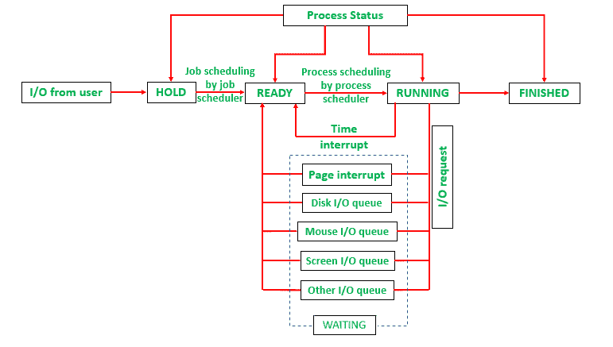

# 进程调度器:多氯联苯和排队

> 原文:[https://www . geesforgeks . org/process-scheduler-PCBs-and-queue/](https://www.geeksforgeeks.org/process-scheduler-pcbs-and-queueing/)

当作业调度程序接受一个作业时，它会创建该作业的印刷电路板(过程控制块)，并在整个执行过程中对其进行更新。
这些印刷电路板(而不是作业)被链接以形成队列，并用于跟踪相应的作业。

**注意:**
PCB 存储了正在处理的作业的所有数据，就像它在系统中的进度一样。操作系统需要这些数据来管理作业的处理。

如上所示，每个队列都可以看作是多氯联苯的链表:

1.  **就绪**队列包含就绪作业的多氯联苯。
2.  **保持**队列包含进入系统的作业的印刷电路板。
3.  **WAITING** 队列包含需要一些资源分配或用户输入的作业的多氯联苯。根据他们在**等待**队列中的原因，他们被链接成几个队列。例如，等待某些输入的印刷电路板在单独的队列中，而请求确定特定文件的文件位置在单独的队列中。
    **【等待】**根据某些策略，队列以特定的顺序进行管理。