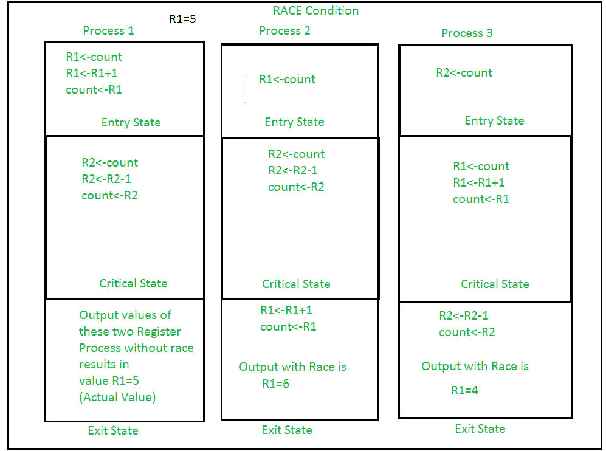
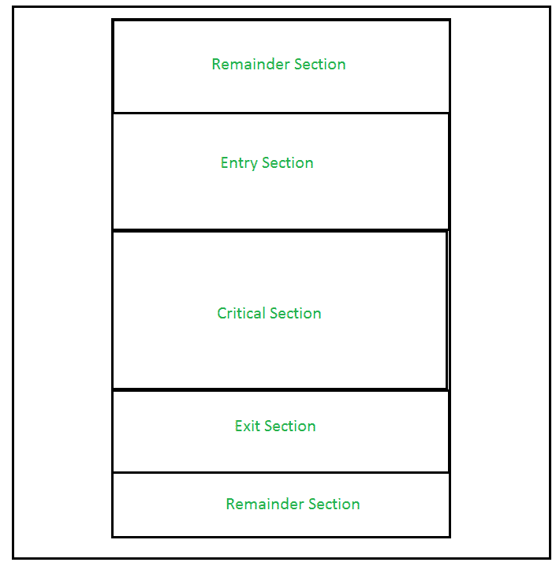
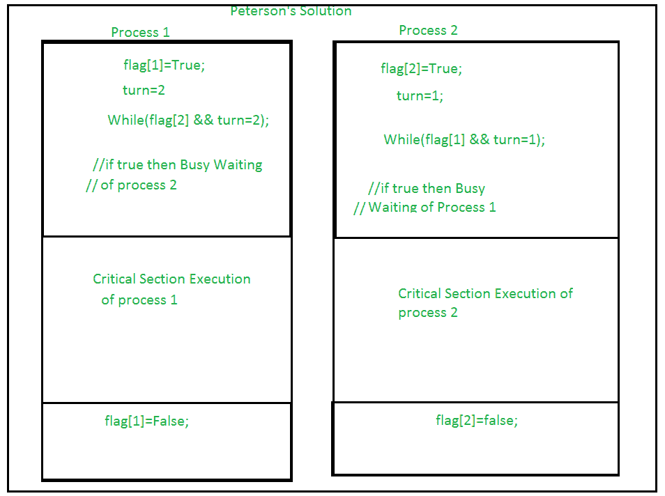
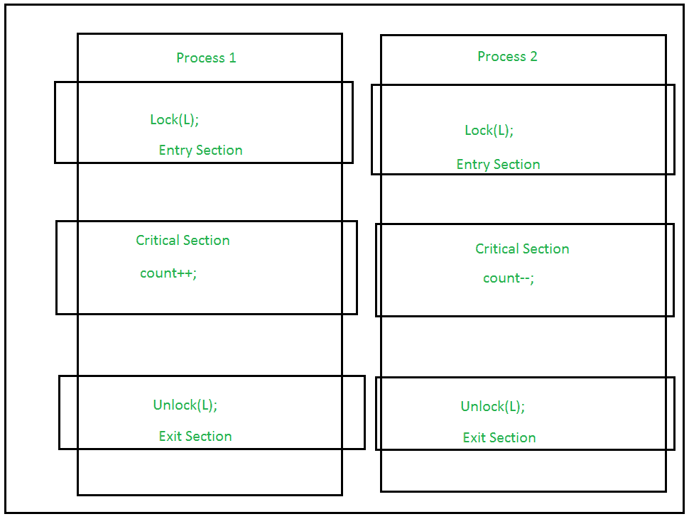
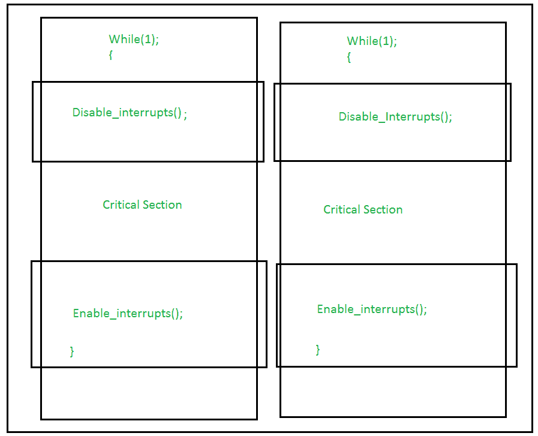

# 进程同步|设置 2

> 原文:[https://www . geesforgeks . org/process-synchronization-set-2/](https://www.geeksforgeeks.org/process-synchronization-set-2/)

先决条件–[进程同步|简介](https://www.geeksforgeeks.org/process-synchronization-set-1/)、[关键部分](https://www.geeksforgeeks.org/g-fact-70/)、[信号量](https://www.geeksforgeeks.org/semaphores-operating-system/)
**进程同步**是一种用于协调使用共享数据的进程的技术。操作系统中有两种类型的进程:-

1.  **独立进程–**
    在执行过程中不影响其他进程或受其他进程影响的进程称为独立进程。不共享任何共享变量、数据库、文件等的进程。
2.  **协同过程–**
    在执行过程中影响另一个过程或被另一个过程影响的过程，称为协同过程。共享文件、变量、数据库等的过程就是协作过程。

进程同步主要用于共享资源的协同进程。让我们考虑一个
//赛车状态图像的例子

几个进程试图同时访问资源和修改共享数据，进程的结果取决于特定的执行顺序，这种情况导致数据不一致，这种情况称为**竞争条件**。这种情况可以通过称为同步或进程同步的技术来避免，在这种技术中，我们只允许一个进程进入并操作关键部分中的共享数据。
//CS 视图示意图

这种设置可以在不同的区域进行定义，例如:

*   **进入部分–**
    它是决定一个特定过程进入关键部分的过程的一部分，而不是许多其他过程。
*   **临界区–**
    是只允许一个进程进入和修改共享变量的部分。这部分流程确保只有其他流程才能访问共享数据资源。
*   **退出部分–**
    该过程允许在进入部分等待的其他过程进入关键部分。它检查在一个进程完成在关键部分的执行后，该进程是否可以通过这个退出部分被删除。
*   **剩余部分–**
    代码中除入口部分、关键部分和出口部分之外的其他部分称为剩余部分。

关键部分问题必须满足这三个要求:

1.  **互斥–**
    表示如果一个进程正在临界区执行，则不允许其他进程在临界区执行。
2.  **进度–**
    当临界区没有进程时，来自该执行请求之外的任何进程都可以毫不延迟地进入临界区。只有那些请求并有有限时间进入流程的流程才能进入。
3.  **有界等待–**
    一个进程进入的次数必须有一个上限，这样在一个进程请求进入其关键部分之后，在该请求被批准之前，其他进程就可以进入它们的关键部分。

进程同步通过两种方法处理:

1.  **Software Approach –**
    In Software Approach, Some specific Algorithm approach is used to maintain synchronization of the data. Like in Approach One or Approach Two, for a number of two process, a temporary variable like (turn) or boolean variable (flag) value is used to store the data. When the condition is True then the process in waiting State, known as Busy Waiting State. This does not satisfy all the Critical Section requirements.

    另一种被称为彼得森解决方案的软件方法最适合同步。它在入口部分使用两个变量来保持一致性，如标志(布尔变量)和转向变量(存储过程状态)。它满足所有三个关键部分的要求。

    //彼得森算法的图像

    

2.  **Hardware Approach –**
    The Hardware Approach of synchronization can be done through Lock & Unlock technique.Locking part is done in the Entry Section, so that only one process is allowed to enter into the Critical Section, after it complete its execution, the process is moved to the Exit Section, where Unlock Operation is done so that another process in the Lock Section can repeat this process of Execution.This process is designed in such a way that all the three conditions of the Critical Sections are satisfied.

    //锁的图像

    

**使用中断–**
这些都很容易实现。当中断被禁用时，则不允许其他进程执行上下文切换操作，这将只允许一个进程进入临界状态。

//中断图像

**测试和设置操作–**
这允许布尔值(真/假)作为硬件同步，它本质上是原子的，即不允许访问其他中断。这主要用于互斥应用。相似类型的操作可以通过比较和交换功能来实现。在此过程中，当变量的锁定操作打开时，允许在临界区访问该变量。在此之前，另一个进程处于忙等待状态。因此，达到了临界区要求。