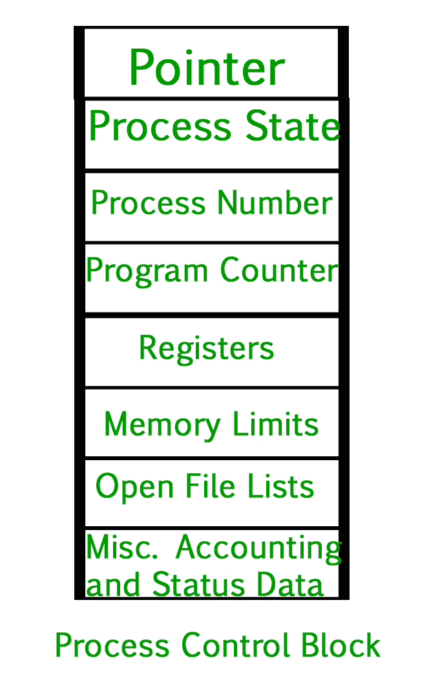
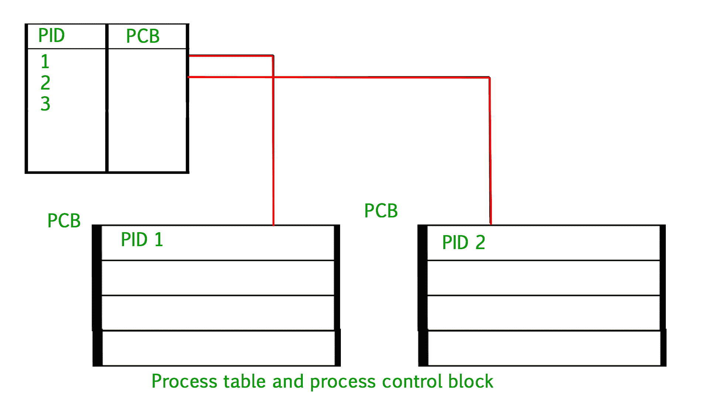

# 工艺表和工艺控制块(PCB)

> 原文:[https://www . geesforgeks . org/process-table-and-process-control-block-PCB/](https://www.geeksforgeeks.org/process-table-and-process-control-block-pcb/)

创建进程时，操作系统会执行几个操作。为了识别流程，它为每个流程分配一个流程标识号(PID)。由于操作系统支持多程序设计，它需要跟踪所有的进程。对于此任务，过程控制块(PCB)用于跟踪过程的执行状态。每个内存块都包含进程状态、程序计数器、堆栈指针、打开文件的状态、调度算法等信息。所有这些信息都是必需的，并且必须在进程从一种状态切换到另一种状态时保存。当进程从一种状态转换到另一种状态时，操作系统必须更新进程 PCB 中的信息。

过程控制块包含关于过程的信息，即寄存器、量程、优先级等。工艺表是一组印刷电路板，这意味着逻辑上包含系统中所有当前工艺的印刷电路板。

*   **指针–**是进程从一种状态切换到另一种状态时需要保存的栈指针，以保留进程的当前位置。
*   **流程状态–**它存储流程的相应状态。
*   **流程编号–**每个流程都分配有一个唯一的 id，称为流程 ID 或 PID，用于存储流程标识符。
*   **程序计数器–**它存储计数器，该计数器包含要为进程执行的下一条指令的地址。
*   **寄存器–**这些是中央处理器寄存器，包括:累加器、基数、寄存器和通用寄存器。
*   **内存限制–**该字段包含操作系统使用的内存管理系统的信息。这可能包括页表、段表等。
*   **打开文件列表–**该信息包括为进程打开的文件列表。

**杂项核算和状态数据–**该字段包括 CPU 使用量、时间限制、作业或进程号等信息。
当处理器被阻止运行时，过程控制块存储寄存器内容，也称为处理器的执行内容。这种执行内容体系结构使操作系统能够在进程返回运行状态时恢复进程的执行上下文。当进程从一种状态转换到另一种状态时，操作系统会更新进程 PCB 中的信息。操作系统在进程表中维护指向每个进程的印刷电路板的指针，以便能够快速访问印刷电路板。

