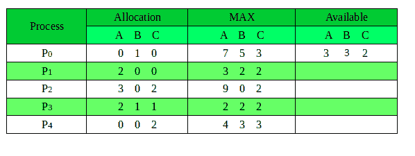
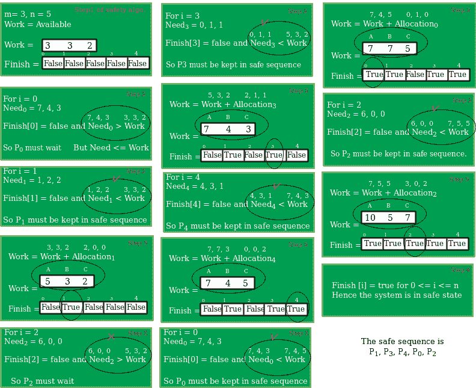

# 银行家算法程序|集合 1(安全算法)

> 原文:[https://www . geesforgeks . org/program-bankers-algorithm-set-1-safety-algorithm/](https://www.geeksforgeeks.org/program-bankers-algorithm-set-1-safety-algorithm/)

先决条件:[庄家算法](https://www.geeksforgeeks.org/bankers-algorithm-in-operating-system-2/)

银行家算法是一种资源分配和死锁避免算法，它通过模拟所有资源的预定最大可能数量的分配来测试安全性，然后进行“s 状态”检查来测试可能的活动，然后决定是否允许继续分配。

以下**数据结构**用于实现银行家算法:

设**‘n’**为系统中进程数，**‘m’**为资源类型数。

**可用:**

*   它是一个一维数组，大小为**‘m’**，表示每种类型的可用资源数量。
*   可用[ j ] = k 表示存在资源类型的**【k】**实例 **R <sub>j</sub>**

**最大值:**

*   它是一个尺寸为' **n*m'** 的二维数组，定义了系统中每个进程的最大需求。
*   Max[ i，j ] = k 表示进程 **P <sub>i</sub>** 最多可以请求**【k】**个资源类型实例**R<sub>j</sub>**

**分配:**

*   它是一个大小为 **'n*m'** 的二维数组，定义了当前分配给每个进程的每种类型的资源数量。
*   分配[ i，j ] = k 表示进程 **P <sub>i</sub>** 当前被分配了资源类型 **R <sub>j</sub>** 的**【k】**实例

**需要:**

*   它是一个二维数组，大小为**‘n * m’**，表示每个进程的剩余资源需求。
*   需要[ i，j ] = k 表示进程 **P <sub>i</sub>** 当前分配的**【k】**资源类型的实例 **R <sub>j</sub>**
*   需要[ i，j ] =最大[ i，j ]–分配[ i，j]

分配 <sub>i</sub> 指定当前分配给进程 P <sub>i</sub> 和需要 <sub>i</sub> 的资源指定进程 P <sub>i</sub> 仍可能请求完成其任务的额外资源。

银行家算法由安全算法和资源请求算法组成

**安全算法**

用于确定系统是否处于安全状态的算法可以描述如下:

1.  让“工作”和“完成”分别是长度为“m”和“n”的向量。
    初始化:工作=可用
    完成[I]=假；对于 i=1，2，…，n
2.  找到一个 I，使得两者都
    a)完成【I】=假
    b)需要 _ I<=工作

    如果不存在这样的 I，转到步骤(4)
3.  工作=工作+分配 _i
    完成[i]=真
    转到步骤(2)
4.  如果完成[I]=真，则系统处于安全状态。

**安全顺序是流程可以安全执行的顺序。**

本文完成了银行家算法安全算法的实现。

## C++

```
// C++ program to illustrate Banker's Algorithm
#include<iostream>
using namespace std;

// Number of processes
const int P = 5;

// Number of resources
const int R = 3;

// Function to find the need of each process
void calculateNeed(int need[P][R], int maxm[P][R],
                   int allot[P][R])
{
    // Calculating Need of each P
    for (int i = 0 ; i < P ; i++)
        for (int j = 0 ; j < R ; j++)

            // Need of instance = maxm instance -
            //                    allocated instance
            need[i][j] = maxm[i][j] - allot[i][j];
}

// Function to find the system is in safe state or not
bool isSafe(int processes[], int avail[], int maxm[][R],
            int allot[][R])
{
    int need[P][R];

    // Function to calculate need matrix
    calculateNeed(need, maxm, allot);

    // Mark all processes as infinish
    bool finish[P] = {0};

    // To store safe sequence
    int safeSeq[P];

    // Make a copy of available resources
    int work[R];
    for (int i = 0; i < R ; i++)
        work[i] = avail[i];

    // While all processes are not finished
    // or system is not in safe state.
    int count = 0;
    while (count < P)
    {
        // Find a process which is not finish and
        // whose needs can be satisfied with current
        // work[] resources.
        bool found = false;
        for (int p = 0; p < P; p++)
        {
            // First check if a process is finished,
            // if no, go for next condition
            if (finish[p] == 0)
            {
                // Check if for all resources of
                // current P need is less
                // than work
                int j;
                for (j = 0; j < R; j++)
                    if (need[p][j] > work[j])
                        break;

                // If all needs of p were satisfied.
                if (j == R)
                {
                    // Add the allocated resources of
                    // current P to the available/work
                    // resources i.e.free the resources
                    for (int k = 0 ; k < R ; k++)
                        work[k] += allot[p][k];

                    // Add this process to safe sequence.
                    safeSeq[count++] = p;

                    // Mark this p as finished
                    finish[p] = 1;

                    found = true;
                }
            }
        }

        // If we could not find a next process in safe
        // sequence.
        if (found == false)
        {
            cout << "System is not in safe state";
            return false;
        }
    }

    // If system is in safe state then
    // safe sequence will be as below
    cout << "System is in safe state.\nSafe"
         " sequence is: ";
    for (int i = 0; i < P ; i++)
        cout << safeSeq[i] << " ";

    return true;
}

// Driver code
int main()
{
    int processes[] = {0, 1, 2, 3, 4};

    // Available instances of resources
    int avail[] = {3, 3, 2};

    // Maximum R that can be allocated
    // to processes
    int maxm[][R] = {{7, 5, 3},
                     {3, 2, 2},
                     {9, 0, 2},
                     {2, 2, 2},
                     {4, 3, 3}};

    // Resources allocated to processes
    int allot[][R] = {{0, 1, 0},
                      {2, 0, 0},
                      {3, 0, 2},
                      {2, 1, 1},
                      {0, 0, 2}};

    // Check system is in safe state or not
    isSafe(processes, avail, maxm, allot);

    return 0;
}
```

## Java 语言(一种计算机语言，尤用于创建网站)

```
// Java program to illustrate Banker's Algorithm
import java.util.*;

class GFG
{

// Number of processes
static int P = 5;

// Number of resources
static int R = 3;

// Function to find the need of each process
static void calculateNeed(int need[][], int maxm[][],
                int allot[][])
{
    // Calculating Need of each P
    for (int i = 0 ; i < P ; i++)
        for (int j = 0 ; j < R ; j++)

            // Need of instance = maxm instance -
            //                 allocated instance
            need[i][j] = maxm[i][j] - allot[i][j];
}

// Function to find the system is in safe state or not
static boolean isSafe(int processes[], int avail[], int maxm[][],
            int allot[][])
{
    int [][]need = new int[P][R];

    // Function to calculate need matrix
    calculateNeed(need, maxm, allot);

    // Mark all processes as infinish
    boolean []finish = new boolean[P];

    // To store safe sequence
    int []safeSeq = new int[P];

    // Make a copy of available resources
    int []work = new int[R];
    for (int i = 0; i < R ; i++)
        work[i] = avail[i];

    // While all processes are not finished
    // or system is not in safe state.
    int count = 0;
    while (count < P)
    {
        // Find a process which is not finish and
        // whose needs can be satisfied with current
        // work[] resources.
        boolean found = false;
        for (int p = 0; p < P; p++)
        {
            // First check if a process is finished,
            // if no, go for next condition
            if (finish[p] == false)
            {
                // Check if for all resources of
                // current P need is less
                // than work
                int j;
                for (j = 0; j < R; j++)
                    if (need[p][j] > work[j])
                        break;

                // If all needs of p were satisfied.
                if (j == R)
                {
                    // Add the allocated resources of
                    // current P to the available/work
                    // resources i.e.free the resources
                    for (int k = 0 ; k < R ; k++)
                        work[k] += allot[p][k];

                    // Add this process to safe sequence.
                    safeSeq[count++] = p;

                    // Mark this p as finished
                    finish[p] = true;

                    found = true;
                }
            }
        }

        // If we could not find a next process in safe
        // sequence.
        if (found == false)
        {
            System.out.print("System is not in safe state");
            return false;
        }
    }

    // If system is in safe state then
    // safe sequence will be as below
    System.out.print("System is in safe state.\nSafe"
        +" sequence is: ");
    for (int i = 0; i < P ; i++)
        System.out.print(safeSeq[i] + " ");

    return true;
}

// Driver code
public static void main(String[] args) 
{
    int processes[] = {0, 1, 2, 3, 4};

    // Available instances of resources
    int avail[] = {3, 3, 2};

    // Maximum R that can be allocated
    // to processes
    int maxm[][] = {{7, 5, 3},
                    {3, 2, 2},
                    {9, 0, 2},
                    {2, 2, 2},
                    {4, 3, 3}};

    // Resources allocated to processes
    int allot[][] = {{0, 1, 0},
                    {2, 0, 0},
                    {3, 0, 2},
                    {2, 1, 1},
                    {0, 0, 2}};

    // Check system is in safe state or not
    isSafe(processes, avail, maxm, allot);
}
}

// This code has been contributed by 29AjayKumar
```

## 蟒蛇 3

```
# Python3 program to illustrate 
# Banker's Algorithm

# Number of processes 
P = 5

# Number of resources 
R = 3

# Function to find the need of each process 
def calculateNeed(need, maxm, allot):

    # Calculating Need of each P 
    for i in range(P):
        for j in range(R):

            # Need of instance = maxm instance - 
            # allocated instance
            need[i][j] = maxm[i][j] - allot[i][j] 

# Function to find the system is in
# safe state or not
def isSafe(processes, avail, maxm, allot):
    need = []
    for i in range(P):
        l = []
        for j in range(R):
            l.append(0)
        need.append(l)

    # Function to calculate need matrix 
    calculateNeed(need, maxm, allot)

    # Mark all processes as infinish 
    finish = [0] * P

    # To store safe sequence 
    safeSeq = [0] * P 

    # Make a copy of available resources 
    work = [0] * R 
    for i in range(R):
        work[i] = avail[i] 

    # While all processes are not finished 
    # or system is not in safe state. 
    count = 0
    while (count < P):

        # Find a process which is not finish 
        # and whose needs can be satisfied 
        # with current work[] resources. 
        found = False
        for p in range(P): 

            # First check if a process is finished, 
            # if no, go for next condition 
            if (finish[p] == 0): 

                # Check if for all resources 
                # of current P need is less 
                # than work
                for j in range(R):
                    if (need[p][j] > work[j]):
                        break

                # If all needs of p were satisfied. 
                if (j == R - 1): 

                    # Add the allocated resources of 
                    # current P to the available/work 
                    # resources i.e.free the resources 
                    for k in range(R): 
                        work[k] += allot[p][k] 

                    # Add this process to safe sequence. 
                    safeSeq[count] = p
                    count += 1

                    # Mark this p as finished 
                    finish[p] = 1

                    found = True

        # If we could not find a next process 
        # in safe sequence. 
        if (found == False):
            print("System is not in safe state")
            return False

    # If system is in safe state then 
    # safe sequence will be as below 
    print("System is in safe state.",
              "\nSafe sequence is: ", end = " ")
    print(*safeSeq) 

    return True

# Driver code 
if __name__ =="__main__":

    processes = [0, 1, 2, 3, 4]

    # Available instances of resources 
    avail = [3, 3, 2] 

    # Maximum R that can be allocated 
    # to processes 
    maxm = [[7, 5, 3], [3, 2, 2],
            [9, 0, 2], [2, 2, 2],
            [4, 3, 3]]

    # Resources allocated to processes 
    allot = [[0, 1, 0], [2, 0, 0],
             [3, 0, 2], [2, 1, 1],
             [0, 0, 2]] 

    # Check system is in safe state or not 
    isSafe(processes, avail, maxm, allot) 

# This code is contributed by
# Shubham Singh(SHUBHAMSINGH10)
```

## C#

```
// C# program to illustrate Banker's Algorithm
using System;

class GFG
{

// Number of processes
static int P = 5;

// Number of resources
static int R = 3;

// Function to find the need of each process
static void calculateNeed(int [,]need, int [,]maxm,
                int [,]allot)
{
    // Calculating Need of each P
    for (int i = 0 ; i < P ; i++)
        for (int j = 0 ; j < R ; j++)

            // Need of instance = maxm instance -
            //             allocated instance
            need[i,j] = maxm[i,j] - allot[i,j];
}

// Function to find the system is in safe state or not
static bool isSafe(int []processes, int []avail, int [,]maxm,
            int [,]allot)
{
    int [,]need = new int[P,R];

    // Function to calculate need matrix
    calculateNeed(need, maxm, allot);

    // Mark all processes as infinish
    bool []finish = new bool[P];

    // To store safe sequence
    int []safeSeq = new int[P];

    // Make a copy of available resources
    int []work = new int[R];
    for (int i = 0; i < R ; i++)
        work[i] = avail[i];

    // While all processes are not finished
    // or system is not in safe state.
    int count = 0;
    while (count < P)
    {
        // Find a process which is not finish and
        // whose needs can be satisfied with current
        // work[] resources.
        bool found = false;
        for (int p = 0; p < P; p++)
        {
            // First check if a process is finished,
            // if no, go for next condition
            if (finish[p] == false)
            {
                // Check if for all resources of
                // current P need is less
                // than work
                int j;
                for (j = 0; j < R; j++)
                    if (need[p,j] > work[j])
                        break;

                // If all needs of p were satisfied.
                if (j == R)
                {
                    // Add the allocated resources of
                    // current P to the available/work
                    // resources i.e.free the resources
                    for (int k = 0 ; k < R ; k++)
                        work[k] += allot[p,k];

                    // Add this process to safe sequence.
                    safeSeq[count++] = p;

                    // Mark this p as finished
                    finish[p] = true;

                    found = true;
                }
            }
        }

        // If we could not find a next process in safe
        // sequence.
        if (found == false)
        {
            Console.Write("System is not in safe state");
            return false;
        }
    }

    // If system is in safe state then
    // safe sequence will be as below
        Console.Write("System is in safe state.\nSafe"
        +" sequence is: ");
    for (int i = 0; i < P ; i++)
            Console.Write(safeSeq[i] + " ");

    return true;
}

// Driver code
static public void Main ()
{
    int []processes = {0, 1, 2, 3, 4};

    // Available instances of resources
    int []avail = {3, 3, 2};

    // Maximum R that can be allocated
    // to processes
    int [,]maxm = {{7, 5, 3},
                    {3, 2, 2},
                    {9, 0, 2},
                    {2, 2, 2},
                    {4, 3, 3}};

    // Resources allocated to processes
    int [,]allot = {{0, 1, 0},
                    {2, 0, 0},
                    {3, 0, 2},
                    {2, 1, 1},
                    {0, 0, 2}};

    // Check system is in safe state or not
    isSafe(processes, avail, maxm, allot);

    }
}

// This code has been contributed by ajit.
```

**输出:**

```
System is in safe state.
Safe sequence is: 1 3 4 0 2

```

**图解:**
考虑一个系统，有五个进程 P0 到 P4，三个资源类型 A、B、C，资源类型 A 有 10 个实例，B 有 5 个实例，C 类型有 7 个实例。假设在时间 t0 拍摄了系统的以下快照:


我们必须确定新的系统状态是否安全。为此，我们需要在上面给定的分配图上执行安全算法。


以下是资源分配图:
[](https://media.geeksforgeeks.org/wp-content/uploads/Bankers.png) 
执行安全算法显示序列< P1、P3、P4、P0、P2 >满足安全要求。

**时间复杂度** = O(n*n*m)，其中 n =进程数，m =资源数。

本文由 **[萨希尔·查布拉(akku)](https://www.facebook.com/sahil.chhabra.965)** 供稿。如果你喜欢 GeeksforGeeks 并想投稿，你也可以使用[write.geeksforgeeks.org](https://write.geeksforgeeks.org)写一篇文章或者把你的文章邮寄到 review-team@geeksforgeeks.org。看到你的文章出现在极客博客主页上，帮助其他极客。

如果你发现任何不正确的地方，或者你想分享更多关于上面讨论的话题的信息，请写评论。