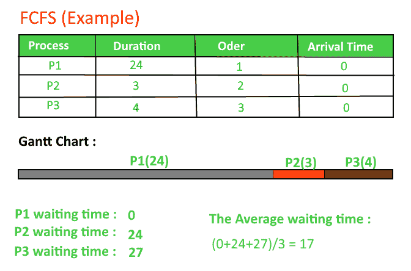

# 【FCFS CPU 调度程序|设置 1

> 原文:[https://www . geesforgeks . org/program-for-FCFS-CPU-scheduling-set-1/](https://www.geeksforgeeks.org/program-for-fcfs-cpu-scheduling-set-1/)

给定 n 个进程及其突发时间，任务是使用 FCFS 调度算法找到平均等待时间和平均周转时间。
先进先出(FIFO)，又称先来先服务(FCFS)，是最简单的调度算法。先进先出只是按照进程到达就绪队列的顺序对其进行排队。
在这种情况下，先来的进程将首先执行，只有在前一个进程完全执行后，下一个进程才会开始。
这里我们考虑到所有进程的到达时间都是 0。
**如何用程序计算循环赛中的下方时间？**

1.  完成时间:流程完成执行的时间。
2.  周转时间:完成时间和到达时间之间的时间差。周转时间=完成时间-到达时间
3.  等待时间:周转时间和突发时间之间的时间差。
    等待时间=周转时间–突发时间

***在这个帖子中，我们假设到达时间为 0，所以掉头和完成时间相同。***



**执行:**

```
1-  Input the processes along with their burst time (bt).
2-  Find waiting time (wt) for all processes.
3-  As first process that comes need not to wait so 
    waiting time for process 1 will be 0 i.e. wt[0] = 0.
4-  Find waiting time for all other processes i.e. for
     process i -> 
       wt[i] = bt[i-1] + wt[i-1] .
5-  Find turnaround time = waiting_time + burst_time 
    for all processes.
6-  Find average waiting time = 
                 total_waiting_time / no_of_processes.
7-  Similarly, find average turnaround time = 
                 total_turn_around_time / no_of_processes.
```

## C++

```
// C++ program for implementation of FCFS
// scheduling
#include<iostream>
using namespace std;

// Function to find the waiting time for all
// processes
void findWaitingTime(int processes[], int n,
                          int bt[], int wt[])
{
    // waiting time for first process is 0
    wt[0] = 0;

    // calculating waiting time
    for (int  i = 1; i < n ; i++ )
        wt[i] =  bt[i-1] + wt[i-1] ;
}

// Function to calculate turn around time
void findTurnAroundTime( int processes[], int n,
                  int bt[], int wt[], int tat[])
{
    // calculating turnaround time by adding
    // bt[i] + wt[i]
    for (int  i = 0; i < n ; i++)
        tat[i] = bt[i] + wt[i];
}

//Function to calculate average time
void findavgTime( int processes[], int n, int bt[])
{
    int wt[n], tat[n], total_wt = 0, total_tat = 0;

    //Function to find waiting time of all processes
    findWaitingTime(processes, n, bt, wt);

    //Function to find turn around time for all processes
    findTurnAroundTime(processes, n, bt, wt, tat);

    //Display processes along with all details
    cout << "Processes  "<< " Burst time  "
         << " Waiting time  " << " Turn around time\n";

    // Calculate total waiting time and total turn
    // around time
    for (int  i=0; i<n; i++)
    {
        total_wt = total_wt + wt[i];
        total_tat = total_tat + tat[i];
        cout << "   " << i+1 << "\t\t" << bt[i] <<"\t    "
            << wt[i] <<"\t\t  " << tat[i] <<endl;
    }

    cout << "Average waiting time = "
         << (float)total_wt / (float)n;
    cout << "\nAverage turn around time = "
         << (float)total_tat / (float)n;
}

// Driver code
int main()
{
    //process id's
    int processes[] = { 1, 2, 3};
    int n = sizeof processes / sizeof processes[0];

    //Burst time of all processes
    int  burst_time[] = {10, 5, 8};

    findavgTime(processes, n,  burst_time);
    return 0;
}
```

## C

```
// C program for implementation of FCFS 
// scheduling
#include<stdio.h>
// Function to find the waiting time for all 
// processes
void findWaitingTime(int processes[], int n, 
                          int bt[], int wt[])
{
    // waiting time for first process is 0
    wt[0] = 0;

    // calculating waiting time
    for (int  i = 1; i < n ; i++ )
        wt[i] =  bt[i-1] + wt[i-1] ;
}

// Function to calculate turn around time
void findTurnAroundTime( int processes[], int n, 
                  int bt[], int wt[], int tat[])
{
    // calculating turnaround time by adding
    // bt[i] + wt[i]
    for (int  i = 0; i < n ; i++)
        tat[i] = bt[i] + wt[i];
}

//Function to calculate average time
void findavgTime( int processes[], int n, int bt[])
{
    int wt[n], tat[n], total_wt = 0, total_tat = 0;

    //Function to find waiting time of all processes
    findWaitingTime(processes, n, bt, wt);

    //Function to find turn around time for all processes
    findTurnAroundTime(processes, n, bt, wt, tat);

    //Display processes along with all details
    printf("Processes   Burst time   Waiting time   Turn around time\n");

    // Calculate total waiting time and total turn 
    // around time
    for (int  i=0; i<n; i++)
    {
        total_wt = total_wt + wt[i];
        total_tat = total_tat + tat[i];
        printf("   %d ",(i+1));
        printf("       %d ", bt[i] );
        printf("       %d",wt[i] );
        printf("       %d\n",tat[i] );
    }
    int s=(float)total_wt / (float)n;
    int t=(float)total_tat / (float)n;
    printf("Average waiting time = %d",s);
    printf("\n");
    printf("Average turn around time = %d ",t);
}

// Driver code
int main()
{
    //process id's
    int processes[] = { 1, 2, 3};
    int n = sizeof processes / sizeof processes[0];

    //Burst time of all processes
    int  burst_time[] = {10, 5, 8};

    findavgTime(processes, n,  burst_time);
    return 0;
}
// This code is contributed by Shivi_Aggarwal
```

## Java 语言(一种计算机语言，尤用于创建网站)

```
// Java program for implementation of FCFS
// scheduling

import java.text.ParseException;

class GFG {

    // Function to find the waiting time for all
    // processes
    static void findWaitingTime(int processes[], int n,
            int bt[], int wt[]) {
        // waiting time for first process is 0
        wt[0] = 0;

        // calculating waiting time
        for (int i = 1; i < n; i++) {
            wt[i] = bt[i - 1] + wt[i - 1];
        }
    }

    // Function to calculate turn around time
    static void findTurnAroundTime(int processes[], int n,
            int bt[], int wt[], int tat[]) {
        // calculating turnaround time by adding
        // bt[i] + wt[i]
        for (int i = 0; i < n; i++) {
            tat[i] = bt[i] + wt[i];
        }
    }

    //Function to calculate average time
    static void findavgTime(int processes[], int n, int bt[]) {
        int wt[] = new int[n], tat[] = new int[n];
        int total_wt = 0, total_tat = 0;

        //Function to find waiting time of all processes
        findWaitingTime(processes, n, bt, wt);

        //Function to find turn around time for all processes
        findTurnAroundTime(processes, n, bt, wt, tat);

        //Display processes along with all details
        System.out.printf("Processes Burst time Waiting"
                       +" time Turn around time\n");

        // Calculate total waiting time and total turn
        // around time
        for (int i = 0; i < n; i++) {
            total_wt = total_wt + wt[i];
            total_tat = total_tat + tat[i];
            System.out.printf(" %d ", (i + 1));
            System.out.printf("     %d ", bt[i]);
            System.out.printf("     %d", wt[i]);
            System.out.printf("     %d\n", tat[i]);
        }
        float s = (float)total_wt /(float) n;
        int t = total_tat / n;
        System.out.printf("Average waiting time = %f", s);
        System.out.printf("\n");
        System.out.printf("Average turn around time = %d ", t);
    }

    // Driver code
    public static void main(String[] args) throws ParseException {
        //process id's
        int processes[] = {1, 2, 3};
        int n = processes.length;

        //Burst time of all processes
        int burst_time[] = {10, 5, 8};

        findavgTime(processes, n, burst_time);

    }
}
// This code is contributed by 29ajaykumar
```

## 蟒蛇 3

```
# Python3 program for implementation
# of FCFS scheduling

# Function to find the waiting
# time for all processes
def findWaitingTime(processes, n,
                    bt, wt):

    # waiting time for
    # first process is 0
    wt[0] = 0

    # calculating waiting time
    for i in range(1, n ):
        wt[i] = bt[i - 1] + wt[i - 1]

# Function to calculate turn
# around time
def findTurnAroundTime(processes, n,
                       bt, wt, tat):

    # calculating turnaround
    # time by adding bt[i] + wt[i]
    for i in range(n):
        tat[i] = bt[i] + wt[i]

# Function to calculate
# average time
def findavgTime( processes, n, bt):

    wt = [0] * n
    tat = [0] * n
    total_wt = 0
    total_tat = 0

    # Function to find waiting
    # time of all processes
    findWaitingTime(processes, n, bt, wt)

    # Function to find turn around
    # time for all processes
    findTurnAroundTime(processes, n,
                       bt, wt, tat)

    # Display processes along
    # with all details
    print( "Processes Burst time " +
                  " Waiting time " +
                " Turn around time")

    # Calculate total waiting time
    # and total turn around time
    for i in range(n):

        total_wt = total_wt + wt[i]
        total_tat = total_tat + tat[i]
        print(" " + str(i + 1) + "\t\t" +
                    str(bt[i]) + "\t " +
                    str(wt[i]) + "\t\t " +
                    str(tat[i]))

    print( "Average waiting time = "+
                   str(total_wt / n))
    print("Average turn around time = "+
                     str(total_tat / n))

# Driver code
if __name__ =="__main__":

    # process id's
    processes = [ 1, 2, 3]
    n = len(processes)

    # Burst time of all processes
    burst_time = [10, 5, 8]

    findavgTime(processes, n, burst_time)

# This code is contributed
# by ChitraNayal
```

## C#

```
// C# program for implementation of FCFS
// scheduling
using System;

class GFG
{

    // Function to find the waiting time for all
    // processes
    static void findWaitingTime(int []processes, int n,
                                int []bt, int[] wt)
    {
        // waiting time for first process is 0
        wt[0] = 0;

        // calculating waiting time
        for (int i = 1; i < n; i++)
        {
            wt[i] = bt[i - 1] + wt[i - 1];
        }
    }

    // Function to calculate turn around time
    static void findTurnAroundTime(int []processes, int n,
            int []bt, int []wt, int []tat) {
        // calculating turnaround time by adding
        // bt[i] + wt[i]
        for (int i = 0; i < n; i++)
        {
            tat[i] = bt[i] + wt[i];
        }
    }

    // Function to calculate average time
    static void findavgTime(int []processes, int n, int []bt)
    {
        int []wt = new int[n];
        int []tat = new int[n];
        int total_wt = 0, total_tat = 0;

        //Function to find waiting time of all processes
        findWaitingTime(processes, n, bt, wt);

        //Function to find turn around time for all processes
        findTurnAroundTime(processes, n, bt, wt, tat);

        //Display processes along with all details
        Console.Write("Processes Burst time Waiting"
                    +" time Turn around time\n");

        // Calculate total waiting time and total turn
        // around time
        for (int i = 0; i < n; i++)
        {
            total_wt = total_wt + wt[i];
            total_tat = total_tat + tat[i];
            Console.Write(" {0} ", (i + 1));
            Console.Write("     {0} ", bt[i]);
            Console.Write("     {0}", wt[i]);
            Console.Write("     {0}\n", tat[i]);
        }
        float s = (float)total_wt /(float) n;
        int t = total_tat / n;
        Console.Write("Average waiting time = {0}", s);
        Console.Write("\n");
        Console.Write("Average turn around time = {0} ", t);
    }

    // Driver code
    public static void Main(String[] args)
    {
        // process id's
        int []processes = {1, 2, 3};
        int n = processes.Length;

        // Burst time of all processes
        int []burst_time = {10, 5, 8};

        findavgTime(processes, n, burst_time);
    }
}

// This code contributed by Rajput-Ji
```

## java 描述语言

```
<script>

    // JavaScript program for implementation of FCFS
   // scheduling

   // Function to find the waiting time for all
  // processes
    function findWaitingTime(processes,n,bt,wt)
    {
        // waiting time for first process is 0
        wt[0] = 0;

        // calculating waiting time
        for (let i = 1; i < n; i++) {
            wt[i] = bt[i - 1] + wt[i - 1];
        }
    }

    function findTurnAroundTime(processes,n,bt,wt,tat)
    {
        // calculating turnaround time by adding
        // bt[i] + wt[i]
        for (let i = 0; i < n; i++) {
            tat[i] = bt[i] + wt[i];
        }
    }

    function findavgTime(processes,n,bt)
    {
        let wt = new Array(n), tat = new Array(n);
        for(let i=0;i<n;i++)
        {
            wt[i]=0;
            tat[i]=0;
        }
        let total_wt = 0, total_tat = 0;

        //Function to find waiting time of all processes
        findWaitingTime(processes, n, bt, wt);

        //Function to find turn around time for all processes
        findTurnAroundTime(processes, n, bt, wt, tat);

        //Display processes along with all details
        document.write("Processes Burst time Waiting"
                       +" time Turn around time<br>");

        // Calculate total waiting time and total turn
        // around time
        for (let i = 0; i < n; i++) {
            total_wt = total_wt + wt[i];
            total_tat = total_tat + tat[i];
            document.write("    ", (i + 1)+" ");
            document.write("     "+  bt[i]+" ");
            document.write("     "+ wt[i]);
            document.write("     "+ tat[i]+"<br>");
        }
        let s = total_wt / n;
        let t = Math.floor(total_tat / n);
        document.write("Average waiting time = "+ s);
        document.write("<br>");
        document.write("Average turn around time = ", t+" ");
    }

    let processes=[1,2,3];
    let  n = processes.length;

    let burst_time=[10,5,8];
    findavgTime(processes, n, burst_time);

    // This code is contributed by rag2127

</script>
```

**输出:**

```
Processes  Burst time  Waiting time  Turn around time
 1        10     0         10
 2        5     10         15
 3        8     15         23
Average waiting time = 8.33333
Average turn around time = 16
```

**要点:**

1.  不优先
2.  平均等待时间不是最佳的
3.  无法并行利用资源:导致护卫效应(考虑有多个输入输出绑定进程和一个中央处理器绑定进程的情况。当中央处理器绑定进程获取中央处理器时，输入输出绑定进程必须等待中央处理器绑定进程。IO 绑定进程本可以更好地占用 CPU 一段时间，然后使用 IO 设备)。