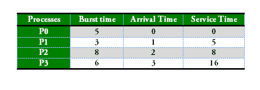

# 【FCFS CPU 调度程序|集合 2(到达时间不同的进程)

> 原文:[https://www . geesforgeks . org/program-for-FCFS-CPU-scheduling-set-2-到达时间不同的进程/](https://www.geeksforgeeks.org/program-for-fcfs-cpu-scheduling-set-2-processes-with-different-arrival-times/)

我们已经讨论了[相同到达时间](https://www.geeksforgeeks.org/program-fcfs-scheduling-set-1/)的流程的 FCFS 调度。在这篇文章中，讨论了流程到达时间不同的场景。给定 n 个进程及其突发时间和到达时间，任务是使用 FCFS 调度算法找到平均等待时间和平均周转时间。
先进先出只是按照进程到达就绪队列的顺序对其进行排队。这里，先来的进程将首先执行，下一个进程只有在前一个进程完全执行后才会开始。

1.  完成时间:流程完成执行的时间。
2.  周转时间:完成时间和到达时间之间的时间差。周转时间=完成时间-到达时间
3.  等待时间:周转时间和突发时间之间的时间差。
    等待时间=周转时间-突发时间。

 

```
Process     Wait Time : Service Time - Arrival Time
   P0                        0 - 0   = 0
   P1                        5 - 1   = 4
   P2                        8 - 2   = 6
   P3                        16 - 3  = 13

Average Wait Time: (0 + 4 + 6 + 13) / 4 = 5.75
```

**服务时间:**服务时间是指一个进程可以开始执行的时间。它是之前进程(之前的进程)的突发时间的总和

**与相同到达时间的 FCFS 的** [**代码相比的代码变化**](https://www.geeksforgeeks.org/program-fcfs-scheduling-set-1/) **:**
查找等待时间:所有进程在当前进程开始之前所花费的时间(即所有先前进程的突发时间)–当前进程的到达时间
**wait _ Time[I]=(Bt[0]+Bt[1]+……Bt[I-1])–到达时间[i]**

**实施:**

```
1- Input the processes along with their burst time(bt)
   and arrival time(at)
2- Find waiting time for all other processes i.e. for
   a given process  i:
       wt[i] = (bt[0] + bt[1] +...... bt[i-1]) - at[i] 
3- Now find turn around time 
          = waiting_time + burst_time for all processes
4- Average waiting time = 
                    total_waiting_time / no_of_processes
5- Average turn around time = 
                 total_turn_around_time / no_of_processes
```

## C++

```
// C++ program for implementation of FCFS
// scheduling with different arrival time
#include<iostream>
using namespace std;

// Function to find the waiting time for all
// processes
void findWaitingTime(int processes[], int n, int bt[],
                                   int wt[], int at[])
{
    int service_time[n];
    service_time[0] = at[0];
    wt[0] = 0;

    // calculating waiting time
    for (int i = 1; i < n ; i++)
    {
        // Add burst time of previous processes
        service_time[i] = service_time[i-1] + bt[i-1];

        // Find waiting time for current process =
        // sum - at[i]
        wt[i] = service_time[i] - at[i];

        // If waiting time for a process is in negative
        // that means it is already in the ready queue
        // before CPU becomes idle so its waiting time is 0
        if (wt[i] < 0)
            wt[i] = 0;
    }
}

// Function to calculate turn around time
void findTurnAroundTime(int processes[], int n, int bt[],
                                      int wt[], int tat[])
{
    // Calculating turnaround time by adding bt[i] + wt[i]
    for (int i = 0; i < n ; i++)
        tat[i] = bt[i] + wt[i];
}

// Function to calculate average waiting and turn-around
// times.
void findavgTime(int processes[], int n, int bt[], int at[])
{
    int wt[n], tat[n];

    // Function to find waiting time of all processes
    findWaitingTime(processes, n, bt, wt, at);

    // Function to find turn around time for all processes
    findTurnAroundTime(processes, n, bt, wt, tat);

    // Display processes along with all details
    cout << "Processes " << " Burst Time " << " Arrival Time "
         << " Waiting Time " << " Turn-Around Time "
         << " Completion Time \n";
    int total_wt = 0, total_tat = 0;
    for (int i = 0 ; i < n ; i++)
    {
        total_wt = total_wt + wt[i];
        total_tat = total_tat + tat[i];
        int compl_time = tat[i] + at[i];
        cout << " " << i+1 << "\t\t" << bt[i] << "\t\t"
             << at[i] << "\t\t" << wt[i] << "\t\t "
             << tat[i]  <<  "\t\t " << compl_time << endl;
    }

    cout << "Average waiting time = "
         << (float)total_wt / (float)n;
    cout << "\nAverage turn around time = "
         << (float)total_tat / (float)n;
}

// Driver code
int main()
{
    // Process id's
    int processes[] = {1, 2, 3};
    int n = sizeof processes / sizeof processes[0];

    // Burst time of all processes
    int burst_time[] = {5, 9, 6};

    // Arrival time of all processes
    int arrival_time[] = {0, 3, 6};

    findavgTime(processes, n, burst_time, arrival_time);

    return 0;
}
```

## Java 语言(一种计算机语言，尤用于创建网站)

```
// Java program for implementation of FCFS
// scheduling with different arrival time
public class GFG{

// Function to find the waiting time for all
// processes
static void findWaitingTime(int processes[], int n, int bt[], int wt[], int at[])
{
    int service_time[] = new int[n];
    service_time[0] = at[0];
    wt[0] = 0;

    // calculating waiting time
    for (int i = 1; i < n ; i++)
    {
        //representing wasted time in queue
        int wasted=0;
        // Add burst time of previous processes
        service_time[i] = service_time[i-1] + bt[i-1];

        // Find waiting time for current process =
        // sum - at[i]
        wt[i] = service_time[i] - at[i];

        // If waiting time for a process is in negative
        // that means it is already in the ready queue
        // before CPU becomes idle so its waiting time is 0
        // wasted time is basically time for process to wait after a process is over
        if (wt[i] < 0) {
            wasted = Math.abs(wt[i]);
            wt[i] = 0;
        }
        //Add wasted time
        service_time[i] = service_time[i] + wasted;
    }
}

// Function to calculate turn around time
static void findTurnAroundTime(int processes[], int n, int bt[],
                                    int wt[], int tat[])
{
    // Calculating turnaround time by adding bt[i] + wt[i]
    for (int i = 0; i < n ; i++)
        tat[i] = bt[i] + wt[i];
}

// Function to calculate average waiting and turn-around
// times.
static void findavgTime(int processes[], int n, int bt[], int at[])
{
    int wt[] = new int[n], tat[] = new int[n];

    // Function to find waiting time of all processes
    findWaitingTime(processes, n, bt, wt, at);

    // Function to find turn around time for all processes
    findTurnAroundTime(processes, n, bt, wt, tat);

    // Display processes along with all details
    System.out.print("Processes " + " Burst Time " + " Arrival Time "
        + " Waiting Time " + " Turn-Around Time "
        + " Completion Time \n");
    int total_wt = 0, total_tat = 0;
    for (int i = 0 ; i < n ; i++)
    {
        total_wt = total_wt + wt[i];
        total_tat = total_tat + tat[i];
        int compl_time = tat[i] + at[i];
        System.out.println(i+1 + "\t\t" + bt[i] + "\t\t"
            + at[i] + "\t\t" + wt[i] + "\t\t "
            + tat[i] + "\t\t " + compl_time);
    }

    System.out.print("Average waiting time = "
        + (float)total_wt / (float)n);
    System.out.print("\nAverage turn around time = "
        + (float)total_tat / (float)n);
}

// Driver code

    public static void main(String args[]) {
        // Process id's
    int processes[] = {1, 2, 3};
    int n = processes.length;

    // Burst time of all processes
    int burst_time[] = {5, 9, 6};

    // Arrival time of all processes
    int arrival_time[] = {0, 3, 6};

    findavgTime(processes, n, burst_time, arrival_time);

    }
}

/*This code is contributed by PrinciRaj1992*/
```

## 蟒蛇 3

```
# Python3 program for implementation of FCFS
# scheduling with different arrival time

# Function to find the waiting time
# for all processes
def findWaitingTime(processes, n, bt, wt, at):
    service_time = [0] * n
    service_time[0] = 0
    wt[0] = 0

    # calculating waiting time
    for i in range(1, n):

        # Add burst time of previous processes
        service_time[i] = (service_time[i - 1] +
                                     bt[i - 1])

        # Find waiting time for current
        # process = sum - at[i]
        wt[i] = service_time[i] - at[i]

        # If waiting time for a process is in
        # negative that means it is already
        # in the ready queue before CPU becomes
        # idle so its waiting time is 0
        if (wt[i] < 0):
            wt[i] = 0

# Function to calculate turn around time
def findTurnAroundTime(processes, n, bt, wt, tat):

    # Calculating turnaround time by
    # adding bt[i] + wt[i]
    for i in range(n):
        tat[i] = bt[i] + wt[i]

# Function to calculate average waiting
# and turn-around times.
def findavgTime(processes, n, bt, at):
    wt = [0] * n
    tat = [0] * n

    # Function to find waiting time
    # of all processes
    findWaitingTime(processes, n, bt, wt, at)

    # Function to find turn around time for
    # all processes
    findTurnAroundTime(processes, n, bt, wt, tat)

    # Display processes along with all details
    print("Processes   Burst Time   Arrival Time     Waiting",
          "Time   Turn-Around Time  Completion Time \n")
    total_wt = 0
    total_tat = 0
    for i in range(n):

        total_wt = total_wt + wt[i]
        total_tat = total_tat + tat[i]
        compl_time = tat[i] + at[i]
        print(" ", i + 1, "\t\t", bt[i], "\t\t", at[i],
              "\t\t", wt[i], "\t\t ", tat[i], "\t\t ", compl_time)

    print("Average waiting time = %.5f "%(total_wt /n))
    print("\nAverage turn around time = ", total_tat / n)

# Driver code
if __name__ =="__main__":

    # Process id's
    processes = [1, 2, 3]
    n = 3

    # Burst time of all processes
    burst_time = [5, 9, 6]

    # Arrival time of all processes
    arrival_time = [0, 3, 6]

    findavgTime(processes, n, burst_time,
                            arrival_time)

# This code is contributed
# Shubham Singh(SHUBHAMSINGH10)
```

## C#

```
// C# program for implementation of FCFS
// scheduling with different arrival time
using System;

public class GFG{

// Function to find the waiting time for all
// processes
static void findWaitingTime(int []processes, int n, int []bt, int []wt, int []at)
{
    int []service_time = new int[n];
    service_time[0] = 0;
    wt[0] = 0;

    // calculating waiting time
    for (int i = 1; i < n ; i++)
    {
        // Add burst time of previous processes
        service_time[i] = service_time[i-1] + bt[i-1];

        // Find waiting time for current process =
        // sum - at[i]
        wt[i] = service_time[i] - at[i];

        // If waiting time for a process is in negative
        // that means it is already in the ready queue
        // before CPU becomes idle so its waiting time is 0
        if (wt[i] < 0)
            wt[i] = 0;
    }
}

// Function to calculate turn around time
static void findTurnAroundTime(int []processes, int n, int[] bt,
                                    int []wt, int[] tat)
{
    // Calculating turnaround time by adding bt[i] + wt[i]
    for (int i = 0; i < n ; i++)
        tat[i] = bt[i] + wt[i];
}

// Function to calculate average waiting and turn-around
// times.
static void findavgTime(int []processes, int n, int []bt, int []at)
{
    int []wt = new int[n]; int []tat = new int[n];

    // Function to find waiting time of all processes
    findWaitingTime(processes, n, bt, wt, at);

    // Function to find turn around time for all processes
    findTurnAroundTime(processes, n, bt, wt, tat);

    // Display processes along with all details
    Console.Write("Processes " + " Burst Time " + " Arrival Time "
        + " Waiting Time " + " Turn-Around Time "
        + " Completion Time \n");
    int total_wt = 0, total_tat = 0;
    for (int i = 0 ; i < n ; i++)
    {
        total_wt = total_wt + wt[i];
        total_tat = total_tat + tat[i];
        int compl_time = tat[i] + at[i];
        Console.WriteLine(i+1 + "\t\t" + bt[i] + "\t\t"
            + at[i] + "\t\t" + wt[i] + "\t\t "
            + tat[i] + "\t\t " + compl_time);
    }

    Console.Write("Average waiting time = "
        + (float)total_wt / (float)n);
    Console.Write("\nAverage turn around time = "
        + (float)total_tat / (float)n);
}

// Driver code

    public static void Main(String []args) {
        // Process id's
    int []processes = {1, 2, 3};
    int n = processes.Length;

    // Burst time of all processes
    int []burst_time = {5, 9, 6};

    // Arrival time of all processes
    int []arrival_time = {0, 3, 6};

    findavgTime(processes, n, burst_time, arrival_time);

    }
}
// This code is contributed by Princi Singh
```

## java 描述语言

```
<script>

// JavaScript program for implementation of FCFS
// scheduling with different arrival time

// Function to find the waiting time for all
// processes
function findWaitingTime(processes , n , bt , wt , at)
{
    var service_time = Array.from({length: n}, (_, i) => 0);
    service_time[0] = at[0];
    wt[0] = 0;

    // calculating waiting time
    for (var i = 1; i < n ; i++)
    {
        //representing wasted time in queue
        var wasted=0;
        // Add burst time of previous processes
        service_time[i] = service_time[i-1] + bt[i-1];

        // Find waiting time for current process =
        // sum - at[i]
        wt[i] = service_time[i] - at[i];

        // If waiting time for a process is in negative
        // that means it is already in the ready queue
        // before CPU becomes idle so its waiting time is 0
        // wasted time is basically time for process to
        // wait after a process is over
        if (wt[i] < 0) {
            wasted = Math.abs(wt[i]);
            wt[i] = 0;
        }
        // Add wasted time
        service_time[i] = service_time[i] + wasted;
    }
}

// Function to calculate turn around time
function findTurnAroundTime(processes , n , bt, wt , tat)
{
    // Calculating turnaround time by adding bt[i] + wt[i]
    for (var i = 0; i < n ; i++)
        tat[i] = bt[i] + wt[i];
}

// Function to calculate average waiting and turn-around
// times.
function findavgTime(processes , n , bt , at)
{
    var wt = Array.from({length: n}, (_, i) => 0.0);
    var tat = Array.from({length: n}, (_, i) => 0.0);

    // Function to find waiting time of all processes
    findWaitingTime(processes, n, bt, wt, at);

    // Function to find turn around time for all processes
    findTurnAroundTime(processes, n, bt, wt, tat);

    // Display processes along with all details
    document.write("Processes " + " Burst Time " + " Arrival Time "
        + " Waiting Time " + " Turn-Around Time "
        + " Completion Time <br>");
    var total_wt = 0, total_tat = 0;
    for (var i = 0 ; i < n ; i++)
    {
        total_wt = total_wt + wt[i];
        total_tat = total_tat + tat[i];
        var compl_time = tat[i] + at[i];
        document.write(i+1 + "  " + bt[i]
        + "  "
            + at[i] + "  " + wt[i] + "  "
            + tat[i] + "  " + compl_time+"<br>");
    }

    document.write("<br>Average waiting time = "
        + total_wt/n +"<br>");
    document.write("<br>Average turn around time = "
        + total_tat/n+"<br>");
}

// Driver code

    // Process id's
   var processes = [1, 2, 3];
   var n = processes.length;

// Burst time of all processes
var burst_time = [5, 9, 6];

// Arrival time of all processes
var arrival_time = [0, 3, 6];

findavgTime(processes, n, burst_time, arrival_time);

// This code is contributed by 29AjayKumar

</script>
```

**输出:**

```
Processes  Burst Time  Arrival Time  Waiting Time  Turn-Around Time  Completion Time 
 1        5        0        0         5         5
 2        9        3        2         11         14
 3        6        6        8         14         20
Average waiting time = 3.33333
Average turn around time = 10.0
```

本文由 [**萨希尔·查布拉(akku)**](https://www.facebook.com/sahil.chhabra.965) 供稿。如果你喜欢 GeeksforGeeks 并想投稿，你也可以使用[write.geeksforgeeks.org](http://www.write.geeksforgeeks.org)写一篇文章或者把你的文章邮寄到 contribute@geeksforgeeks.org。看到你的文章出现在极客博客主页上，帮助其他极客。
如果发现有不正确的地方，或者想分享更多关于上述话题的信息，请写评论。