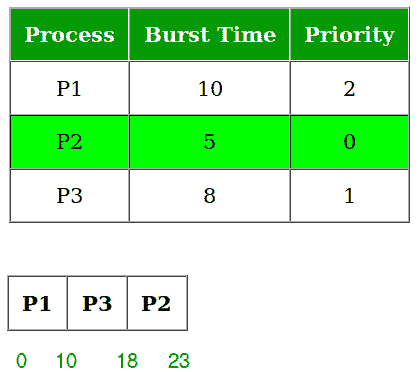

# 优先中央处理器调度程序|设置 1

> 原文:[https://www . geesforgeks . org/program-for-priority-CPU-scheduling-set-1/](https://www.geeksforgeeks.org/program-for-priority-cpu-scheduling-set-1/)

优先级调度是批处理系统中最常见的调度算法之一。每个进程都有一个优先级。优先级最高的进程将首先执行，以此类推。
具有相同优先级的进程以先到先得的方式执行。优先级可以根据内存需求、时间需求或任何其他资源需求来决定。
**实施:**

```
1- First input the processes with their burst time 
   and priority.
2- Sort the processes, burst time and priority
   according to the priority.
3- Now simply apply FCFS algorithm.
```



注意:优先级调度的一个主要问题是无限期阻塞或饥饿。低优先级进程无限期阻塞问题的解决方案是老化。老化是一种逐渐增加在系统中等待很长时间的进程的优先级的技术。

## C++

```
// C++ program for implementation of FCFS
// scheduling
#include<bits/stdc++.h>
using namespace std;

struct Process
{
    int pid;  // Process ID
    int bt;   // CPU Burst time required
    int priority; // Priority of this process
};

// Function to sort the Process acc. to priority
bool comparison(Process a, Process b)
{
    return (a.priority > b.priority);
}

// Function to find the waiting time for all
// processes
void findWaitingTime(Process proc[], int n,
                     int wt[])
{
    // waiting time for first process is 0
    wt[0] = 0;

    // calculating waiting time
    for (int  i = 1; i < n ; i++ )
        wt[i] =  proc[i-1].bt + wt[i-1] ;
}

// Function to calculate turn around time
void findTurnAroundTime( Process proc[], int n,
                         int wt[], int tat[])
{
    // calculating turnaround time by adding
    // bt[i] + wt[i]
    for (int  i = 0; i < n ; i++)
        tat[i] = proc[i].bt + wt[i];
}

//Function to calculate average time
void findavgTime(Process proc[], int n)
{
    int wt[n], tat[n], total_wt = 0, total_tat = 0;

    //Function to find waiting time of all processes
    findWaitingTime(proc, n, wt);

    //Function to find turn around time for all processes
    findTurnAroundTime(proc, n, wt, tat);

    //Display processes along with all details
    cout << "\nProcesses  "<< " Burst time  "
         << " Waiting time  " << " Turn around time\n";

    // Calculate total waiting time and total turn
    // around time
    for (int  i=0; i<n; i++)
    {
        total_wt = total_wt + wt[i];
        total_tat = total_tat + tat[i];
        cout << "   " << proc[i].pid << "\t\t"
             << proc[i].bt << "\t    " << wt[i]
             << "\t\t  " << tat[i] <<endl;
    }

    cout << "\nAverage waiting time = "
         << (float)total_wt / (float)n;
    cout << "\nAverage turn around time = "
         << (float)total_tat / (float)n;
}

void priorityScheduling(Process proc[], int n)
{
    // Sort processes by priority
    sort(proc, proc + n, comparison);

    cout<< "Order in which processes gets executed \n";
    for (int  i = 0 ; i <  n; i++)
        cout << proc[i].pid <<" " ;

    findavgTime(proc, n);
}

// Driver code
int main()
{
    Process proc[] = {{1, 10, 2}, {2, 5, 0}, {3, 8, 1}};
    int n = sizeof proc / sizeof proc[0];
    priorityScheduling(proc, n);
    return 0;
}
```

## Java 语言(一种计算机语言，尤用于创建网站)

```
// Java program for implementation of FCFS
// scheduling
import java.util.*;

class Process
{
    int pid; // Process ID
    int bt; // CPU Burst time required
    int priority; // Priority of this process
    Process(int pid, int bt, int priority)
    {
        this.pid = pid;
        this.bt = bt;
        this.priority = priority;
    }
    public int prior() {
        return priority;
    }
}

public class GFG
{

// Function to find the waiting time for all
// processes
public void findWaitingTime(Process proc[], int n,
                    int wt[])
{

    // waiting time for first process is 0
    wt[0] = 0;

    // calculating waiting time
    for (int i = 1; i < n ; i++ )
        wt[i] = proc[i - 1].bt + wt[i - 1] ;
}

// Function to calculate turn around time
public void findTurnAroundTime( Process proc[], int n,
                        int wt[], int tat[])
{
    // calculating turnaround time by adding
    // bt[i] + wt[i]
    for (int i = 0; i < n ; i++)
        tat[i] = proc[i].bt + wt[i];
}

// Function to calculate average time
public void findavgTime(Process proc[], int n)
{
    int wt[] = new int[n], tat[] = new int[n], total_wt = 0, total_tat = 0;

    // Function to find waiting time of all processes
    findWaitingTime(proc, n, wt);

    // Function to find turn around time for all processes
    findTurnAroundTime(proc, n, wt, tat);

    // Display processes along with all details
    System.out.print("\nProcesses   Burst time   Waiting time   Turn around time\n");

    // Calculate total waiting time and total turn
    // around time
    for (int i = 0; i < n; i++)
    {
        total_wt = total_wt + wt[i];
        total_tat = total_tat + tat[i];
        System.out.print(" " + proc[i].pid + "\t\t" + proc[i].bt + "\t " + wt[i] + "\t\t " + tat[i] + "\n");
    }

    System.out.print("\nAverage waiting time = "
            +(float)total_wt / (float)n);
    System.out.print("\nAverage turn around time = "+(float)total_tat / (float)n);
}

public void priorityScheduling(Process proc[], int n)
{

    // Sort processes by priority
    Arrays.sort(proc, new Comparator<Process>() {
        @Override
        public int compare(Process a, Process b) {
            return b.prior() - a.prior();
        }
    });
    System.out.print("Order in which processes gets executed \n");
    for (int i = 0 ; i < n; i++)
        System.out.print(proc[i].pid + " ") ;

    findavgTime(proc, n);
}

// Driver code
public static void main(String[] args)
{
    GFG ob=new GFG();
    int n = 3;
    Process proc[] = new Process[n];
    proc[0] = new Process(1, 10, 2);
    proc[1] = new Process(2, 5, 0);
    proc[2] = new Process(3, 8, 1);
    ob.priorityScheduling(proc, n);
}
}

// This code is contributed by rahulpatil07109.
```

## 蟒蛇 3

```
# Python3 program for implementation of
# Priority Scheduling

# Function to find the waiting time 
# for all processes
def findWaitingTime(processes, n, wt):
    wt[0] = 0

    # calculating waiting time
    for i in range(1, n):
        wt[i] = processes[i - 1][1] + wt[i - 1]

# Function to calculate turn around time
def findTurnAroundTime(processes, n, wt, tat):

    # Calculating turnaround time by
    # adding bt[i] + wt[i]
    for i in range(n):
        tat[i] = processes[i][1] + wt[i]

# Function to calculate average waiting
# and turn-around times.
def findavgTime(processes, n):
    wt = [0] * n
    tat = [0] * n

    # Function to find waiting time
    # of all processes
    findWaitingTime(processes, n, wt)

    # Function to find turn around time
    # for all processes
    findTurnAroundTime(processes, n, wt, tat)

    # Display processes along with all details
    print("\nProcesses    Burst Time    Waiting",
          "Time    Turn-Around Time")
    total_wt = 0
    total_tat = 0
    for i in range(n):

        total_wt = total_wt + wt[i]
        total_tat = total_tat + tat[i]
        print(" ", processes[i][0], "\t\t",
                   processes[i][1], "\t\t",
                   wt[i], "\t\t", tat[i])

    print("\nAverage waiting time = %.5f "%(total_wt /n))
    print("Average turn around time = ", total_tat / n)

def priorityScheduling(proc, n):

    # Sort processes by priority
    proc = sorted(proc, key = lambda proc:proc[2],
                                  reverse = True);

    print("Order in which processes gets executed")
    for i in proc:
        print(i[0], end = " ")
    findavgTime(proc, n)

# Driver code
if __name__ =="__main__":

    # Process id's
    proc = [[1, 10, 1],
            [2, 5, 0],
            [3, 8, 1]]
    n = 3
    priorityScheduling(proc, n)

# This code is contributed
# Shubham Singh(SHUBHAMSINGH10)
```

**输出:**

```
Order in which processes gets executed 
1 3 2 
Processes  Burst time  Waiting time  Turn around time
 1        10     0         10
 3        8     10         18
 2        5     18         23

Average waiting time = 9.33333
Average turn around time = 17
```

本文讨论到达时间为 0 的过程。在下一集，我们将考虑不同的到达时间来评估等待时间。
本文由 [**萨希尔·查布拉(akku)**](https://www.facebook.com/sahil.chhabra.965) 供稿。如果你喜欢 GeeksforGeeks 并想投稿，你也可以使用[contribute.geeksforgeeks.org](http://contribute.geeksforgeeks.org)写一篇文章或者把你的文章邮寄到 contribute@geeksforgeeks.org。看到你的文章出现在极客博客主页上，帮助其他极客。
如果发现有不正确的地方，或者想分享更多关于上述话题的信息，请写评论。