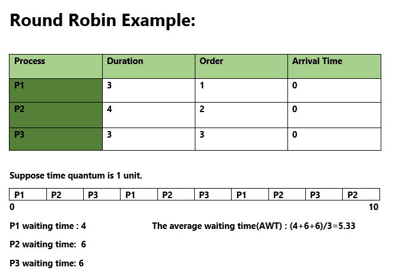

# 循环调度程序|第 1 集

> 原文:[https://www . geesforgeks . org/program-round-robin-scheduling-set-1/](https://www.geeksforgeeks.org/program-round-robin-scheduling-set-1/)

循环调度是一种 [CPU 调度算法](https://www.geeksforgeeks.org/cpu-scheduling-in-operating-systems/)，其中每个进程以循环的方式被分配一个固定的时隙。

*   它简单，易于实现，并且没有饥饿，因为所有进程都获得了公平的 CPU 份额。
*   作为核心的 CPU 调度中最常用的技术之一。
*   它是抢先的，因为进程最多只能在固定的时间段内被分配 CPU。
*   它的缺点是上下文切换的开销更大。

<figure class="table">

| 序列号 | 优势 | 不足之处 |
| --- | --- | --- |
| 1. | 这是公平的，因为每个进程都获得了相等的 CPU 份额。 | 等待时间和响应时间更长。 |
| 2. | 新创建的进程被添加到就绪队列的末尾。 | 吞吐量低。 |
| 3. | 循环调度器通常采用分时方式，给每个作业一个时隙或时间段。
 | 有上下文切换。 |
| 4. | 在执行循环调度时，特定的时间段被分配给不同的作业。
 | 甘特图似乎太大了(如果用于计划的时间段较少。例如:1 ms 为大调度。) |
| 5. | 在此调度中，每个进程都有机会在特定时间段后重新调度。
 | 小批量生产的耗时调度。 |

**插图:**



**如何用程序计算循环赛中的下方时间？**

1.  完成时间:流程完成执行的时间。
2.  周转时间:完成时间和到达时间之间的时间差。周转时间=完成时间-到达时间
3.  等待时间:周转时间和突发时间之间的时间差。
    等待时间=周转时间–突发时间

***在这个帖子中，我们假设到达时间为 0，所以掉头和完成时间相同。***
棘手的部分是计算等待时间。一旦计算了等待时间，就可以快速计算周转时间。
**查找所有流程等待时间的步骤:**

```
1- Create an array rem_bt[] to keep track of remaining
   burst time of processes. This array is initially a 
   copy of bt[] (burst times array)
2- Create another array wt[] to store waiting times
   of processes. Initialize this array as 0.
3- Initialize time : t = 0
4- Keep traversing the all processes while all processes
   are not done. Do following for i'th process if it is
   not done yet.
    a- If rem_bt[i] > quantum
       (i)  t = t + quantum
       (ii) rem_bt[i] -= quantum;
    c- Else // Last cycle for this process
       (i)  t = t + rem_bt[i];
       (ii) wt[i] = t - bt[i]
       (ii) rem_bt[i] = 0; // This process is over
```

一旦我们有了等待时间，我们就可以将进程的周转时间 tat[i]计算为等待时间和突发时间之和，即 wt[i] + bt[i]
以下是上述步骤的实现。

## C++

```
// C++ program for implementation of RR scheduling
#include<iostream>
using namespace std;

// Function to find the waiting time for all
// processes
void findWaitingTime(int processes[], int n,
            int bt[], int wt[], int quantum)
{
    // Make a copy of burst times bt[] to store remaining
    // burst times.
    int rem_bt[n];
    for (int i = 0 ; i < n ; i++)
        rem_bt[i] = bt[i];

    int t = 0; // Current time

    // Keep traversing processes in round robin manner
    // until all of them are not done.
    while (1)
    {
        bool done = true;

        // Traverse all processes one by one repeatedly
        for (int i = 0 ; i < n; i++)
        {
            // If burst time of a process is greater than 0
            // then only need to process further
            if (rem_bt[i] > 0)
            {
                done = false; // There is a pending process

                if (rem_bt[i] > quantum)
                {
                    // Increase the value of t i.e. shows
                    // how much time a process has been processed
                    t += quantum;

                    // Decrease the burst_time of current process
                    // by quantum
                    rem_bt[i] -= quantum;
                }

                // If burst time is smaller than or equal to
                // quantum. Last cycle for this process
                else
                {
                    // Increase the value of t i.e. shows
                    // how much time a process has been processed
                    t = t + rem_bt[i];

                    // Waiting time is current time minus time
                    // used by this process
                    wt[i] = t - bt[i];

                    // As the process gets fully executed
                    // make its remaining burst time = 0
                    rem_bt[i] = 0;
                }
            }
        }

        // If all processes are done
        if (done == true)
        break;
    }
}

// Function to calculate turn around time
void findTurnAroundTime(int processes[], int n,
                        int bt[], int wt[], int tat[])
{
    // calculating turnaround time by adding
    // bt[i] + wt[i]
    for (int i = 0; i < n ; i++)
        tat[i] = bt[i] + wt[i];
}

// Function to calculate average time
void findavgTime(int processes[], int n, int bt[],
                                    int quantum)
{
    int wt[n], tat[n], total_wt = 0, total_tat = 0;

    // Function to find waiting time of all processes
    findWaitingTime(processes, n, bt, wt, quantum);

    // Function to find turn around time for all processes
    findTurnAroundTime(processes, n, bt, wt, tat);

    // Display processes along with all details
    cout << "Processes "<< " Burst time "
        << " Waiting time " << " Turn around time\n";

    // Calculate total waiting time and total turn
    // around time
    for (int i=0; i<n; i++)
    {
        total_wt = total_wt + wt[i];
        total_tat = total_tat + tat[i];
        cout << " " << i+1 << "\t\t" << bt[i] <<"\t "
            << wt[i] <<"\t\t " << tat[i] <<endl;
    }

    cout << "Average waiting time = "
        << (float)total_wt / (float)n;
    cout << "\nAverage turn around time = "
        << (float)total_tat / (float)n;
}

// Driver code
int main()
{
    // process id's
    int processes[] = { 1, 2, 3};
    int n = sizeof processes / sizeof processes[0];

    // Burst time of all processes
    int burst_time[] = {10, 5, 8};

    // Time quantum
    int quantum = 2;
    findavgTime(processes, n, burst_time, quantum);
    return 0;
}
```

## Java 语言(一种计算机语言，尤用于创建网站)

```
// Java program for implementation of RR scheduling

public class GFG
{
    // Method to find the waiting time for all
    // processes
    static void findWaitingTime(int processes[], int n,
                 int bt[], int wt[], int quantum)
    {
        // Make a copy of burst times bt[] to store remaining
        // burst times.
        int rem_bt[] = new int[n];
        for (int i = 0 ; i < n ; i++)
            rem_bt[i] =  bt[i];

        int t = 0; // Current time

        // Keep traversing processes in round robin manner
        // until all of them are not done.
        while(true)
        {
            boolean done = true;

            // Traverse all processes one by one repeatedly
            for (int i = 0 ; i < n; i++)
            {
                // If burst time of a process is greater than 0
                // then only need to process further
                if (rem_bt[i] > 0)
                {
                    done = false; // There is a pending process

                    if (rem_bt[i] > quantum)
                    {
                        // Increase the value of t i.e. shows
                        // how much time a process has been processed
                        t += quantum;

                        // Decrease the burst_time of current process
                        // by quantum
                        rem_bt[i] -= quantum;
                    }

                    // If burst time is smaller than or equal to
                    // quantum. Last cycle for this process
                    else
                    {
                        // Increase the value of t i.e. shows
                        // how much time a process has been processed
                        t = t + rem_bt[i];

                        // Waiting time is current time minus time
                        // used by this process
                        wt[i] = t - bt[i];

                        // As the process gets fully executed
                        // make its remaining burst time = 0
                        rem_bt[i] = 0;
                    }
                }
            }

            // If all processes are done
            if (done == true)
              break;
        }
    }

    // Method to calculate turn around time
    static void findTurnAroundTime(int processes[], int n,
                            int bt[], int wt[], int tat[])
    {
        // calculating turnaround time by adding
        // bt[i] + wt[i]
        for (int i = 0; i < n ; i++)
            tat[i] = bt[i] + wt[i];
    }

    // Method to calculate average time
    static void findavgTime(int processes[], int n, int bt[],
                                         int quantum)
    {
        int wt[] = new int[n], tat[] = new int[n];
        int total_wt = 0, total_tat = 0;

        // Function to find waiting time of all processes
        findWaitingTime(processes, n, bt, wt, quantum);

        // Function to find turn around time for all processes
        findTurnAroundTime(processes, n, bt, wt, tat);

        // Display processes along with all details
        System.out.println("Processes " + " Burst time " +
                      " Waiting time " + " Turn around time");

        // Calculate total waiting time and total turn
        // around time
        for (int i=0; i<n; i++)
        {
            total_wt = total_wt + wt[i];
            total_tat = total_tat + tat[i];
            System.out.println(" " + (i+1) + "\t\t" + bt[i] +"\t " +
                              wt[i] +"\t\t " + tat[i]);
        }

        System.out.println("Average waiting time = " +
                          (float)total_wt / (float)n);
        System.out.println("Average turn around time = " +
                           (float)total_tat / (float)n);
    }

    // Driver Method
    public static void main(String[] args)
    {
        // process id's
        int processes[] = { 1, 2, 3};
        int n = processes.length;

        // Burst time of all processes
        int burst_time[] = {10, 5, 8};

        // Time quantum
        int quantum = 2;
        findavgTime(processes, n, burst_time, quantum);
    }
}
```

## 蟒蛇 3

```
# Python3 program for implementation of
# RR scheduling

# Function to find the waiting time
# for all processes
def findWaitingTime(processes, n, bt,
                         wt, quantum):
    rem_bt = [0] * n

    # Copy the burst time into rt[]
    for i in range(n):
        rem_bt[i] = bt[i]
    t = 0 # Current time

    # Keep traversing processes in round
    # robin manner until all of them are
    # not done.
    while(1):
        done = True

        # Traverse all processes one by
        # one repeatedly
        for i in range(n):

            # If burst time of a process is greater
            # than 0 then only need to process further
            if (rem_bt[i] > 0) :
                done = False # There is a pending process

                if (rem_bt[i] > quantum) :

                    # Increase the value of t i.e. shows
                    # how much time a process has been processed
                    t += quantum

                    # Decrease the burst_time of current
                    # process by quantum
                    rem_bt[i] -= quantum

                # If burst time is smaller than or equal 
                # to quantum. Last cycle for this process
                else:

                    # Increase the value of t i.e. shows
                    # how much time a process has been processed
                    t = t + rem_bt[i]

                    # Waiting time is current time minus
                    # time used by this process
                    wt[i] = t - bt[i]

                    # As the process gets fully executed
                    # make its remaining burst time = 0
                    rem_bt[i] = 0

        # If all processes are done
        if (done == True):
            break

# Function to calculate turn around time
def findTurnAroundTime(processes, n, bt, wt, tat):

    # Calculating turnaround time
    for i in range(n):
        tat[i] = bt[i] + wt[i]

# Function to calculate average waiting
# and turn-around times.
def findavgTime(processes, n, bt, quantum):
    wt = [0] * n
    tat = [0] * n

    # Function to find waiting time
    # of all processes
    findWaitingTime(processes, n, bt,
                         wt, quantum)

    # Function to find turn around time
    # for all processes
    findTurnAroundTime(processes, n, bt,
                                wt, tat)

    # Display processes along with all details
    print("Processes    Burst Time     Waiting",
                     "Time    Turn-Around Time")
    total_wt = 0
    total_tat = 0
    for i in range(n):

        total_wt = total_wt + wt[i]
        total_tat = total_tat + tat[i]
        print(" ", i + 1, "\t\t", bt[i],
              "\t\t", wt[i], "\t\t", tat[i])

    print("\nAverage waiting time = %.5f "%(total_wt /n) )
    print("Average turn around time = %.5f "% (total_tat / n))

# Driver code
if __name__ =="__main__":

    # Process id's
    proc = [1, 2, 3]
    n = 3

    # Burst time of all processes
    burst_time = [10, 5, 8]

    # Time quantum
    quantum = 2;
    findavgTime(proc, n, burst_time, quantum)

# This code is contributed by
# Shubham Singh(SHUBHAMSINGH10)
```

## C#

```
// C# program for implementation of RR
// scheduling
using System;

public class GFG {

    // Method to find the waiting time
    // for all processes
    static void findWaitingTime(int []processes,
             int n, int []bt, int []wt, int quantum)
    {

        // Make a copy of burst times bt[] to
        // store remaining burst times.
        int []rem_bt = new int[n];

        for (int i = 0 ; i < n ; i++)
            rem_bt[i] = bt[i];

        int t = 0; // Current time

        // Keep traversing processes in round
        // robin manner until all of them are
        // not done.
        while(true)
        {
            bool done = true;

            // Traverse all processes one by
            // one repeatedly
            for (int i = 0 ; i < n; i++)
            {
                // If burst time of a process
                // is greater than 0 then only
                // need to process further
                if (rem_bt[i] > 0)
                {

                    // There is a pending process
                    done = false;

                    if (rem_bt[i] > quantum)
                    {
                        // Increase the value of t i.e.
                        // shows how much time a process
                        // has been processed
                        t += quantum;

                        // Decrease the burst_time of
                        // current process by quantum
                        rem_bt[i] -= quantum;
                    }

                    // If burst time is smaller than
                    // or equal to quantum. Last cycle
                    // for this process
                    else
                    {

                        // Increase the value of t i.e.
                        // shows how much time a process
                        // has been processed
                        t = t + rem_bt[i];

                        // Waiting time is current
                        // time minus time used by
                        // this process
                        wt[i] = t - bt[i];

                        // As the process gets fully
                        // executed make its remaining
                        // burst time = 0
                        rem_bt[i] = 0;
                    }
                }
            }

            // If all processes are done
            if (done == true)
            break;
        }
    }

    // Method to calculate turn around time
    static void findTurnAroundTime(int []processes,
               int n, int []bt, int []wt, int []tat)
    {
        // calculating turnaround time by adding
        // bt[i] + wt[i]
        for (int i = 0; i < n ; i++)
            tat[i] = bt[i] + wt[i];
    }

    // Method to calculate average time
    static void findavgTime(int []processes, int n,
                             int []bt, int quantum)
    {
        int []wt = new int[n];
        int []tat = new int[n];
        int total_wt = 0, total_tat = 0;

        // Function to find waiting time of
        // all processes
        findWaitingTime(processes, n, bt, wt, quantum);

        // Function to find turn around time
        // for all processes
        findTurnAroundTime(processes, n, bt, wt, tat);

        // Display processes along with
        // all details
        Console.WriteLine("Processes " + " Burst time " +
                    " Waiting time " + " Turn around time");

        // Calculate total waiting time and total turn
        // around time
        for (int i = 0; i < n; i++)
        {
            total_wt = total_wt + wt[i];
            total_tat = total_tat + tat[i];
            Console.WriteLine(" " + (i+1) + "\t\t" + bt[i]
                         + "\t " + wt[i] +"\t\t " + tat[i]);
        }

        Console.WriteLine("Average waiting time = " +
                        (float)total_wt / (float)n);
        Console.Write("Average turn around time = " +
                        (float)total_tat / (float)n);
    }

    // Driver Method
    public static void Main()
    {
        // process id's
        int []processes = { 1, 2, 3};
        int n = processes.Length;

        // Burst time of all processes
        int []burst_time = {10, 5, 8};

        // Time quantum
        int quantum = 2;
        findavgTime(processes, n, burst_time, quantum);
    }
}

// This code is contributed by nitin mittal.
```

## java 描述语言

```
<script>
    // JavaScript program for implementation of RR scheduling

    // Function to find the waiting time for all
    // processes
    const findWaitingTime = (processes, n, bt, wt, quantum) => {
        // Make a copy of burst times bt[] to store remaining
        // burst times.
        let rem_bt = new Array(n).fill(0);
        for (let i = 0; i < n; i++)
            rem_bt[i] = bt[i];

        let t = 0; // Current time

        // Keep traversing processes in round robin manner
        // until all of them are not done.
        while (1) {
            let done = true;

            // Traverse all processes one by one repeatedly
            for (let i = 0; i < n; i++) {
                // If burst time of a process is greater than 0
                // then only need to process further
                if (rem_bt[i] > 0) {
                    done = false; // There is a pending process

                    if (rem_bt[i] > quantum) {
                        // Increase the value of t i.e. shows
                        // how much time a process has been processed
                        t += quantum;

                        // Decrease the burst_time of current process
                        // by quantum
                        rem_bt[i] -= quantum;
                    }

                    // If burst time is smaller than or equal to
                    // quantum. Last cycle for this process
                    else {
                        // Increase the value of t i.e. shows
                        // how much time a process has been processed
                        t = t + rem_bt[i];

                        // Waiting time is current time minus time
                        // used by this process
                        wt[i] = t - bt[i];

                        // As the process gets fully executed
                        // make its remaining burst time = 0
                        rem_bt[i] = 0;
                    }
                }
            }

            // If all processes are done
            if (done == true)
                break;
        }
    }

    // Function to calculate turn around time
    const findTurnAroundTime = (processes, n, bt, wt, tat) => {
        // calculating turnaround time by adding
        // bt[i] + wt[i]
        for (let i = 0; i < n; i++)
            tat[i] = bt[i] + wt[i];
    }

    // Function to calculate average time
    const findavgTime = (processes, n, bt, quantum) => {
        let wt = new Array(n).fill(0), tat = new Array(n).fill(0);
        let total_wt = 0, total_tat = 0;

        // Function to find waiting time of all processes
        findWaitingTime(processes, n, bt, wt, quantum);

        // Function to find turn around time for all processes
        findTurnAroundTime(processes, n, bt, wt, tat);

        // Display processes along with all details
        document.write(`Processes Burst time Waiting time Turn around time<br/>`);

        // Calculate total waiting time and total turn
        // around time
        for (let i = 0; i < n; i++) {
            total_wt = total_wt + wt[i];
            total_tat = total_tat + tat[i];

            document.write(`${i + 1} ${bt[i]} ${wt[i]} ${tat[i]}<br/>`);
        }

        document.write(`Average waiting time = ${total_wt / n}`);
        document.write(`<br/>Average turn around time = ${total_tat / n}`);
    }

    // Driver code
    // process id's
    processes = [1, 2, 3];
    let n = processes.length;

    // Burst time of all processes
    let burst_time = [10, 5, 8];

    // Time quantum
    let quantum = 2;
    findavgTime(processes, n, burst_time, quantum);

    // This code is contributed by rakeshsahni

</script>
```

**输出:**

```
Processes  Burst time  Waiting time  Turn around time
 1        10     13         23
 2        5     10         15
 3        8     13         21
Average waiting time = 12
Average turn around time = 19.6667
```

本文由 [**萨哈布拉**](https://www.facebook.com/sahil.chhabra.965) 供稿。如果你喜欢 GeeksforGeeks 并想投稿，你也可以使用[write.geeksforgeeks.org](https://write.geeksforgeeks.org)写一篇文章或者把你的文章邮寄到 review-team@geeksforgeeks.org。看到你的文章出现在极客博客主页上，帮助其他极客。
如果发现有不正确的地方，或者想分享更多关于上述话题的信息，请写评论。

</figure>