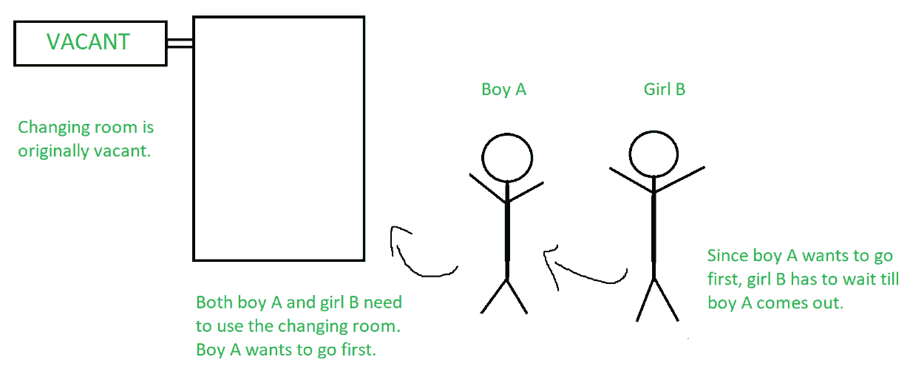
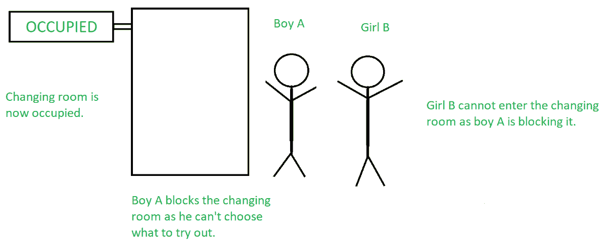

# 过程的进展

> 原文:[https://www.geeksforgeeks.org/progress-of-a-process/](https://www.geeksforgeeks.org/progress-of-a-process/)

在同时执行多个进程的过程中，关键部分中语句的执行顺序可能会影响[关键部分](https://www.geeksforgeeks.org/g-fact-70/)中值的最终状态。这只不过是一种[比赛状态](https://practice.geeksforgeeks.org/problems/race-condition)，并导致代码中的不一致。这些在[互斥](https://www.geeksforgeeks.org/mutual-exclusion-in-synchronization/)的帮助下被移除，但是仍然有可能因此导致其他进程饥饿。当这种[饥饿](https://www.geeksforgeeks.org/difference-between-deadlock-and-starvation-in-os/)延伸到无穷大时，就会导致死锁。

因此，仅仅互斥并不能保证进程的同时执行没有任何问题——需要称为进度的第二个条件来确保在这种执行过程中不会出现死锁。

高尔文对进步的正式定义是:

> 如果没有进程在其关键部分执行，并且一些进程希望进入其关键部分，则只有那些不在其剩余部分执行的进程才能参与决定下一个进入其关键部分的进程，并且此选择不能无限期推迟

这是一次要接受的很多东西，所以让我们用一个例子来看看我们的陈述有多有效。假设在一个百货商店的衣服区，一个男孩 A 和一个女孩 B 想使用更衣室。

男孩甲决定先用更衣室，但不能决定带多少衣服进去。因此，即使更衣室是空的，女孩 B(她已经决定了要试穿多少件衣服)也不能进入更衣室，因为她受到了男孩 a 的阻碍。

换句话说，男孩 A 阻止女孩 B 使用更衣室，即使他不需要使用。这就是进步的概念被用来防止的。

根据进度的主要定义，能够参与关于谁能进入关键部分的决策的唯一过程是那些即将进入关键部分或在进入关键部分之前正在执行一些代码的过程。处于其提醒部分(关键部分之后的部分)的流程不允许参与此决策过程。

进度的主要工作是确保一个进程在任何时间点都在关键部分执行(因此一些工作总是由处理器完成)。这一决定不能“无限期推迟”——换句话说，应该花有限的时间来选择应该允许哪个流程进入关键部分。如果这个决定不能在有限的时间内做出，就会导致僵局。