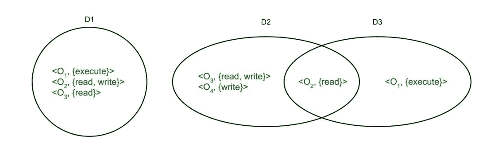

# 操作系统中的保护:保护域、关联、认证

> 原文:[https://www . geesforgeks . org/protection-in-OS-domain-of-protection-association-authentication/](https://www.geeksforgeeks.org/protection-in-os-domain-of-protection-association-authentication/)

在本文中，我们将介绍[操作系统](https://www.geeksforgeeks.org/operating-systems/)中的保护概述，它的保护需求和目标。并将重点介绍操作系统中的保护，如保护域、关联、认证等。我们一个一个来讨论。

**需要保护操作系统:**

*   为了确保数据安全、流程和程序安全，防止非法用户访问，甚至程序访问，我们需要保护。
*   这是为了确保程序、资源和数据仅根据系统策略进行访问。
*   这也是为了确保没有访问权限的侵犯，没有对现有数据的未授权访问，没有病毒或蠕虫。
*   可能存在安全威胁，例如未经授权的读取、写入、修改或阻止系统为授权用户正常工作。

**保护目标:**

*   因此，保护是一种保护数据和进程免受恶意和故意入侵的方法。为此，我们制定了保护策略，这些策略或者由系统本身设计，或者由管理层自己指定，或者由程序员单独强制实施，以额外的安全性保护他们的程序。
*   它还为多程序操作系统提供了用户共享文件或目录等公共空间所需的安全感。
*   这些策略绑定了进程如何访问计算机系统中的资源，如中央处理器、内存、软件甚至操作系统。操作系统设计人员和应用程序程序员都对此负责。然而，这些政策总是时有变化。

**保护域:**

*   保护策略限制每个进程对其资源处理的访问。一个进程必须在它所要求的时间限制内和它所要求的方式下，只使用它完成任务所需要的那些资源。这是进程的受保护域。
*   计算机系统有进程和对象，它们被视为抽象数据类型，这些对象有特定于它们的操作。一个域元素被描述为<object of="" operations="" on="" object="">。</object>
*   每个域都由一组对象和可以对其执行的操作组成。一个域可以只由一个进程、一个过程或一个用户组成。那么，如果一个域对应一个过程，那么改变域就意味着改变过程标识。对象可以共享一个或两个公共操作。然后这些域重叠。

**进程和域之间的关联:**
进程在拥有访问权限时从一个域切换到另一个域。它可以有以下两种类型。

1.  **固定或静态–**
    在固定关联中，所有的访问权限都可以在最开始赋予进程，但这会产生大量的域切换访问权限。因此，可以动态地找到改变域内容的方法。

2.  **变化的或动态的–**
    在动态关联中，一个进程可以动态切换，如果需要，在进程中创建新的域。

**安全措施:**

*   针对不当行为采取了不同级别的安全措施，例如不允许任何人进入场所或进入系统。
*   用于传输文件的网络必须始终安全。传输时，任何外来软件都不能从网络中提取信息。这被称为网络嗅探，可以通过引入加密的数据传输通道来防止。此外，操作系统必须能够抵御强制甚至意外的违规。
*   最好的认证方式是使用用户名密码组合，使用指纹、眼睛视网膜扫描甚至用户卡来访问系统。
*   密码是一种很好的身份验证方法，但也是最常见且最容易受到攻击的方法之一。破解密码并不太难。虽然有弱密码，但即使是硬密码也可以通过嗅探或让多个用户访问甚至网络嗅探来破解，如上所述。

**安全认证:**
为了使密码强大并成为强大的认证来源，一次性密码、加密密码和密码学的使用如下。

1.  **一次性密码**–
    它的使用方式是在用户每次登录时都是唯一的。这是一对密码组合在一起，赋予用户访问权限。系统生成一个随机数，用户提供一个互补的随机数，或者系统和用户通过一个算法并通过两者共享的公共函数获得一个随机数，它们匹配输出，从而获得访问权。

2.  **加密密码–**
    这也是一种非常好的认证访问的方式。加密数据通过网络传输，网络传输和检查密码有助于数据传输，不会中断或被拦截。

3.  **密码学–**
    **是另一种确保未经授权的用户无法通过网络传输数据的方法。这有助于在完全保护的情况下传输数据。它通过引入密钥的概念来保护数据。这里的关键非常重要。当用户发送数据时，他使用拥有密钥的计算机对数据进行编码，接收器也必须使用相同的密钥对数据进行解码。因此，即使数据在中途被盗，未经授权的用户仍然很有可能无法访问它。**