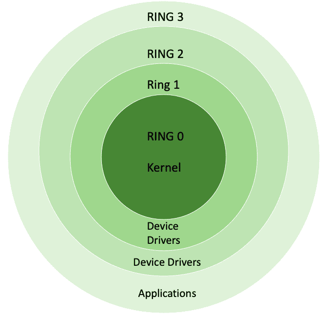

# 保护环

> 原文:[https://www.geeksforgeeks.org/protection-ring/](https://www.geeksforgeeks.org/protection-ring/)

在计算机科学中，有序保护域被称为**保护环**。这些机制有助于提高容错能力并提供计算机安全性。操作系统提供不同级别的资源访问。环按等级从最高特权到最低特权排列。

**保护环的使用:**
保护环的使用为权限和执行级别提供了逻辑空间。保护环的两个重要用途是:

1.  提高容错能力
2.  提供计算机安全

**保护环等级:**
基本上有 4 个等级，从最有特权的 0 到最没有特权的 3。大多数操作系统使用 0 级作为内核或执行，使用 3 级作为应用程序。级别 n 可访问的资源也可访问级别 0 到 n，特权级别是环。

保护环

**保护环的模式:**
基本上有两种模式:监管模式和管理程序模式。下面简单解释一下。

1.  **监管模式:**
    监管模式是某些处理器中的一种执行模式，允许执行包括特权指令在内的所有指令。它还允许访问不同的地址空间、内存管理硬件和其他外设。通常，操作系统以这种模式运行。
2.  **虚拟机管理程序模式:**
    现代 CPU 为虚拟机管理程序提供 x86 虚拟化指令，以控制“Ring 0”硬件访问。为了帮助实现虚拟化，VT 和 Pacifica 在“环 0”之下插入了新的权限级别，并且这两者都添加了九个新的“机器代码”指令，这些指令只在环 1 上工作，并打算由虚拟机管理程序使用。

**实现:**
在一些系统中，保护环与处理器模式相结合，以对抗从机规则。运行在支持这些规则的硬件上的操作系统可以使用这两种保护方法，也可以只使用其中一种。保护环体系结构的有效使用需要硬件和操作系统之间的密切交互。

操作系统的设计使得它们可以在很多平台上工作，并且在每个平台上可能有不同的实现机制环。安全模型通常被简化为两个访问级别——第一个是“核心”级别，第二个是“用户”级别，即使硬件提供了更大粒度的性能级别。

**保护环特性:**

*   保护环遵循层次结构。
*   保护环提供分层架构。
*   保护环提供计算机安全。
*   保护环提供良好的容错能力。