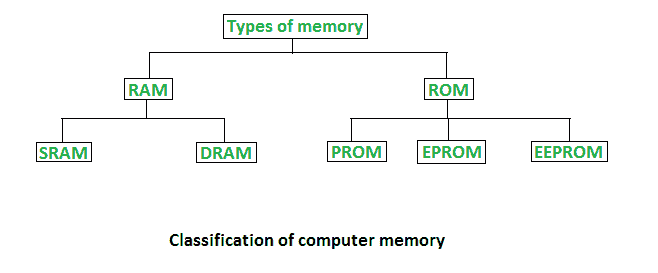
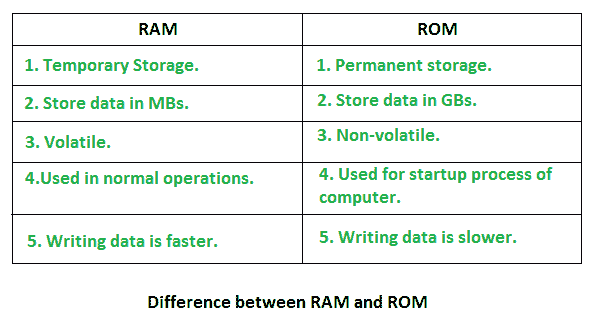

# 随机存取存储器(RAM)和只读存储器(ROM)

> 原文:[https://www . geesforgeks . org/随机存取存储器 ram 和只读存储器 rom/](https://www.geeksforgeeks.org/random-access-memory-ram-and-read-only-memory-rom/)

内存是计算系统中最重要的元素，因为没有内存，计算机就无法执行简单的任务。计算机内存有两种基本类型——主内存(随机存取存储器和只读存储器)和辅助内存(硬盘、光盘等)。随机存取存储器是主易失性存储器，只读存储器是主非易失性存储器。

计算机内存的分类

### **随机存取存储器–**

*   也称为读写*存储器*或*主存储器*或*主存储器*。
*   中央处理器在执行程序时需要的程序和数据都存储在这个存储器中。
*   它是一个易失性存储器，因为断电时数据会丢失。
*   RAM 进一步分为两种类型- [*SRAM*](https://www.geeksforgeeks.org/sram-full-form/) *(静态随机存取存储器)*和 [*DRAM*](https://www.geeksforgeeks.org/dram-full-form/) *(动态随机存取存储器)*。

静态随机存取存储器和动态随机存取存储器的区别

### 只读**存储器(只读存储器)**

*   存储操作系统所必需的重要信息，如启动计算机所必需的程序。
*   它不易挥发。
*   始终保留其数据。
*   用于嵌入式系统或编程不需要改变的地方。
*   用于计算器和外围设备。
*   ROM 进一步分为四种类型- M *ROM* 、[T3】PROMT5、](https://www.geeksforgeeks.org/prom-full-form/)[T7】EPROMT9、](https://www.geeksforgeeks.org/eprom-full-form/)[T11】EEPROMT13。](https://www.geeksforgeeks.org/eeprom-full-form/)

#### **只读存储器的类型**

*   **PROM(可编程只读存储器)**–可由用户编程。一旦编程，其中的数据和指令就不能更改。
*   **EPROM(可擦除可编程只读存储器)**–可重新编程。要清除其中的数据，将其暴露在紫外线下。要重新编程，清除所有先前的数据。
*   **EEPROM(电可擦除可编程只读存储器)**–施加电场即可擦除数据，无需紫外线。我们只能擦除芯片的一部分。
*   **MROM(Mask ROM)**–Mask ROM 是一种只读存储器，在生产时被屏蔽掉。像其他类型的只读存储器一样，屏蔽只读存储器不能使用户改变存储在其中的数据。如果可以的话，这个过程会很困难或者很慢。

随机存取存储器和只读存储器的区别