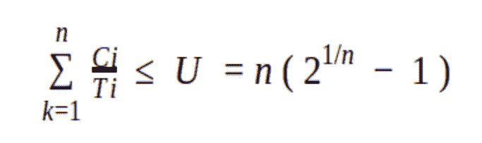
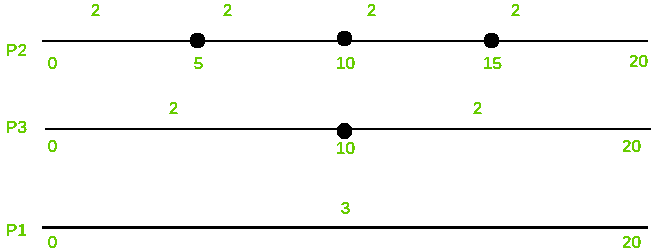
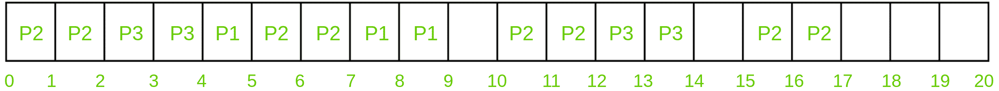

# 单调速率调度

> 原文:[https://www.geeksforgeeks.org/rate-monotonic-scheduling/](https://www.geeksforgeeks.org/rate-monotonic-scheduling/)

**速率单调调度**是属于[实时操作系统](https://www.geeksforgeeks.org/real-time-operating-system-rtos/)静态优先级调度范畴的一种优先级算法。本质上是先发制人。优先级是根据所涉及的流程的周期时间来决定的。如果流程的作业持续时间较短，则优先级最高。因此，如果具有最高优先级的进程开始执行，它将抢占其他正在运行的进程。进程的优先级与其运行的周期成反比。

只有当一组流程满足以下等式时，才能对其进行调度:



其中 n 是进程集中进程的数量，Ci 是进程的计算时间，Ti 是进程运行的时间段，U 是处理器利用率。

**示例:**
了解 Rate 单调调度算法工作原理的示例。

| 处理 | 执行时间(丙) | 时间段 |
| --- | --- | --- |
| 第一亲代 | three | Twenty |
| P2 | Two | five |
| P3 | Two | Ten |

```
n( 2^1/n - 1 ) = 3 ( 2^1/3 - 1 ) = 0.7977

U = 3/20 + 2/5 + 2/10 = 0.75 
```

利用率低于 1%或 100%。三个进程的组合利用率小于这些进程的阈值，这意味着上述进程集是可调度的，因此满足算法的上述等式。

1.  **调度时间–**
    为了计算算法的调度时间，我们必须取所有进程时间段的 LCM。上面例子的 LCM ( 20，5，10)是 20。因此，我们可以按 20 个时间单位来安排。
2.  **优先级–**
    如上所述，运行时间最短的进程优先级最高。因此，P2 将是最优先的国家，其次是 P3，最后是 P1。

    ```
    P2 > P3 > P1 
    ```

3.  **Representation and flow –**

    

    上图显示，流程 P2 每 5 个时间单位执行两次，流程 P3 每 10 个时间单位执行两次，流程 P1 每 20 个时间单位执行三次。为了理解下面算法的整个执行过程，必须牢记这一点。

    

    P2 进程将首先运行 2 个时间单位，因为它具有最高优先级。完成两个单位后，P3 将获得机会，因此它将运行 2 个时间单位。

    正如我们所知，P2 进程将在 5 个时间单位的时间间隔内运行 2 次，P3 进程将在 10 个时间单位的时间间隔内运行 2 次，它们满足了标准，因此现在优先级最低的 P1 进程将获得机会，并将运行 1 次。这里五个时间单位的间隔已经完成。由于其优先权，P2 将抢占 P1，因此将跑 2 次。由于 P3 在 10 个时间单位的间隔内完成了它的 2 个时间单位，P1 将获得机会，它将运行剩余的 2 次，完成它在 20 个时间单位内的 3 次执行。

    现在 9-10 间隔保持空闲，因为没有进程需要它。在 10 个时间单位时，P2 进程将运行 2 次，完成第三个时间间隔(10-15)的标准。P3 进程现在将运行两次，完成其执行。出于上述同样的原因，间隔 14-15 将再次保持空闲。在 15 时间单位，进程 P2 将执行两次，完成其执行。这就是单调速率调度的工作原理。

**条件:**
单调速率调度的分析假设每个进程应该具备的属性很少。它们是:

1.  所涉及的流程不应与其他流程共享资源。
2.  截止日期必须与时间段相似。截止日期是确定的。
3.  需要以最高优先级运行的进程将抢占所有其他进程。
4.  优先级必须根据速率单调调度协议分配给所有进程。

**优势:**

1.  很容易实现。
2.  如果任何静态优先级分配算法都能满足截止日期，那么速率单调调度也能做到这一点。它是最优的。
3.  它由时间周期的计算副本组成，不像其他分时算法那样忽略进程的调度需求。

**缺点:**

1.  在军事革命下，支持非周期性和零星的任务是非常困难的。
2.  当任务期限和期限不同时，军事革命不是最佳的。