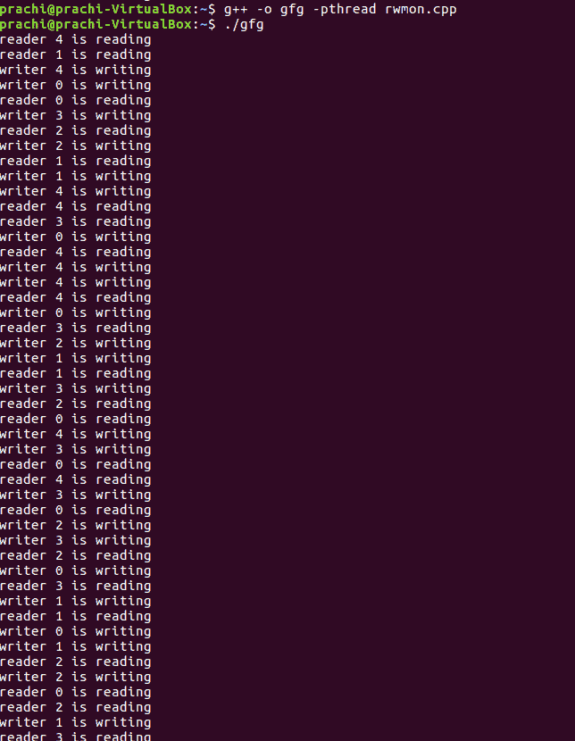

# 使用监视器(pthreads)的读写器问题

> 原文:[https://www . geesforgeks . org/reader-writer-problem-use-monitors-pthreads/](https://www.geeksforgeeks.org/reader-writer-problem-using-monitors-pthreads/)

先决条件–[监控](https://www.geeksforgeeks.org/monitors/)、[读者-作者问题](https://www.geeksforgeeks.org/operating-system-reader-writers-solution-using-monitors/)
有一个共享资源，由多个进程访问，即读者和作者。任意数量的读取器可以同时从共享资源中读取，但是一次只有一个写入器可以写入共享资源。当编写器向资源写入数据时，没有其他进程可以访问资源。如果此时有任何读者访问资源，则编写器无法写入资源。类似地，如果有一个写入程序正在访问资源，或者如果有任何等待的写入程序，则读取器无法读取。

使用监视器的读写器问题可以使用 pthreads 实现。 **POSIX 线程(或 pthread)** 库是一个基于标准的 C/C++线程 API。该库提供以下同步机制:

*   **互斥锁(pthread _ mutex _ t)–互斥锁:**
    阻止其他线程访问变量。这强制线程独占访问一个变量或一组变量。
*   **条件变量–(pthread _ cond _ t):**
    条件变量机制允许线程暂停执行并放弃处理器，直到某个条件为真。

**使用 pthread 库实现读写器解决方案:**

在您的 Linux 系统中使用以下命令执行该程序

```
$g++ -pthread program_name.cpp
$./a.out
or
$g++ -pthread program_name.cpp -o object_name
$./object_name

```

**代码:**

```
// Reader-Writer problem using monitors

#include <iostream>
#include <pthread.h>
#include <unistd.h>
using namespace std;

class monitor {
private:
    // no. of readers
    int rcnt;

    // no. of writers
    int wcnt;

    // no. of readers waiting
    int waitr;

    // no. of writers waiting
    int waitw;

    // condition variable to check whether reader can read
    pthread_cond_t canread;

    // condition variable to check whether writer can write
    pthread_cond_t canwrite;

    // mutex for synchronisation
    pthread_mutex_t condlock;

public:
    monitor()
    {
        rcnt = 0;
        wcnt = 0;
        waitr = 0;
        waitw = 0;

        pthread_cond_init(&canread, NULL);
        pthread_cond_init(&canwrite, NULL);
        pthread_mutex_init(&condlock, NULL);
    }

    // mutex provide synchronisation so that no other thread
    // can change the value of data
    void beginread(int i)
    {
        pthread_mutex_lock(&condlock);

        // if there are active or waiting writers
        if (wcnt == 1 || waitw > 0) {
            // incrementing waiting readers
            waitr++;

            // reader suspended
            pthread_cond_wait(&canread, &condlock);
            waitr--;
        }

        // else reader reads the resource
        rcnt++;
        cout << "reader " << i << " is reading\n";
        pthread_mutex_unlock(&condlock);
        pthread_cond_broadcast(&canread);
    }

    void endread(int i)
    {

        // if there are no readers left then writer enters monitor
        pthread_mutex_lock(&condlock);

        if (--rcnt == 0)
            pthread_cond_signal(&canwrite);

        pthread_mutex_unlock(&condlock);
    }

    void beginwrite(int i)
    {
        pthread_mutex_lock(&condlock);

        // a writer can enter when there are no active
        // or waiting readers or other writer
        if (wcnt == 1 || rcnt > 0) {
            ++waitw;
            pthread_cond_wait(&canwrite, &condlock);
            --waitw;
        }
        wcnt = 1;
        cout << "writer " << i << " is writing\n";
        pthread_mutex_unlock(&condlock);
    }

    void endwrite(int i)
    {
        pthread_mutex_lock(&condlock);
        wcnt = 0;

        // if any readers are waiting, threads are unblocked
        if (waitr > 0)
            pthread_cond_signal(&canread);
        else
            pthread_cond_signal(&canwrite);
        pthread_mutex_unlock(&condlock);
    }

}

// global object of monitor class
M;

void* reader(void* id)
{
    int c = 0;
    int i = *(int*)id;

    // each reader attempts to read 5 times
    while (c < 5) {
        usleep(1);
        M.beginread(i);
        M.endread(i);
        c++;
    }
}

void* writer(void* id)
{
    int c = 0;
    int i = *(int*)id;

    // each writer attempts to write 5 times
    while (c < 5) {
        usleep(1);
        M.beginwrite(i);
        M.endwrite(i);
        c++;
    }
}

int main()
{
    pthread_t r[5], w[5];
    int id[5];
    for (int i = 0; i < 5; i++) {
        id[i] = i;

        // creating threads which execute reader function
        pthread_create(&r[i], NULL, &reader, &id[i]);

        // creating threads which execute writer function
        pthread_create(&w[i], NULL, &writer, &id[i]);
    }

    for (int i = 0; i < 5; i++) {
        pthread_join(r[i], NULL);
    }
    for (int i = 0; i < 5; i++) {
        pthread_join(w[i], NULL);
    }
}
```

**输出:**

