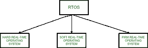

# 实时操作系统(RTOS)

> 原文:[https://www . geesforgeks . org/real-time-operating-system-RTOS/](https://www.geeksforgeeks.org/real-time-operating-system-rtos/)

实时**操作系统(RTOS)** 用于必须在短时间内或在一定期限内接受和处理大量事件的环境，这些事件大多在计算机系统外部。这些应用包括工业控制、电话交换设备、飞行控制和实时模拟。使用 RTOS，处理时间以十分之几秒为单位。这个系统有时间限制，有固定的截止日期。这类系统中的处理必须在指定的约束条件下进行。否则，这将导致系统故障。

实时操作系统的例子:航空交通控制系统、指挥控制系统、航空预订系统、心脏和平使者、网络多媒体系统、机器人等。
实时操作系统可以有 3 种类型–

1.  **Hard** Real-Time **operating system:** 
    These operating systems guarantee that critical tasks be completed within a range of time. 

    例如，雇佣机器人焊接车身。如果机器人焊接太早或太晚，汽车就卖不出去，所以它是一个硬实时系统，几乎不按时要求机器人完成汽车焊接。

2.  **Soft** real-time **operating system:** 
    This operating system provides some relaxation in the time limit. 

    例如——多媒体系统、数字音频系统等。在实时系统中会遇到明确的、程序员定义的和受控的过程。处理单个外部事件会改变单独的流程。当发生由中断发出的相关事件时，该过程被激活。

    多任务操作是通过相互独立地调度进程来完成的。每个流程都被赋予一定的优先级，该优先级对应于它所服务的事件的相对重要性。处理器被分配给优先级最高的进程。这种类型的调度称为基于优先级的抢先调度，被实时系统使用。

3.  **Firm** Real-time **Operating System**: 
    RTOS of this type have to follow deadlines as well. In spite of its small impact, missing a deadline can have unintended consequences, including a reduction in the quality of the product. Example: Multimedia applications.

**优势:**

实时操作系统的优势如下-

1.  **最大消耗–**
    设备和系统的最大利用率。从而从所有资源中获得更多的产出。

2.  **任务转移–**
    在这些系统中，分配给转移任务的时间非常少。例如，在旧系统中，大约需要 10 微秒。将一个任务转移到另一个任务，在最新的系统中，需要 3 微秒。

3.  **关注应用程序–**
    关注正在运行的应用程序，对队列中的应用程序不太重视。

4.  嵌入式系统中的实时**操作系统–**
    由于程序规模较小，RTOS 也可以像在交通等领域一样是嵌入式系统。

5.  **无错误–**
    这些类型的系统是无错误的。

6.  **内存分配–**
    内存分配最好在这些类型的系统中管理。

**缺点:**
实时操作系统的缺点如下-

1.  **有限任务–**
    很少有任务同时运行，为了避免错误，它们的注意力很少集中在少数应用程序上。

2.  **使用重系统资源–**
    有时候系统资源不太好，也很贵。

3.  **复杂算法–**
    算法非常复杂，设计者很难写出来。

4.  **设备驱动程序和中断信号–**
    它需要特定的设备驱动程序和中断信号来最早响应中断。

5.  **线程优先级–**
    设置线程优先级不好，因为这些系统非常不容易切换任务。

6.  **最小切换–**RTOS 执行最小任务切换。