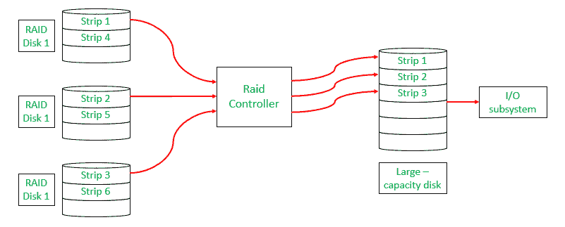
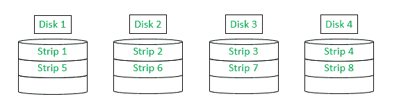
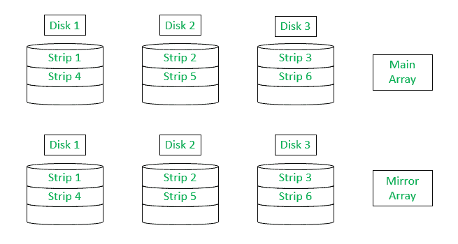
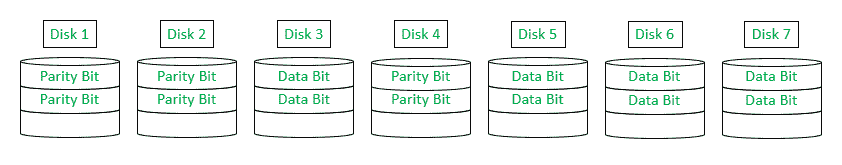
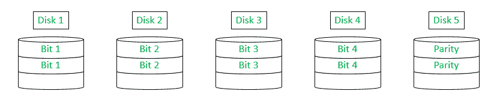
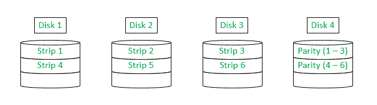
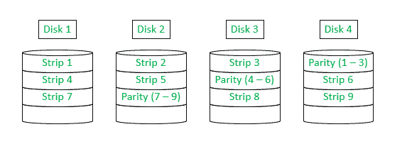
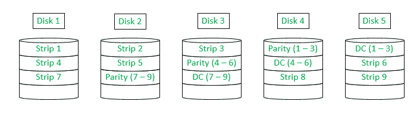

# 独立磁盘冗余阵列(RAID) |第二组

> 原文:[https://www . geesforgeks . org/独立磁盘冗余阵列-raid-set-2/](https://www.geeksforgeeks.org/redundant-array-of-independent-disks-raid-set-2/)

[独立磁盘冗余阵列(RAID)](https://www.geeksforgeeks.org/raid-redundant-arrays-of-independent-disks/) 是一组几个物理磁盘驱动器，操作系统将其视为单个逻辑单元。它在缩小越来越快的处理器和越来越慢的磁盘驱动器之间的差距方面发挥了重要作用。

RAID 背后的基本原理是，几个较小容量的磁盘驱动器在性能上比一些大容量的磁盘驱动器更好，因为通过在几个较小的磁盘之间分配数据，系统可以更快地从它们那里访问数据，从而提高输入/输出性能，并在磁盘故障时提高数据恢复。

典型的磁盘阵列配置包括连接到容纳软件的控制器的小型磁盘驱动器，并协调磁盘中的数据到连接到输入/输出子系统的大容量磁盘的传输。
请注意，整个配置被操作系统视为单个大容量磁盘。

*   数据被分成称为**条带**的段，这些段分布在阵列中的磁盘上。
*   横跨磁盘的一组连续条带称为**条带**。
*   整个过程叫做**条纹**。

除了引入冗余的概念有助于因硬件故障而导致的数据恢复之外，它还增加了硬件的成本。
RAID 的整个系统从 0 级到 6 级分为 7 级。这里，级别并不表示层级，而是表示不同类型的配置和纠错能力。

**0 级:**
RAID 0 级是唯一无法从硬件故障中恢复的级别，因为它不提供纠错或冗余。因此，不能称之为 RAID 的真正形式。然而，它确实提供了与其他设备相同的显著优势——对于操作系统来说，这组设备似乎是一个单一的逻辑单元。

如上图所示，当操作系统发出命令时，该命令可以并行传输到条带，从而大大提高了性能。

**级别 1 :**
RAID 级别 1 不仅使用分条的过程，还通过提供冗余来使用镜像配置，即它在磁盘镜像阵列中创建所有数据的重复集，在硬件出现故障时作为备份。如果一个驱动器出现故障，可以立即从镜像磁盘阵列中检索数据。有了这个，它就变成了一个可靠的系统。

如上所示，数据已被复制到另一个磁盘阵列中作为备份。

*   **缺点**包括数据写入两次，一次在主磁盘，然后在备份磁盘。然而，通过与数据的主要写入并行地复制数据，可以节省处理时间。
*   另一个**缺点**是需要双倍的空间，所以比较贵。但是，**的优势**有备份，不用担心数据丢失，抵消了这个劣势。

**2 级:**
RAID 2 级利用非常小的条带(通常为 1 字节大小)和一个**汉明码**来提供冗余(用于错误检测、纠正等任务)。).
**汉明码**:是数据传输时用于检错纠错的算法。它给数据增加了额外的冗余位。它能够纠正单比特错误和纠正双比特错误。

这种配置有一个**缺点**，由于附加阵列的数量取决于条带的大小，并且所有驱动器必须高度同步，因此实施起来既昂贵又复杂。
**的优势**包括如果驱动器出现故障，那么只有一个磁盘会受到影响，数据可以快速恢复。

**3 级:**
RAID 3 级是只需要一个磁盘冗余的配置。每个条带只计算一个奇偶校验位，并存储在指定的冗余磁盘中。
如果驱动器出现故障，RAID 控制器会将来自该磁盘的所有位视为 0，并记录故障磁盘的位置。因此，如果正在读取的数据有奇偶校验错误，则控制器知道该位应该为 1，并对其进行纠正。

如果数据正在写入有故障设备的阵列，则控制器会保持奇偶校验一致，以便在更换阵列时重新生成数据。更换故障磁盘并在新磁盘(或阵列)上重新生成其内容时，系统会恢复正常。

**级别 4 :**
RAID 级别 4 使用与级别 0 &级别 1 相同的概念，但也为每个条带计算奇偶校验，并将该奇偶校验存储在奇偶校验磁盘的相应条带中。
此配置的**优势**是，如果磁盘出现故障，数据仍然可以从奇偶校验磁盘恢复。

每次执行写命令时都会计算奇偶校验。但是，当要在磁盘内部重写数据时，RAID 控制器必须能够更新数据和奇偶校验磁盘。因此，无论何时执行写入或重写操作，都需要访问奇偶校验磁盘。这就产生了一种被称为**瓶颈**的情况，这是该配置的主要**劣势**。

**5 级:**
RAID 5 级是修改 4 级。在级别 4 中，只有一个磁盘被指定用于奇偶校验存储奇偶校验。但是在第 5 级中，它将奇偶校验磁盘分布在阵列中的磁盘上。

这种配置的**优势**是避免了 4 级时产生瓶颈的情况。
这种配置的**缺点**是，当磁盘出现故障时，数据的重新生成非常复杂。

**6 级:**
RAID 6 级提供了额外程度的错误检测和纠正。它需要 2 种不同的奇偶校验计算。
一个计算与四级和五级使用的相同，另一个计算是独立的数据检查算法。这两个奇偶校验存储在阵列中的不同磁盘上，对应于阵列中的数据条。

这种配置的**优势**是，即使有 2 个磁盘出现故障或故障，也可以恢复数据。
此配置的**劣势**包括:

*   冗余增加了写入数据所需的时间，因为现在数据也要写入第二个奇偶校验磁盘。
*   在此配置中，另一个磁盘被指定为奇偶校验磁盘，这减少了阵列中数据磁盘的数量。