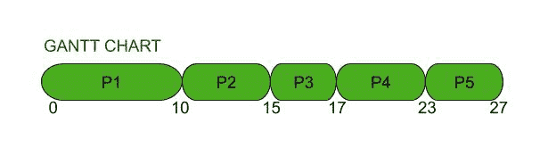
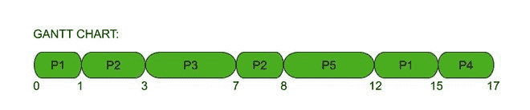

# FCFS 中的关系和抢占式优先级调度算法

> 原文:[https://www . geeksforgeeks . org/relation-in-FCFS-and-preemptive-priority-scheduling-algorithm/](https://www.geeksforgeeks.org/relation-in-fcfs-and-preemptive-priority-scheduling-algorithm/)

在本文中，我们将看到 FCFS 是如何成为一种特殊的优先级抢占调度算法的。此外，我们将讨论彼此之间的关系。让我们一个一个讨论。

**1。** [**先来先服务(FCFS)调度算法**](https://www.geeksforgeeks.org/fcfs-disk-scheduling-algorithms/) **:**
FCFS 是 [CPU 调度算法](https://www.geeksforgeeks.org/cpu-scheduling-in-operating-systems/)中最简单的一个，执行先来后到的进程。是[非抢占算法](https://www.geeksforgeeks.org/preemptive-and-non-preemptive-scheduling/)。首先到达就绪队列的进程首先由中央处理器执行，然后是第二个，然后是第三个，依此类推。流程的到达时间是这里的决定因素。就绪队列类似于先进先出队列。

**示例–**
以下是进程、它们的到达时间和爆发时间的列表。[甘特图](https://www.geeksforgeeks.org/short-note-on-gantt-chart/)显示了它们是如何执行的。

<figure class="table">

| 过程 | 到达时间 | 突发时间 |
| P1
 | 0
 | 10
 |
| P2
 | 3
 | 5
 |
| P3
 | 5
 | 2
 |
| P4
 | 6
 | 6
 |
| P5
 | 8
 | 4
 |

随着进程进入就绪队列，它们被一个接一个地发送到中央处理器执行。除非第一个到达的进程完成它的执行，否则下一个进程没有机会。

**2。** [**【抢占式优先级调度算法】**](https://www.geeksforgeeks.org/difference-between-preemptive-priority-based-and-non-preemptive-priority-based-cpu-scheduling-algorithms/) **:**
在抢占式优先级调度算法中，进程是有优先级的。优先级数字越低，流程的优先级越高。优先级较高的进程到达时会抢占正在进行的进程。它得到了中央处理器。优先级为 1 的进程总是在到达时获得 CPU，并且永远不会被抢占。它的响应时间为 0。同等优先级的流程按 FCFS 顺序安排。

**示例–**
以下是进程、它们的到达时间和爆发时间的列表。甘特图显示了它们是如何执行的。

<figure class="table">

| 过程 | 到达时间 | 突发时间 | 优先 |
| 总数 | 剩余的 |
| P1
 | 0
 | 4
 | 4
 | 4
 |
| P2
 | 1
 | 3
 | 3
 | 3
 |
| P3
 | 3
 | 4
 | 4
 | 1
 |
| P4
 | 6
 | 2
 | 2
 | 5
 |
| P5
 | 8
 | 4
 | 4
 | 2
 |

**FCFS 是一种特殊的** [**抢占式优先级调度算法**](https://www.geeksforgeeks.org/program-for-preemptive-priority-cpu-scheduling/) **:**
FCFS 执行就绪队列中最先出现的进程。这意味着它优先考虑流程的到达时间。排在第一位的进程比其他进程获得更高的优先级，因此首先获得 CPU。因此，我们说 FCFS 是一种特殊的抢占式优先级调度算法，其中较早到达的时间具有较高的优先级。

**抢占式优先级是一种特殊的** [**FCFS 调度算法**](https://www.geeksforgeeks.org/fcfs-scheduling-full-form/) **:**
抢占式优先级调度算法在有同等优先级进程时的行为类似于 FCFS。如果两个进程具有相同的优先级，将首先执行到达时间较早的进程。因此，我们说抢占优先权是一种特殊的 FCFS 调度算法。

【FCFS 与抢占式优先级调度算法的区别:

<figure class="table">

| 没有 | 先到先得 | 抢先优先权 |
| 1. | 它以进入就绪队列的相同顺序执行进程。 | 它首先执行那些优先级最高的进程。 |
| 2. | 这是一个非抢先的过程。 | 这是一个先发制人的过程。 |
| 3. | 这是最简单的过程。 | 实现起来比较复杂。 |
| 4. | 后面流程的响应和等待时间会增加很多。 | 当流程的响应时间和等待时间显著减少时，它会更有效。 |
| 5. | 最后进入就绪队列的进程必须等待的时间最长。如果开始时的进程有很长的突发时间，那么整个系统就会延迟。 | 优先级最低的进程等待时间最长。它们被执行得很晚，尽管它们的爆发时间可能很短。 |
| 6. | FCFS 作为一种抢占式优先级调度算法，到达时间越早优先级越高。 | 当有同等优先级的进程时，抢占式优先级调度算法就像 FCFS 一样。 |

</figure>

</figure>

</figure>