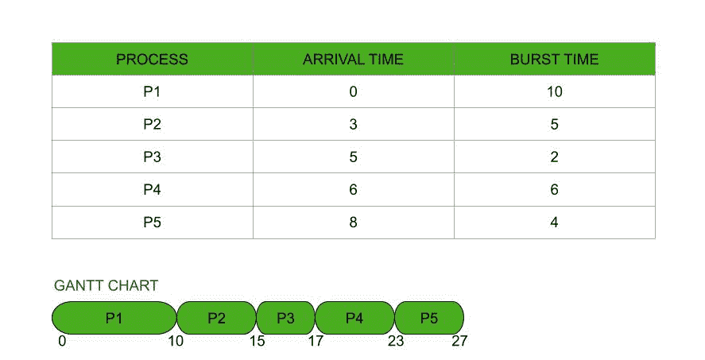
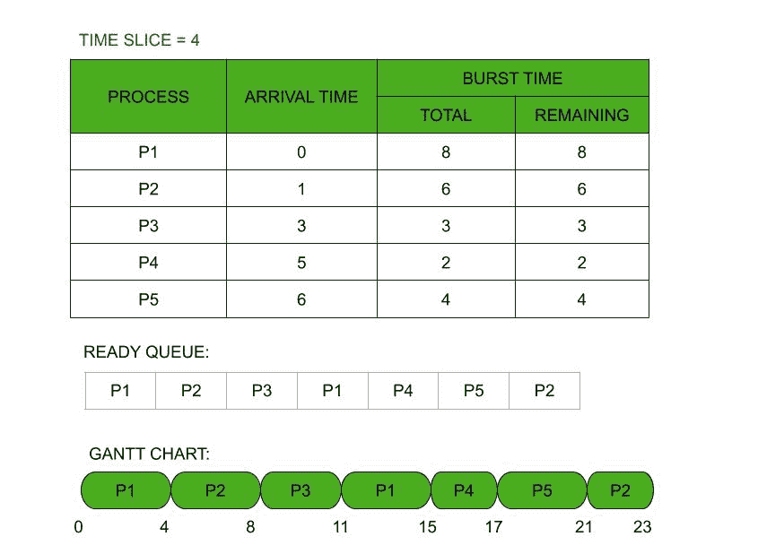

# FCFS 中的关系和循环调度算法

> 原文:[https://www . geesforgeks . org/relation-in-FCFS-and-round-robin-scheduling-algorithm/](https://www.geeksforgeeks.org/relation-in-fcfs-and-round-robin-scheduling-algorithm/)

在本文中，我们将看到 FCFS 是一种特殊的循环算法，而循环是一种特殊的 FCFS 算法。此外，我们将讨论彼此之间的关系。我们一个一个来讨论。

**先到先得(FCFS)调度算法:**

[FCFS](https://www.geeksforgeeks.org/program-for-fcfs-cpu-scheduling-set-1/) 是 [CPU 调度算法](https://www.geeksforgeeks.org/cpu-scheduling-in-operating-systems/)中最简单的一个，它执行先来后到的进程。是[非抢先算法](https://www.geeksforgeeks.org/preemptive-and-non-preemptive-scheduling/)。进入就绪队列的进程首先由中央处理器执行，然后是第二个，然后是第三个，依此类推。流程的到达时间是这里的决定因素。就绪队列类似于先进先出队列。

带甘特图的 FCFS 调度算法

**循环算法:**

[循环调度算法](https://www.geeksforgeeks.org/program-round-robin-scheduling-set-1/)是抢占式调度算法。它使用时间片或时间量子的概念。就绪队列开始处的进程有机会首先被执行，但仅限于一次性量程的范围。随着越来越多的新进程被添加到就绪队列中，正在进行的进程被抢占并被添加到就绪队列的末尾。下一个过程获得机会，再次为一次性量子跨度。该算法是为分时系统设计的。

时间片= 4 的循环算法

**FCFS 是一种特殊的 RR 算法:**

大时间量的 FCFS 就像一个 [RR 算法](https://www.geeksforgeeks.org/program-round-robin-scheduling-set-1/)。想象一个 RR 算法，它的时间片很大，等于或大于最长进程的突发时间，那么每个进程将以它们到达就绪队列的方式执行。不会有先发制人。它的行为就像 FCFS 算法一样。因此，我们说 FCFS 是一种特殊的 RR 算法。

**注–**

在这里，我们并不是说 RR 不是一种特殊的 FCFS，因为 FCFS 不支持时间量子的概念。RR 可以是 FCFS 的特殊类型，但它有下面提到的单独条件。

**RR 是一种特殊的 FCFS 算法:**

在 [RR](https://www.geeksforgeeks.org/program-round-robin-scheduling-set-1/) 中，当进程在一次性量程内没有完全执行时，它会被抢占，并以新的到达时间再次添加到就绪队列中。对于就绪队列，它是正在输入的新进程。因此， [RR](https://www.geeksforgeeks.org/program-round-robin-scheduling-set-1/) 在它们进入就绪队列时一个接一个地执行它们。这里没有使用其他类型的优先级。因此，我们说 RR 是一种特殊的 FCFS 算法，当作业被抢占并以新的到达时间重新加入就绪队列时。