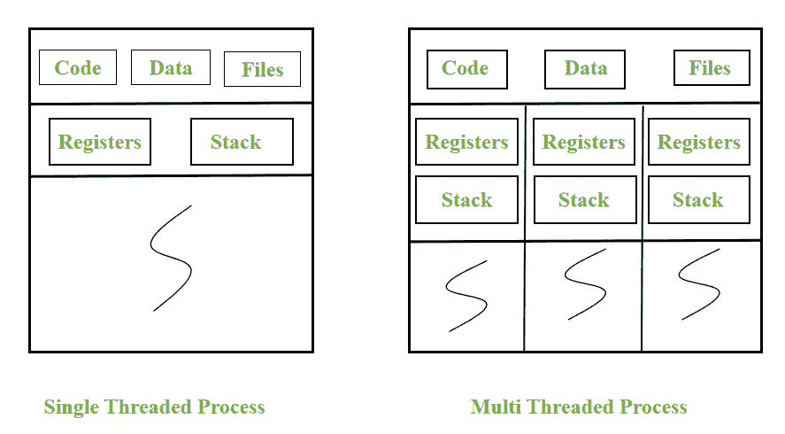
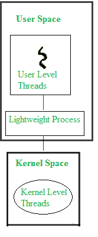

# 用户级线程和内核级线程的关系

> 原文:[https://www . geesforgeks . org/用户级线程和内核级线程之间的关系/](https://www.geeksforgeeks.org/relationship-between-user-level-thread-and-kernel-level-thread/)

任务是在程序执行时完成的，这就产生了一个过程。每个任务包含一个或多个子任务，而这些子任务是由线程在程序中作为函数执行的。操作系统(内核)不知道用户空间中的线程。

有两种类型的线程，用户级线程(ULT)和内核级线程(KLT)。

1.  **用户级线程:**
    用户空间中的线程由应用程序开发人员设计，使用线程库来执行唯一的子任务。

2.  **内核级线程:**
    由 os 开发者设计的内核空间中的线程，执行 OS 独有的功能。类似于中断处理程序。

用户级线程和内核级线程之间存在着紧密的联系。

**ULT 和 KLT 的属地:**

1.  **Use of Thread Library :** 
    Thread library acts as an interface for the application developer to create number of threads (according to the number of subtasks) and to manage those threads. This API for a process can be implemented in kernel space or user space. In real-time application, the necessary thread library is implemented in user space. This reduces the system call to kernel whenever the application is in need of thread creation, scheduling or thread management activities. Thus, the thread creation is faster as it requires only function calls within the process. The user address space for each thread is allocated at run-time. Overall it reduces various interface and architectural overheads as all these functions are independent of kernel support. 
2.  **Synchronization :** 
    The subtasks (functions) within each task (process) can be executed concurrently or parallelly depending on the application. In that case, single-threaded process is not suitable. There evokes multithreaded process. A unique subtask is allocated to every thread within the process. These threads may use the same data section or different data section. Typically, threads within the same process will share the code section, data section, address space, open files etc. 

当通过共享代码段同时执行子任务时，可能会导致数据不一致。最终，需要适当的同步技术来维护控制流，以访问共享数据([关键部分](https://www.geeksforgeeks.org/g-fact-70/))。

在多线程进程中，同步采用了四种不同的模型:

1.  **互斥锁–**这允许一次只有一个线程访问共享资源。

2.  **读/写锁–**这允许对共享资源进行独占写入和并发读取。

3.  **计数信号量–**这个计数是指一次可以同时访问的共享资源的数量。一旦达到计数限制，剩余的线程就会被阻塞。

4.  **Condition Variables –** This blocks the thread until the condition satisfies(Busy Waiting). 
    All these synchronization models are carried out within each process using thread library. The memory space for the lock variables is allocated in the user address space. Thus, requires no kernel intervention. 

**1。调度:**
应用开发者在线程创建期间使用线程库设置每个 ULT 线程的优先级和调度策略。在程序执行时，基于定义的属性，由线程库进行调度。在这种情况下，系统调度器无法控制线程调度，因为内核不知道 ULT 线程。

**2。上下文切换:**
在同一进程中，从一个 ULT 线程切换到另一个 ULT 线程更快，因为每个线程都有自己独特的线程控制块、寄存器和堆栈。因此，寄存器被保存和恢复。不需要改变地址空间。整个切换在线程库的控制下发生在用户地址空间内。

**3。异步输入/输出:**
在输入/输出请求后，ULT 线程保持阻塞状态，直到它收到来自接收器的确认(ack)。虽然它遵循异步输入/输出，但它为应用程序用户创建了一个同步环境。这是因为线程库本身调度另一个 ULT 执行，直到被阻塞的线程发送 *sigpoll* 作为 ack 到进程线程库。只有线程库重新调度阻塞的线程。

例如，考虑一个程序从一个文件复制(读取)内容并粘贴(写入)到另一个文件。此外，显示进度完成百分比的弹出窗口。

这个过程包含三个子任务，每个子任务分配给一个 ULT，

*   **线程 A–**从源文件读取内容。存储在进程地址空间的全局变量 X 中。

*   **线程 B–**读取全局变量 x .写入目标文件。

*   **线程 C–**以图形方式显示完成进度的百分比。

在这里，应用程序开发人员将使用线程库调度程序内的多个控制流。

执行顺序:先从线程 A 开始，然后是线程 B，然后是线程 c
线程 A 和线程 B 共享全局变量 X，只有当线程 A 在 X 上写后，线程 B 才能读取 X，这样的话，就要在共享变量上采用同步，避免线程 B 读取旧数据。从线程 A 到线程 B 再到线程 C 的上下文切换发生在进程地址空间内。每个线程在自己的线程控制块(TCB)中保存和恢复寄存器。线程 C 保持阻塞状态，直到线程 B 开始对目标文件的第一次写操作。这就是背后的原因，100%的图形指示几秒钟后弹出，虽然过程完成。

**ULT 和 KLT 之间的附属国:**
KLT 和 ULT 之间唯一的主要附属国出现在 ULT 需要**核心资源**的时候。每个 ULT 线程都与一个名为轻量级进程的虚拟处理器相关联。这是由线程库根据应用需要创建并组合到 ULT 的。每当调用系统调用时，系统调度程序都会创建一个内核级线程，并将其调度到 LWPs。这些 KLT 被不知道 ULT 的系统调度程序调度来访问内核资源。而 KLT 通过 LWPs 知道与其相关的每个 ULT。

关系不存在怎么办？
如果 KLT 和 ULT 之间没有关联，那么根据内核，每个进程都是单线程进程。在这种情况下，

1.  系统调度器可以利用优先级较低的线程或空闲线程来调度进程。这将导致高优先级线程的饥饿，进而降低系统的效率。

2.  当单个线程被阻塞时，整个进程都会被阻塞。那么即使在多核系统中，CPU 利用率也会变得低得多。尽管可能存在可执行线程，但内核将每个进程视为单线程进程，一次只分配一个内核。

3.  系统调度器可以提供单个时间片，而与进程内的线程数量无关。单线程进程和具有 1000 个线程且时间片相同的进程会使系统效率更低。