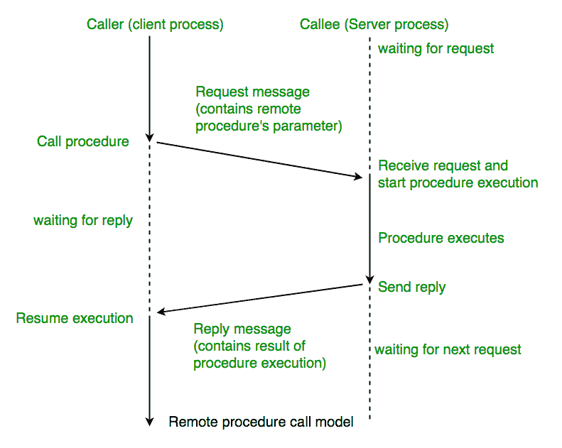
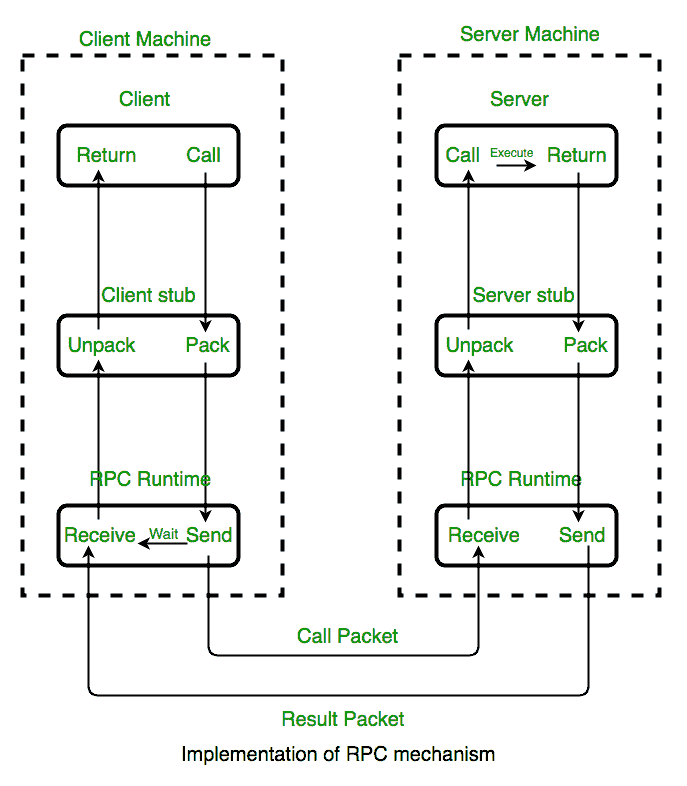

# 操作系统中的远程过程调用(RPC)

> 原文:[https://www . geesforgeks . org/remote-procedure-call-RPC-in-operating-system/](https://www.geeksforgeeks.org/remote-procedure-call-rpc-in-operating-system/)

**远程过程调用(RPC)** 是构建**分布式、基于客户端-服务器的应用程序**的强大技术。它基于扩展传统的本地过程调用，使得**被调用过程不需要与调用过程**存在于相同的地址空间中。这两个进程可能在同一个系统上，也可能在不同的系统上，网络将它们连接起来。

**<u>进行远程过程调用时:</u>**

**1。**调用环境被挂起，过程参数通过网络传输到过程要执行的环境，过程在那里执行。

**2。**当过程完成并产生其结果时，其结果被传送回调用环境，在那里执行恢复，就像从常规过程调用返回一样。

**注意:RPC** 特别适合客户端-服务器**(例如查询-响应)**交互，其中控制流**在调用者和被调用者**之间交替。从概念上讲，客户机和服务器不会同时执行。相反，执行线程从调用者跳到被调用者，然后再跳回来。

**<u>RPC 的工作</u>**

**RPC 期间会发生以下步骤:**

1.  客户端调用**客户端存根程序**，以通常的方式传递参数。客户端存根驻留在客户端自己的地址空间中。
2.  客户端存根**将参数整理(打包)**成消息。编组包括将参数的表示转换为标准格式，并将每个参数复制到消息中。
3.  客户端存根将消息传递给传输层，传输层将消息发送给远程服务器。
4.  在服务器上，传输层将消息传递给服务器存根，服务器存根**解析(解包)**参数，并使用常规过程调用机制调用所需的服务器例程。
5.  当服务器过程完成时，它返回到服务器存根**(例如，通过正常的过程调用返回)**，后者将返回值整理成一条消息。然后，服务器存根将消息传递给传输层。
6.  传输层将结果消息发送回客户端传输层，客户端传输层将消息传递回客户端存根。
7.  客户端存根调用返回参数，执行返回给调用者。

**<u>RPC ISSUES</u>****:**
**必须解决的问题:**

**1。RPC 运行时:**
RPC 运行时系统是一个例程库和一组服务，它们处理 RPC 机制下的网络通信。在 RPC 调用过程中，客户端和服务器端运行时系统的代码处理**绑定，通过适当的协议建立通信，在客户端和服务器之间传递调用数据，并处理通信错误。**

**2。存根:**
存根的功能是**为程序员编写的应用程序代码**提供透明度。

*   **在客户端**上，存根处理客户端的本地过程调用和运行时系统之间的接口，对数据进行封送和解组，调用 RPC 运行时协议，如果需要，执行一些绑定步骤。
*   **在服务器端**，存根在运行时系统和由服务器执行的本地管理程序之间提供了类似的接口。

**3。绑定:客户端如何知道呼叫谁，以及服务驻留在哪里？**
最灵活的解决方案是使用动态绑定，在首次进行 RPC 时在运行时找到服务器。第一次调用客户端存根时，它会联系名称服务器以确定服务器所在的传输地址。

**绑定由两部分组成:**

*   <u>命名:</u>
*   <u>定位:</u>

1.  **拥有服务的服务器**为其导出一个接口。导出接口会将其注册到系统中，以便客户端可以使用。
2.  **客户端**必须先导入(导出)接口，然后才能开始通信。

**4。与 RPC 相关的调用语义:**
主要分为以下几种选择-

*   **重试请求消息–**
    当服务器出现故障或接收方没有收到消息时，是否重试发送请求消息。
*   **重复过滤–**
    删除重复的服务器请求。
*   **重发结果–**
    重发丢失的消息，无需在服务器端重新执行操作。

**<u>优势:</u>**

1.  RPC 提供**抽象**即网络通信的消息传递本质对用户是隐藏的。
2.  RPC 通常省略许多协议层来提高性能。即使是很小的性能改进也很重要，因为程序可能经常调用 RPC。
3.  RPC 支持在分布式环境中使用应用程序，而不仅仅是在本地环境中。
4.  使用 RPC 代码重写/重新开发的工作量被最小化。
5.  RPC 支持的面向进程和面向线程的模型。

**参考文献:**

*   [https://web.cs.wpi.edu/~cs4514/b98/week8-rpc/week8-rpc.html](https://web.cs.wpi.edu/~cs4514/b98/week8-rpc/week8-rpc.html)
*   [https://users.cs.cf.ac.uk/Dave.Marshall/C/node33.html](https://users.cs.cf.ac.uk/Dave.Marshall/C/node33.html)
*   [计算机网络:FOROUZAN 自上而下的方法](https://amzn.to/3hmRN6W)

本文由**雅什辛拉**供稿。如果你喜欢 GeeksforGeeks 并想投稿，你也可以使用[write.geeksforgeeks.org](http://www.write.geeksforgeeks.org)写一篇文章或者把你的文章邮寄到 review-team@geeksforgeeks.org。看到你的文章出现在极客博客主页上，帮助其他极客。

如果你发现任何不正确的地方，或者你想分享更多关于上面讨论的话题的信息，请写评论。