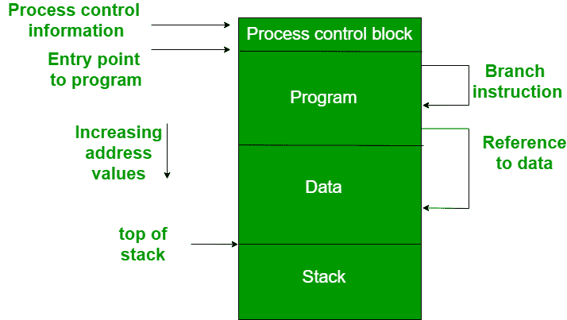

# 内存管理系统要求

> 原文:[https://www . geesforgeks . org/requirements-of-memory-management-system/](https://www.geeksforgeeks.org/requirements-of-memory-management-system/)

内存管理跟踪每个内存位置的状态，无论它是已分配的还是空闲的。它根据程序的请求动态分配内存，并在不再需要时释放内存以供重用。内存管理意味着满足一些我们应该记住的要求。

内存管理的这些要求是:

1.  **Relocation –** The available memory is generally shared among a number of processes in a multiprogramming system, so it is not possible to know in advance which other programs will be resident in main memory at the time of execution of his program. Swapping the active processes in and out of the main memory enables the operating system to have a larger pool of ready-to-execute process.

    When a program gets swapped out to a disk memory, then it is not always possible that when it is swapped back into main memory then it occupies the previous memory location, since the location may still be occupied by another process. We may need to **relocate** the process to a different area of memory. Thus there is a possibility that program may be moved in main memory due to swapping.

    

    该图描绘了过程图像。进程映像占据了主内存的一个连续区域。操作系统需要知道许多事情，包括过程控制信息的位置、执行堆栈和代码输入。在一个程序中，各种指令中都有内存引用，这些被称为逻辑地址。

    将程序加载到主存后，处理器和操作系统必须能够将逻辑地址转换为物理地址。分支指令包含要执行的下一条指令的地址。数据引用指令包含被引用数据的字节或字的地址。

2.  **保护–**当我们同时拥有多个程序时，总会有危险，因为一个程序可能会写入另一个程序的地址空间。因此，当其他进程试图在一个进程中进行写入时，无论是偶然的还是偶然的，都必须保护每个进程免受不必要的干扰。在重新安置和保护要求之间进行权衡，因为重新安置要求的满足增加了满足保护要求的难度。

    预测程序在主内存中的位置是不可能的，这就是为什么在编译时不可能检查绝对地址来确保保护。大多数编程语言允许在运行时动态计算地址。内存保护要求必须由处理器而不是操作系统来满足，因为操作系统在占用处理器时很难控制进程。因此，可以检查内存引用的有效性。
3.  **共享–**保护机制必须允许多个进程访问主内存的相同部分。允许每个进程访问程序的同一个副本，而不是拥有自己的单独副本，这是有优势的。

    例如，多个进程可能使用同一个系统文件，自然会在主内存中加载该文件的一个副本，并让这些进程共享。内存管理的任务是允许在不影响保护的情况下对共享内存区域进行受控访问。机制用于支持支持共享功能的位置调整。
4.  **逻辑组织–**主存被组织成线性的，或者它可以是由一系列字节或字组成的一维地址空间。大多数程序可以被组织成模块，其中一些是不可修改的(只读，仅执行)，而其中一些包含可以修改的数据。为了有效地处理用户程序，操作系统和计算机硬件必须支持一个基本模块来提供所需的保护和共享。它有以下优点:

    *   模块是独立编写和编译的，从一个模块到另一个模块的所有引用都由系统在运行时解析。
    *   不同的模块提供不同程度的保护。
    *   有一些机制可以让模块在进程间共享。共享可以在模块级别提供，允许用户指定所需的共享。
5.  **物理组织–**计算机内存的结构有两个层次，称为主内存和次内存。与辅助存储器相比，主存储器相对非常快且成本高。主存储器是易失性的。因此，辅助存储器被提供用于长期存储数据，而主存储器保存当前使用的程序。主内存和次内存之间的主要系统问题是信息流，程序员理解这一点是不切实际的，原因有二:

    *   当程序可用的主存及其数据可能不足时，程序员可能会进行一种被称为覆盖的实践。它允许将不同的模块分配给同一个内存区域。一个缺点是对程序员来说很耗时。
    *   在多道程序设计环境中，程序员不知道编码时有多少空间可用，以及这些空间在内存中的位置。

**参考文献:**内部构件和设计原则，威廉·史泰林斯第 7 版