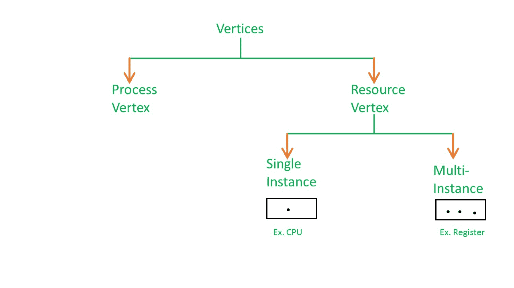
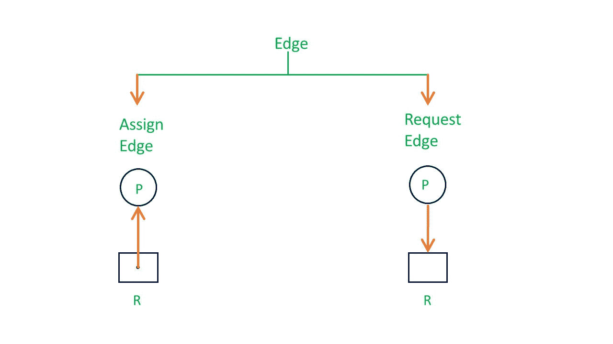
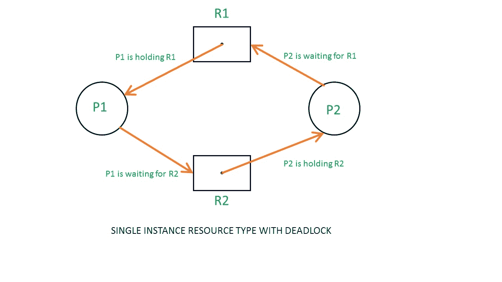
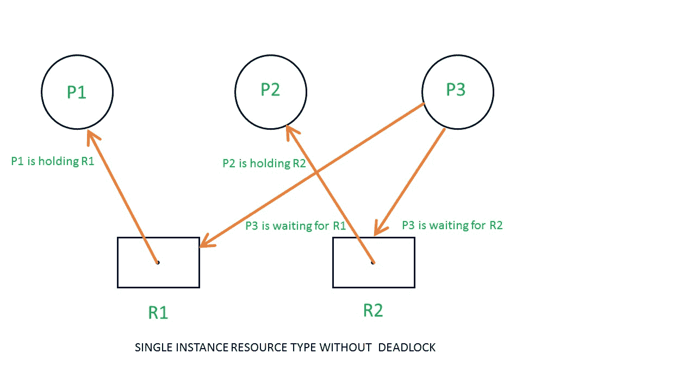
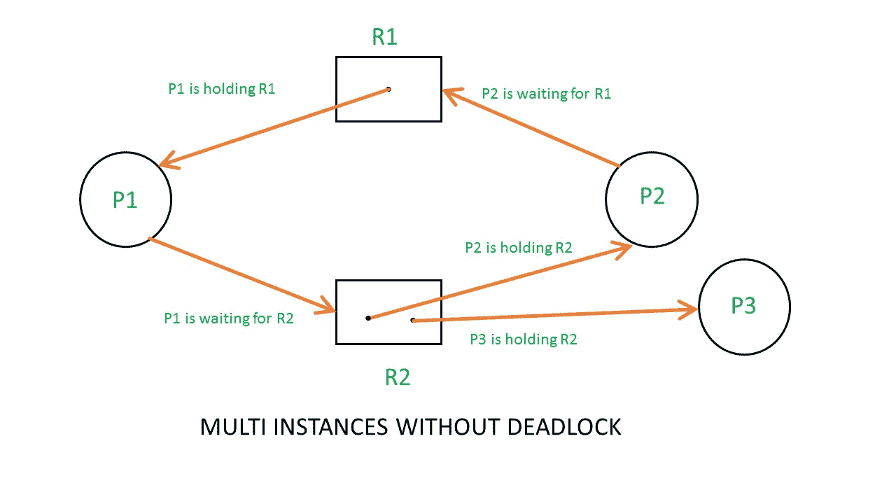
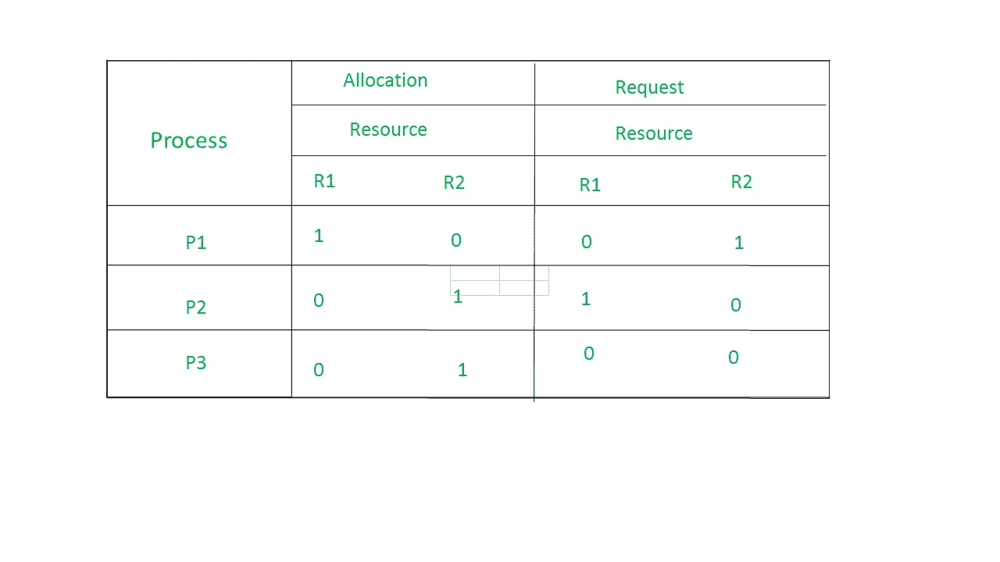
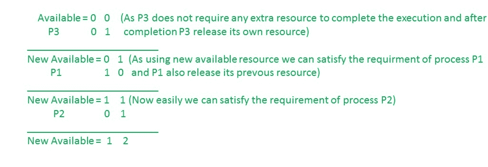
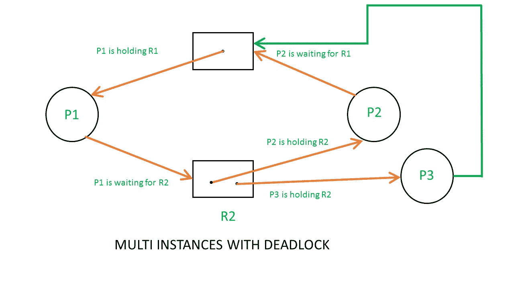
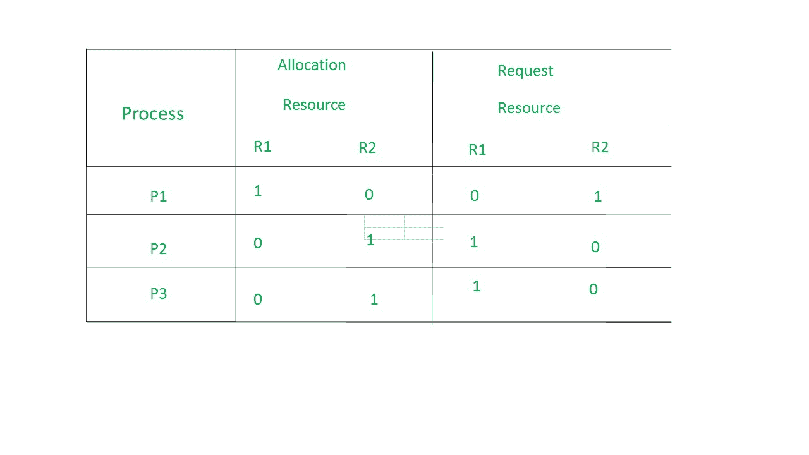

# 操作系统中的资源分配图

> 原文:[https://www . geesforgeks . org/resource-allocation-graph-rag-in-operating-system/](https://www.geeksforgeeks.org/resource-allocation-graph-rag-in-operating-system/)

正如[庄家算法](https://www.geeksforgeeks.org/operating-system-bankers-algorithm/)使用某种像分配、请求、可用的表那样的东西来了解系统的状态是什么。类似地，如果你想理解系统的状态而不是使用那些表，实际上表很容易表示和理解，但是你仍然可以在图中表示相同的信息。那个图叫做**资源分配图**。

因此，资源分配图向我们解释了系统在**进程和资源**方面的状态。比如有多少资源可用，分配了多少，每个进程的请求是什么。一切都可以用图表来表示。有一个图表的好处之一是，有时可以通过使用 RAG 直接看到死锁，但是通过查看表可能无法知道。但是如果系统包含大量的进程和资源，那么表更好；如果系统包含较少的进程和资源，那么图更好。
我们知道任何图都包含顶点和边。所以 RAG 也包含顶点和边。在 RAG 中，顶点有两种类型–

**1。流程顶点–**每个流程将被表示为一个流程顶点。一般来说，这个过程会用一个圆圈来表示。
T3】2。资源顶点–每个资源都将被表示为一个资源顶点。它也是两种类型–

*   **单实例类型资源–**表示为一个盒子，盒子里面会有一个点。所以点的数量表示每种资源类型有多少个实例。
*   **多资源实例类型资源–**也表示为一个盒子，盒子里面会有很多点呈现。

现在来到 RAG 的边缘。RAG 中有两种类型的边–

**1。分配边–**如果已经为流程分配了资源，则称之为分配边。
T3】2。请求边缘–这意味着在未来，流程可能需要一些资源来完成执行，这称为请求边缘。

因此，如果一个进程正在使用一个资源，就会从资源节点向进程节点画一个箭头。如果一个进程正在请求一个资源，从进程节点到资源节点会画一个箭头。

**示例 1(单实例 RAG)–**

如果资源分配图中有一个周期，并且周期中的每个资源只提供一个实例，那么进程将处于死锁状态。例如，如果进程 P1 持有资源 R1，进程 P2 持有资源 R2，进程 P1 等待 R2，进程 P2 等待 R1，那么进程 P1 和进程 P2 将处于死锁状态。

这是另一个例子，显示进程 P1 和 P2 获取资源 R1 和 R2，而进程 P3 正在等待获取这两个资源。在这个例子中，没有死锁，因为没有循环依赖。
所以单实例资源类型中的循环是死锁的充分条件。

**示例 2(多实例 RAG)–**

从上面的例子中，不可能说 RAG 处于安全状态或不安全状态。为了查看这个 RAG 的状态，让我们构建分配矩阵和请求矩阵。

*   The total number of processes are three; P1, P2 & P3 and the total number of resources are two; R1 & R2.

    **分配矩阵–**

*   要构建分配矩阵，只需转到资源，看看它被分配给哪个进程。
*   R1 is allocated to P1, therefore write 1 in allocation matrix and similarly, R2 is allocated to P2 as well as P3 and for the remaining element just write 0.

    **请求矩阵–**

*   为了找出请求矩阵，您必须进入流程并查看输出边。
*   P1 is requesting resource R2, so write 1 in the matrix and similarly, P2 requesting R1 and for the remaining element write 0.

    所以现在可用的资源是= (0，0)。

    **检查死锁(安全与否)–**

    

    所以，这个 RAG 没有死锁。即使有循环，也没有僵局。因此在多实例资源循环中并不是死锁的充分条件。

    

    上面的例子与前面的例子相同，除了 P3 请求资源 R1 的过程。
    于是表格变成如下所示。

    

    因此，可用资源是= (0，0)，但需求是(0，1)、(1，0)和(1，0)。所以你不能满足任何一个要求。因此，它陷入了僵局。

    因此，多实例资源类型图中的每个循环都不是死锁，如果必须有死锁，那么就必须有循环。所以，对于多实例资源类型的 RAG，循环是死锁的必要条件，但还不够。

**GATE CS 角题**
练习下面的题有助于测试你的知识。所有的问题在前几年的 GATE 考试或 GATE 模拟考试中都被问过。强烈建议你练习一下。

1.  [GATE CS 2009，第 60 题](https://www.geeksforgeeks.org/gate-gate-cs-2009-question-30/)
2.  [GATE CS 2014(第 1 集)，第 65 题](https://www.geeksforgeeks.org/gate-gate-cs-2014-set-1-question-41/)

**参考–**
a . Silberschatz，P. Galvin，G. Gagne，“[操作系统概念(第 8 版)](https://www.amazon.com/Operating-System-Concepts-Abraham-Silberschatz/dp/0470128720)”，Wiley India Pvt. Ltd .

本文由 **Samit Mandal** 供稿。如果你喜欢 GeeksforGeeks 并想投稿，你也可以使用[contribute.geeksforgeeks.org](http://www.contribute.geeksforgeeks.org)写一篇文章或者把你的文章邮寄到 contribute@geeksforgeeks.org。看到你的文章出现在极客博客主页上，帮助其他极客。

如果你发现任何不正确的地方，或者你想分享更多关于上面讨论的话题的信息，请写评论。