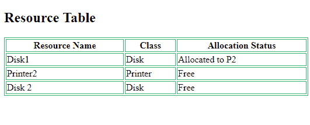

# 流程的资源分配技术

> 原文:[https://www . geesforgeks . org/resource-allocation-technologies-for-process/](https://www.geeksforgeeks.org/resource-allocation-techniques-for-processes/)

当程序需要资源时，操作系统分配资源。当程序终止时，资源被取消分配，并分配给其他需要它们的程序。现在的问题是，操作系统使用什么策略将这些资源分配给用户程序？

有两种资源分配技术:

1.  **Resource partitioning approach –**
    In this approach, the operating system decides beforehand, that what resources should be allocated to which user program. It divides the resources in the system to many *resource partitions*, where each partition may include various resources – for example, 1 MB memory, disk blocks, and a printer.

    然后，它在程序启动前为每个用户程序分配一个资源分区。资源表记录资源分区及其当前分配状态(已分配或空闲)。

    **优势:**

    *   易于实施
    *   减少开销

    **缺点:**

    *   **缺乏灵活性–**如果一个资源分区包含的资源多于特定进程所需的资源，那么额外的资源就会被浪费。
    *   如果一个程序需要比单个资源分区更多的资源，它就不能执行(尽管其他分区中有空闲资源)。

    示例资源表可能如下所示:

    

2.  **Pool based approach –**
    In this approach, there is a *common pool of resources*. The operating System checks the allocation status in the resource table whenever a program makes a request for a resource. If the resource is free, it allocates the resource to the program.

    **优势:**

    *   分配的资源没有浪费。
    *   如果资源是空闲的，任何资源需求都可以满足(不像分区方法)

    **缺点:**

    *   每次请求和释放时分配和取消分配资源的开销。