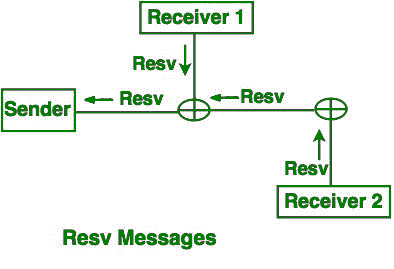
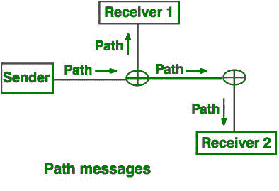

# 实时系统中的资源预留协议

> 原文:[https://www . geesforgeks . org/resource-reservation-protocol-in-time-systems/](https://www.geeksforgeeks.org/resource-reservation-protocol-in-real-time-systems/)

**资源预留协议(RSVP)** 在实时系统中用于向特定接收机进行高效的高质量频带传输。它通常由接收方用于将传输包从发送方快速传送到接收方。

**资源预留协议特点:**

*   RSVP 是接收器启动的。实时系统中的接收节点发起协议。
*   RSVP 是单向的。接收节点只接收数据包，不想发送任何数据。
*   服务质量由 RSVP 协议提供。
*   接纳控制用于网络拓扑中每一跳的 RSVP。
*   分类、缓冲区管理和调度由 RSVP 高效管理
*   它动态地适应路由的变化，以实现高效的消息传输。
*   它实际上不是路由协议。这取决于其他路由协议。

**在 RSVP 中使用 Flowspec** 来确定不同的参数，如带宽、链路强度、拥塞等，以实现平滑和无碰撞的通信和数据传输。

**Filterspcec** 在 RSVP 中用于过滤数据包。作为固定或共享接收器，它用于根据数据包的目的地类型路由数据包。

**RSVP 连接建立中使用的消息类型:**

*   **预约消息(resv):** 接收方发送预约消息(resv)给发送方，发送方指定预约建立所需的所有资源和参数。
*   **路径消息(path):** 发送方收到接收方的预留消息后，记录所有需要预留的资源，并记录路径。发送方向所有接收方多播一条路径消息(Path)，该消息指定了数据包的路由详细信息。它还包含了所有必要的规格，关于预订作出的接收器。

#### 预订信息转移:

#### 路径消息传输:

资源预留协议中发送方发送的数据被加密，以防止发送给接收方的数据被破坏。

在资源预留协议中，错误报告在发送端完成，以便对通信策略进行必要的更改。

在 RSVP 失败的情况下，该跳的准入状态被发送给请求者以处理必要的分组。

在 RARP 中，路由器记录必要的正向和反向路由状态。路由器还可以对发送方发送给接收方的路径消息进行必要的更改，以指示实际的资源可用性。